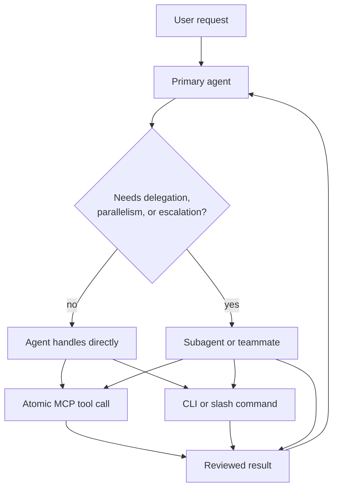

# Agents Architecture

Agents are the reasoning and orchestration layer of Augur. They interpret user intent, choose workflows, dispatch bounded work, decide what needs memory, and call MCP tools for atomic operations.

## Agent tiering model

Agent tiering assigns the right model and authority to the task. High-ambiguity design, architecture, or review work gets a stronger agent. Mechanical file edits, bounded search, and well-scoped execution can use smaller or specialized agents.

Tiering is operational, not decorative. It affects dispatch, escalation, context budget, and how much autonomy a subagent should receive.

## Mode system and team protocol

Augur distinguishes Dev Mode from Operation Mode. Dev Mode changes the system: code, skills, actions, dashboard, config, ADRs. Operation Mode uses the system for user work: career, health, finance, content, life, and personal knowledge.

Teams split work only when task boundaries are clear. A main agent owns goal integrity and merges results. Subagents own bounded work packets and report evidence.

## Dispatch and escalation pattern

The dispatch escalation pattern provides three common tiers:

- oneshot for fast, structured prompts
- embedded CLI for visible repair or light interactivity
- IDE/full-agent dispatch for exploratory or complex work

Dashboard dispatch still lands in an AI-client session. The dashboard does not become the LLM executor.

## Agent-vs-MCP boundary

Agents own judgment. MCP tools own atomic operations. Command docs and skill docs own policy. Daemons schedule work.

Examples of agent-owned work include classifying retention, choosing a wiki page to strengthen, prioritizing findings, and deciding whether to parallelize. Examples of tool-owned work include reading a file, writing a vault note, extracting one document, returning setup status, or searching one index.

See [architecture-capability-exposure.md](./architecture-capability-exposure.md) for how this boundary becomes generated policy.

## Subagent dispatch

Subagents are useful for independent, bounded work: codebase questions, disjoint patches, verification, or exploration that can run without blocking the main critical path.

The main agent should not offload the immediate blocker just to wait for it. Delegation is valuable when it runs in parallel with meaningful local work and has a clear output contract.

## Agent registry and capabilities

Agent definitions live in client-native or shared agent directories and are synchronized by `sync_agents`. ADR-464 established multi-master agent distribution and model mapping so agents authored for one client can be adapted for others.

The capability surface makes available commands, MCP tools, and workflows visible without forcing every capability into every direct client tool list.

## Implementation pointers

- `docs/agent-topics/AGENTS.md` is the agent-facing mode and protocol doc.
- `docs/references/dispatch-escalation-pattern.md` defines escalation tiers.
- `docs/references/agent-vs-mcp-checklist.md` defines the judgment/tool split.
- `project-brain/capabilities/skills/ai/scripts/sync_agents/agent_parser.py` discovers and adapts agent definitions.
- See [architecture-sync-agents.md](./architecture-sync-agents.md) for cross-client projection and [architecture-sdlc.md](./architecture-sdlc.md) for agents in the development lifecycle.
