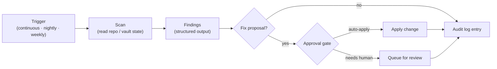

# Augur Autoloops

Augur ships a small set of scheduled, scope-bounded automations called **autoloops**. They run on the user's machine, inspect repo and vault state, propose corrective changes, and write structured outputs. Two claims anchor this document: autoloops give the user **continuous improvement without driving it themselves**, and the approval-gated, audit-logged execution model makes **trust-through-automation** a structural property rather than a marketing line.

## What an autoloop is

An autoloop is a single skill action that follows the **scan-fix protocol**: read state, produce findings, optionally propose a corrective change, and either auto-apply or queue for human review. Each loop has a clear scope (security, code quality, repo hygiene, test coverage, documentation, etc.) and never crosses into other loops' domains.

Loops run via the unified daemon — launchd on macOS, Windows Task Scheduler on Windows. Each loop action declares its `loop.name` (category), `tier` (priority), and `trigger` (continuous, nightly, weekly) in its skill's `SKILL.md`. The daemon owns scheduling; loops own logic; the MCP gateway owns dispatch and audit.

Loops never run destructive actions without an explicit approval gate. The default is "find and report"; "find and fix" is opt-in per loop and per finding type.

## How a loop runs

The diagram shows the three decision points where loop policy controls the system. **Findings → Fix proposal** decides whether the loop is read-only or fix-capable. **Approval gate** decides whether a fix auto-applies or waits for the user. **Audit log entry** is non-optional — every run writes structured output regardless of outcome, so the dashboard and downstream loops always see a consistent history.

A loop that finds nothing still produces an audit entry. This matters: the audit stream is the substrate the rest of the ops layer reads from.

## The autoloop catalog (current state, April 2026)

Loops register under one of ten named categories. Each category spans one or more skill actions across `skills/daemon/` and `skills/loop-*/`. The table reflects what's actually scheduled today:

| Category               | Cadence               | Tiers       | What it covers                                       |
|------------------------|-----------------------|-------------|------------------------------------------------------|
| self-heal              | continuous + nightly  | T0–T1       | Detect runtime errors and dispatch fixes             |
| hardening              | nightly               | T0–T5       | Scope-bounded scans (security, mounts, code, fs)     |
| code-quality           | nightly               | T1–T2       | Lint, mypy, structure                                |
| testing                | nightly               | T0–T3       | Test coverage and execution                          |
| observability          | nightly               | T1–T3       | Health metrics, performance profiling                |
| skill-standards        | nightly               | T0, T2, T5  | SKILL.md schema, refs, conventions                   |
| knowledge-enrichment   | weekly                | T2          | Documentation and wiki updates                       |
| command-evolution      | nightly               | T1          | Command registry maintenance                         |
| page-health            | nightly               | T1          | Dashboard page integrity                             |
| ui-quality             | nightly               | T2          | UI consistency checks                                |

Tiers are integers; lower numbers run earlier in a given cadence. Continuous loops run while the daemon is up; nightly and weekly loops run on the daemon schedule.

## The security autoloop as the worked example

The **security autoloop** lives in `skills/loop-security/` and registers under the `hardening` category at tier 3, nightly. It is the most-developed scan-fix module of any loop in Augur as of April 2026 and is the model the others are converging on.

Its scan-fix module covers five orthogonal stages:

- **S1** — prompt-injection detection.
- **S2** — secret scanning, with `detect-secrets` plus a fallback scanner.
- **S3** — static code analysis (Bandit + AST fallback).
- **S4** — integrity and trust checks.
- **S5** — permissions and policy checks.

Tank CLI integration plugs the loop into the existing CLI registry, and the scan-fix module proposes corrective changes alongside findings. Because the security autoloop runs every night, any release cut from a green night has been audited end-to-end (see [architecture-overview.md §Release and lifecycle](./architecture-overview.md#release-and-lifecycle)).

## Why this is defensible

**Continuous improvement is the user benefit.** Drift gets caught without the user driving it: regressions in security, code quality, repo hygiene, test coverage, and documentation surface as findings the user can review or auto-apply. As the loop catalog grows, the system gets better at maintaining itself. This is a compound advantage — every loop added is one less category of drift the user has to remember to check.

**Trust-through-automation is the moat.** Most agent platforms ship "do anything" tools that defer trust questions to the user. Augur ships approved, audit-logged, sandbox-bounded loops that move the system toward known-good states with human-in-the-loop on destructive changes. Trust is a structural property, not a roadmap promise. A competitor with a broad-permission "let the agent decide" model cannot copy this without rebuilding their permission model from the ground up.

## Where this lives in the repo

- `skills/daemon/` — scheduler, launchd / Task Scheduler integration, loop dispatch.
- `skills/loop-*/` — current loop skills: `loop-security`, `loop-test`, `loop-quality`, `loop-repo`, `loop-ops`, `loop-memory`, `loop-observability`, `loop-docs`, `loop-wiring`, `loop-hub-coverage`.
- ADR-245 — ops loops centralized issue inventory.

## Where to go next

- [architecture-overview.md](./architecture-overview.md) — the three-layer model and named subsystems.
- [architecture-llm-wiki.md](./architecture-llm-wiki.md) — the other architecture deep-dive.
- [ROADMAP.md](../ROADMAP.md) — public release plan with status markers.
