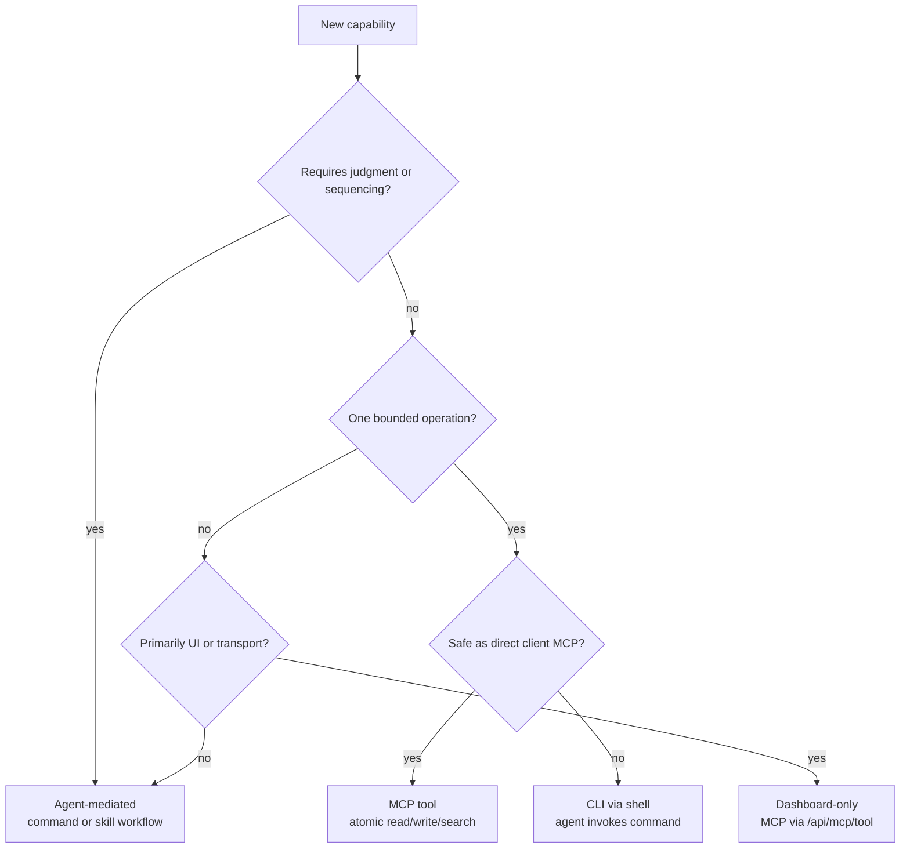

# Capability Exposure Architecture

Capability exposure decides which Augur operations appear directly in clients, which stay agent-mediated, which are CLI-via-shell, and which are dashboard-only. The goal is to expose useful surfaces without turning every internal tool into a broad client API.

## Policy and rationale

Augur's core split is "agent decides, tools execute." Direct tool exposure is reserved for bounded operations with a clear contract. Broad workflows, classification, prioritization, retention, multi-step sequencing, and destructive decisions stay in agent logic or command docs.

This keeps the system consistent across CLI, dashboard, and scheduled triggers. A dashboard button, a slash command, and a nightly run should lead to the same agent-orchestrated execution model.

## The four exposure tiers

| Tier | Meaning | Example shape |
|---|---|---|
| Direct MCP tool | Client can call the tool directly | read one wiki page, return one status report |
| Agent-mediated | Agent chooses and sequences tools | `/ask` retention, wiki compounding, ingest routing |
| CLI via shell | Agent invokes a command surface | `/dev-build`, `/auto-lint`, `gh`, external CLIs |
| Dashboard-only | UI calls MCP through dashboard transport | setup widget status, browse-only health blocks |

The preferred surface is recorded in capability policy so generated instructions and Browse can present the right entry point.

## capability_exposure.yaml schema

`config/system/capability_exposure.yaml` stores one row per capability. Rows include:

- `classification_status`
- `owner_kind`
- `management`
- `scope`
- `primary_surface`
- `preferred_client`
- `export_to`

Capability ids are namespaced, such as `command:adr`, `workflow:auto-lint`, `cli:gh`, or `mcp-tool:wiki-read`. `export_to` controls whether the capability appears in CLI docs, agent instructions, Browse, direct MCP, Claude, or other targets.

## The decision matrix

The decision matrix comes from `docs/references/agent-vs-mcp-checklist.md`.

Use the agent when the work needs judgment: classification, summarization, prioritization, choosing what to save, interpreting ambiguity, sequencing steps, or deciding parallelism.

Use an MCP tool when the operation is atomic: read one thing, write one thing, search one scope, extract one file, return one structured dataset, or perform one narrow mutation.

Use skill docs and command docs when the work is policy: workflow steps, trigger semantics, retention rules, command UX, and "when to use which tool" guidance.

Use the daemon or scheduler only to start work. Do not hide intelligence there.

## Drift detection

Drift scanners compare declared capability policy with generated client surfaces and Browse rows. Unclassified exports are debt because they create hidden behavior that no policy has approved.

ADR-734 extends this closure layer with browse control rows, drift guardrails, and cleanup actions. The policy file is therefore both documentation and an enforcement input.

## Implementation pointers

- `config/system/capability_exposure.yaml` is the source policy file.
- `docs/references/agent-vs-mcp-checklist.md` and `docs/references/agent-vs-mcp-examples.md` define the design test.
- `project-brain/capabilities/skills/ai/scripts/sync_agents/` projects approved exports into client instructions.
- `apps/dashboard/app/(views)/browse/CapabilityPolicyPanel.tsx` renders policy control surfaces.
- See [architecture-agents.md](./architecture-agents.md) for orchestration and [architecture-dashboard.md](./architecture-dashboard.md) for dashboard transport.
