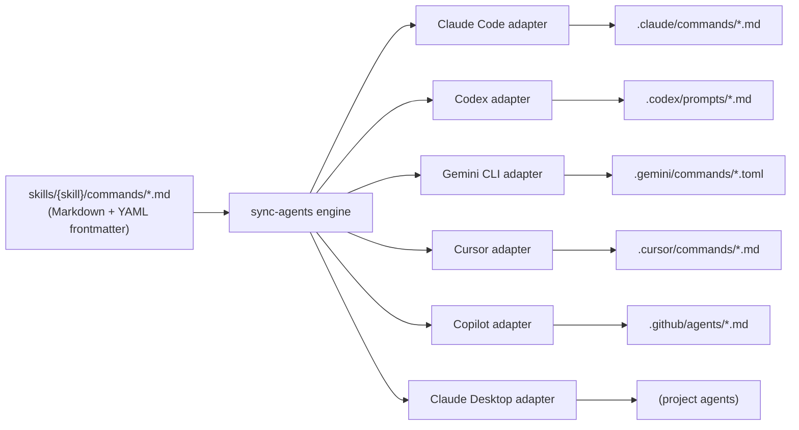

# Augur Commands and Per-Client Schemas

Augur commands are skill-declared, source-of-truth Markdown files. The sync engine fans them out to every supported AI client in that client's native command schema. Two claims anchor this document: a user gets **the same command in every client they connect** (single-source multi-client portability), and a command's **read-vs-mutate trust is enforced at the protocol level**, not the UI. The substrate is per-client adapters plus the MCP approval gates that apply identically regardless of which client invoked the command.

## What an Augur command is

A command is a Markdown file under `skills/{skill}/commands/` with YAML frontmatter declaring at minimum a `description` and a `visibility` level. The body is the prompt the AI client should follow when the command is invoked. The frontmatter is the metadata each client adapter needs to render the command in its own native schema (slash command, prompt, tool, etc.).

A command file is the *interface*. The *runtime* is MCP — when a user actually invokes the command, dispatch happens through the MCP gateway. This separation is what makes the same command work identically across clients.

## Visibility ladder

Commands declare visibility in frontmatter. The current ladder, with the most-used levels first:

- `visibility: ops` — operations the user runs by hand. Most browse, status, and search commands sit here. Safe to invoke.
- `visibility: auto` — runs on a daemon schedule (autoloop). Not directly user-invoked, but visible in the catalog.
- `visibility: orch` — orchestration; usually a multi-step wrapper around several MCP tools.
- `visibility: public` — public-facing commands, exported broadly to user-installed clients.
- `visibility: core` — core platform commands, available across all hubs.
- `visibility: dev` — development-only; gated to the dev surface.
- `visibility: test` — test-only; not exported to user-installed clients.

Read-vs-mutate semantics are not a separate field — they are encoded in the underlying MCP tool the command dispatches to. The MCP gateway applies approval gates to mutations regardless of which client invoked the command. So a user clicking the command in the dashboard and a Claude Code agent calling `/command` both hit the same approval logic. This is the trust property that makes the multi-client surface safe.

## Source-of-truth fan-out



The diagram shows the single skill `commands/*.md` file fanning out through the sync engine into six per-client adapters, each writing to its native target dir. Adapters live in `skills/ai/scripts/sync_agents/adapters/` and are pluggable.

The sync engine's contract: it reads source commands, applies adapter-specific transforms (Markdown → TOML for Gemini; frontmatter shape adjustments for Codex; etc.), and writes generated files marked with a header that identifies them as Augur-managed. ADR-553 added Gemini extension support; ADR-558 added managed-output purge so re-installs can clean up stale adapter outputs.

A user who writes one command in `skills/loop-security/commands/auto-security-audit.md` sees that command appear as `/auto-security-audit` in Claude Code, in Codex, in Gemini CLI, in Cursor, and via `@-mention` in Copilot — all running the same underlying MCP tool through the same dispatch path.

## Per-client schema reference

Concrete reference for each client's native command schema. Augur's adapters target each format precisely so the command "feels native" in the client.

| Client          | Target dir                      | Format        | Frontmatter style        | Activation       |
|-----------------|---------------------------------|---------------|--------------------------|------------------|
| Claude Code     | `.claude/commands/*.md`         | Markdown      | YAML frontmatter         | `/command-name`  |
| Codex           | `.codex/prompts/*.md`           | Markdown      | YAML frontmatter         | `/command-name`  |
| Gemini CLI      | `.gemini/commands/*.toml`       | TOML          | TOML keys                | `/command-name`  |
| Cursor          | `.cursor/commands/*.md`         | Markdown      | YAML frontmatter         | `/command-name`  |
| Copilot         | `.github/agents/*.md`           | Markdown      | YAML frontmatter         | `@-mention`      |
| Claude Desktop  | (project agents only)           | Markdown      | YAML frontmatter         | invoked by name  |

Activation form differs (slash for most, `@-mention` for Copilot, direct-name for Claude Desktop), but the underlying dispatch is identical: each client calls into MCP, the gateway routes, the skill runs.

> Activation form is the simplest case; some clients support namespacing — see the client's own docs.

## Worked example — auto-security-audit

The source file lives at `skills/loop-security/commands/auto-security-audit.md` with frontmatter:

```yaml
---
description: Scan all skills for security vulnerabilities and auto-quarantine/block findings
visibility: auto
---
```

The sync engine reads this and writes:

- `.claude/commands/auto-security-audit.md` (Markdown + frontmatter)
- `.codex/prompts/auto-security-audit.md` (Markdown + frontmatter)
- `.gemini/commands/auto-security-audit.toml` (TOML transform)
- `.cursor/commands/auto-security-audit.md` (Markdown + frontmatter)

A user in any client types `/auto-security-audit`. The client invokes the command's prompt. The agent (or daemon, since this is auto-visibility) executes the underlying MCP tool. Same dispatch, same result, same audit entry — regardless of which client started it.

## Why this is defensible

**Single-source multi-client portability is the user benefit.** One command file, every client. A user who switches from Claude Code to Codex to Gemini doesn't lose their commands — they're already there. A skill author who ships a new command doesn't have to maintain six parallel files in six different formats.

**Read/mutate trust at the protocol level is the user benefit.** The command interface declares visibility; the MCP gateway applies approval gates to mutations. An `/install-skill` command is gated identically whether triggered by a dashboard click or a slash command in any client. Trust does not depend on which surface invoked the command.

**Per-client adapters plus protocol-level approval gating are the moat.** A competitor with hand-built integrations has to maintain N format adapters as each client's native schema evolves. A competitor without protocol-level approval gates ends up reinventing trust per client. Both are ground-up rebuilds, not bolt-ons.

## Where this lives in the repo

- `skills/{skill}/commands/*.md` — source commands.
- `skills/ai/scripts/sync_agents/` — sync engine + per-client adapters.
- `skills/ai/scripts/sync_agents/adapters/{claude_code,codex,gemini,cursor,copilot,claude_desktop}.py` — one adapter per client.
- ADR-553 (Gemini extension), ADR-558 (managed-output purge), ADR-562 (runtime IDE registry).

## Where to go next

- [architecture-overview.md](./architecture-overview.md) — the three-layer model and named subsystems.
- [architecture-dashboard.md](./architecture-dashboard.md) — page model and GUI/agent parity.
- [architecture-mcp-gateway.md](./architecture-mcp-gateway.md) — gateway internals.
- [ROADMAP.md](../ROADMAP.md) — public release plan with status markers.
