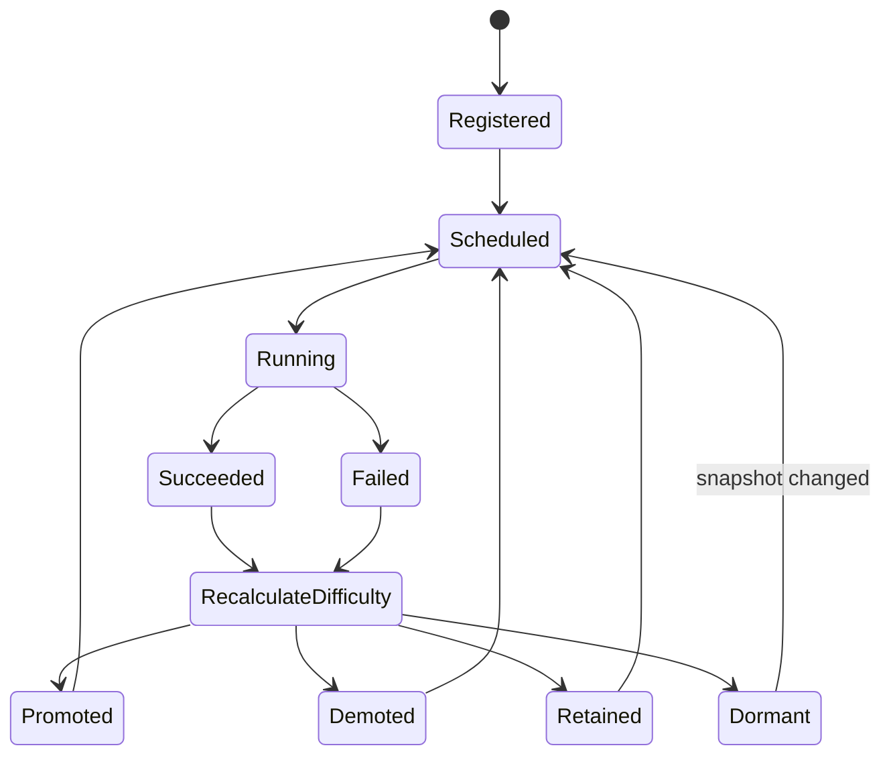
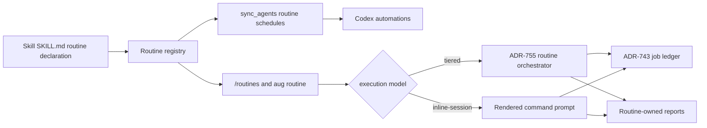

# Daemon Architecture

The daemon layer starts and observes background routines, but it does not replace the agent execution model. It schedules checks, records state, launches loops, heals known local runtime issues, and hands intelligent work back to AI-client sessions and MCP tools.

## Daemon process model

`project-brain/capabilities/skills/daemon/scripts/unified_daemon.py` is the runtime supervisor. It coordinates subprocess-style services such as the adaptive loop engine, notification flows, and continuous checks. On Windows, setup can install scheduled/task-style launch paths; on macOS, launch agents are used.

The daemon writes operational state under `get_runtime_dir()` and logs under `get_logs_dir()`. It should resolve paths through `src.config.paths` so worktrees and platform-specific state locations do not drift.

## Adaptive Loop Engine

`project-brain/capabilities/skills/daemon/scripts/adaptive_loop_executor.py` discovers auto-commands from shared and private skill roots, reads `config/system/adaptive_loops.yaml`, and runs loop categories under trust and budget controls.

Trust state is per loop and per category. `CategoryState` tracks trust, success/failure counts, difficulty, strategy, commit verification, hot paths, and clean-scan streaks. `LoopState` tracks loop-level budget, probation, clean cycles, and category ordering.

Key thresholds live in `project-brain/capabilities/skills/daemon/scripts/adaptive/trust_constants.py`:

| Constant | Meaning |
|---|---|
| `PROMOTION_THRESHOLD = 0.5` | Trust threshold for unlocking the next tier |
| `PROMOTION_MIN_SUCCESSES = 3` | Minimum successes before promotion |
| `DIFFICULTY_ESCALATION_THRESHOLD = 3` | Consecutive successes before raising difficulty |
| `MAX_DIFFICULTY = 4` | Difficulty ceiling |
| `CONSECUTIVE_FAILURES_TO_DISABLE = 5` | Failure streak before disable |
| `REPORT_ONLY_DEMOTION_THRESHOLD = 20` | Fixes without commits before demotion to d0 |
| `DORMANT_CLEAN_THRESHOLD = 20` | Clean scans at max difficulty before dormant mode |

Manual category promotion re-enables a category and resets immediate trust/difficulty state while preserving lifetime commit stats.

## Healing and autonomous cycles

Healing checks diagnose broken runtime state and known local failures. Autonomous loop cycles run scan, act on findings, commit, and repeat within scoped rules. Broad destructive cleanup is prohibited unless ownership is proven.

Structural findings should produce a design gate or ADR-backed follow-up rather than silently rewriting architecture from a background process.

## Loop history and status surfaces

The daemon writes trust state, evolve queue, journal, and reports under runtime adaptive paths. `/routines` and `aug routine` are the human and agent-facing surfaces for that state.

Browse exposes background routine rows through the capability and routine discovery layers rather than requiring agents to inspect daemon internals.

## Job Ledger

The job ledger is the crash-safe run-record layer beneath daemon executors. It writes one directory per job under `get_runtime_dir()/jobs/<job-id>/`, with human-readable `meta.json`, append-only `events.jsonl`, and optional `output/` files. The current state is the `state` field from the last valid JSONL event, so `cat events.jsonl` tells the full story of a run without a database.

This store is separate from `runtime/adaptive/`. Adaptive state tracks trust, difficulty, budgets, and convergence; the job ledger tracks what happened in one concrete execution. The adaptive engine does not derive trust from the ledger, and the ledger does not mutate adaptive learning state.

The wrapped dispatch points are the adaptive loop executor, schedule executor, continuous executor, and self-heal pipeline. `unified_daemon.py` runs a best-effort supervisor sweep on startup and on the heartbeat cadence. The supervisor surfaces orphaned or timed-out jobs and appends terminal events; it does not force-kill live processes.

## Notification pipeline

The daemon owns local notifications and plugin events. Tools such as `list-notifications`, `manage-daemon-notifications`, `plugin-events-list`, `plugin-events-acknowledge`, `check-expirations`, and `dismiss-old-notifications` expose atomic operations.

Notifications are status signals. They should not become hidden orchestration paths.

## Scheduling vs orchestration

The scheduler starts work. The agent orchestrates work. MCP tools execute atomic operations. This is the rule that keeps daemon, dashboard, and CLI behavior aligned.

Nightly and continuous triggers can launch or request sessions, but they should not embed the full decision loop inside daemon scripts.

## Unified routines

ADR-758 collapses auto-loops and dream-class compounding into one registry and
one operator surface. A routine is declared by the owning skill with
`x-augur-routine:` or `x-augur-routines:` in `SKILL.md`; `aug routine` and
`/routines` are the canonical list, status, run, report, and schedule surfaces.
`/dream` remains a deprecated alias for one release cycle.

Execution models stay distinct below the registry:

| Model | Used by | Execution boundary | Runtime state |
|---|---|---|---|
| `tiered` | testing, hardening, code-quality, skill-quality, file-organizer, and other adaptive routines | Deterministic scan/mechanical phases run in Python; semantic fixes require an active AI-client session through the ADR-755 orchestrator | Adaptive trust state plus ADR-743 ledger entries |
| `inline-session` | dream | The command prompt is rendered into the current AI-client session; deterministic MCP phases and judgment phases run in that session | ADR-743 ledger entries plus routine-owned reports |

Routine policies describe how much adaptation the runtime may apply:

| Policy | Meaning |
|---|---|
| `adaptive` | Trust, budget, difficulty, scan, mechanical fix, and escalation behavior are governed by the adaptive engine. |
| `observability-only` | The routine reports measurements and findings without repair behavior. |
| `oneshot` | The routine renders or runs one bounded compounding flow without adaptive trust promotion. |

Registry-based dispatch keeps scheduling, orchestration, and atomic execution
separate:

The daemon's role is deliberately narrow: keep the supervisor and local MCP
entry points healthy, accept ledger writes, and expose status. It does not own
the LLM context, does not call hidden LLMs, and does not embed client scheduling
logic. Codex schedules are materialized from each routine owner's
`assets/seeds/routine-schedule.yaml`; other clients receive native command
projection or graceful manual invocation depending on their capabilities.

## Implementation pointers

- `project-brain/capabilities/skills/daemon/SKILL.md` owns daemon commands and actions.
- `project-brain/capabilities/skills/daemon/commands/routines.md` documents the unified routine operator surface.
- `project-brain/capabilities/skills/daemon/scripts/routine_orchestrator/registry.py` discovers `x-augur-routine` declarations.
- `project-brain/capabilities/skills/daemon/scripts/routine_orchestrator/orchestrator.py` dispatches tiered routines.
- `project-brain/capabilities/skills/daemon/scripts/unified_daemon.py` is the supervisor.
- `project-brain/capabilities/skills/daemon/scripts/adaptive_loop_executor.py` is the adaptive loop entry point.
- `project-brain/capabilities/skills/daemon/scripts/adaptive/` contains trust, convergence, discovery, reporting, and execution modules.
- See [architecture-agents.md](./architecture-agents.md) for orchestration boundaries and [architecture-sdlc.md](./architecture-sdlc.md) for auto-loop use in development.
