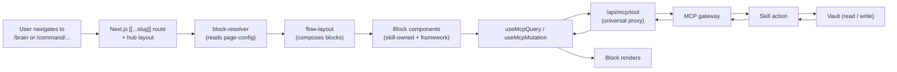
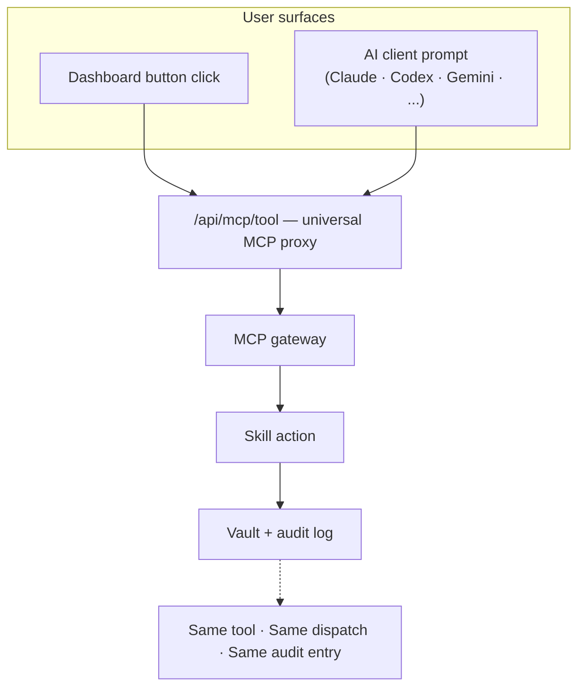

# Augur Dashboard

The Augur dashboard is a Next.js App Router shell that hosts skill-owned UIs and reads everything through MCP. Two claims anchor this document: a user can **click a button or ask an AI agent and get the same outcome** (GUI/agent parity), and a skill author can **ship a UI by declaring it in YAML** (config-driven blocks). The structural property that makes both possible is that the dashboard is itself an MCP client — there is no separate execution path for the GUI.

## What the dashboard is

Built on Next.js 15 App Router under `apps/dashboard/`. Six hub namespaces — adaptive, brain, command, life, studio, plus settings/dev — each implemented as a `[[...slug]]` catch-all route with a hub layout. The shell is small: global navigation, error boundary, and an invisible MCP context manager. The substance lives in skill-owned blocks composed into pages.

The dashboard does not own business logic. It does not call Python scripts directly. Every user-action read and every user-action write goes through MCP. (Auth, CSRF, and similar shell concerns are framework infrastructure and are not MCP-routed.)

## Page-as-blocks model

The diagram shows the data path from URL to pixel. **block-resolver** turns a page-config (YAML) into a list of block component instances. **flow-layout** composes them into a Next-friendly layout with ordering, sections, and suspense boundaries. Each block calls **useMcpQuery** or **useMcpMutation** — thin React hooks over the universal MCP proxy at `/api/mcp/tool`. The proxy speaks to the MCP gateway, which dispatches to a skill, which reads or writes the vault.

Two block registries cover the two ways a UI can ship. **generated-block-registry** is built at scan time from skills declaring config-driven pages in `augur/pages/*.yaml` (per ADR-491). **custom-block-registry** is for hand-written React blocks when a skill needs interactivity beyond what config can express. The dashboard shell never imports skill-specific code; it resolves through the registry at runtime.

## GUI/agent parity

Two parallel user surfaces — a click on a dashboard button, an instruction to an AI agent — converge on the same `/api/mcp/tool` proxy. From there the path is identical: gateway → skill → vault → audit. Same execution path. Same audit log entry. Same context.

This isn't a coincidence. The dashboard is itself an MCP client. Calling `mcpCall` from a React component is functionally identical to an agent calling the tool through stdio JSON-RPC. The proxy is the universal interface; the client just chooses the transport.

Practical consequence: a user who clicks "Run audit" in the dashboard and a user who asks "run the audit" through Claude Code see the same result, the same audit entry, and (after navigating back) the same post-action UI state.

## How a click becomes an MCP call

A user opens `/brain`. The hub layout mounts. `block-resolver` loads the page-config for `/brain`. One block on the page is a "recent ingestions" reader; on mount it calls `useMcpQuery("get-recent-ingestions")`. Another block is a "run knowledge memory cleanup" button; on click it calls `useMcpMutation("knowledge-memory-cleanup")`. Both flow through `/api/mcp/tool`. The gateway dispatches. The skill runs. The vault is read or written. The response returns. The block re-renders. The audit log gets one entry per call.

The `ContextManager` component (mounted at the root layout) silently swaps the active MCP tool context as the user navigates between hubs, so the agent surface and the dashboard see the same active toolset at the same time.

## Why this is defensible

**GUI/agent parity is the user benefit.** Click or ask — same outcome, same audit. A user is not penalized for choosing a surface; agents are not blackboxed away from what the dashboard sees. Switching from "I clicked it yesterday" to "ask the agent to do it again" is trivial because the audit entry is the same.

**Config-driven blocks are the user benefit (for skill authors).** A skill author ships a UI by declaring it in YAML; no React unless the block needs custom interactivity. As the catalog grows, the dashboard surface grows with it without bespoke page work.

**MCP-as-substrate is the moat that enables both.** A competitor with a separate-stack GUI can't retrofit parity without rebuilding their backend — every action a button takes is hard-coded into a server route, separate from whatever the agent calls. A competitor with hand-coded pages can't keep up with a growing skill catalog without rewriting the dashboard each release. Bolting either on later is a ground-up rebuild, not an iteration.

## Where this lives in the repo

- `apps/dashboard/app/` — Next.js routes, including hub `[[...slug]]` catch-alls.
- `apps/dashboard/lib/blocks/` — block resolver, flow layout, generated and custom registries.
- `apps/dashboard/lib/mcp/` — universal MCP proxy client (`mcpCall`, `useMcpQuery`, `useMcpMutation`, `useMcpPoll`).
- `apps/dashboard/components/ContextManager.tsx` — context switching on navigation.
- `skills/{skill}/augur/dashboard/` — skill-owned UI source.
- `skills/{skill}/augur/pages/*.yaml` — config-driven page declarations.
- ADR-490 (framework vs feature import boundaries), ADR-491 (config-driven page declarations).

## Where to go next

- [architecture-overview.md](./architecture-overview.md) — the three-layer model and named subsystems.
- [architecture-commands.md](./architecture-commands.md) — how commands work across AI clients.
- [architecture-mcp-gateway.md](./architecture-mcp-gateway.md) — gateway-internal detail.
- [ROADMAP.md](../ROADMAP.md) — public release plan with status markers.
