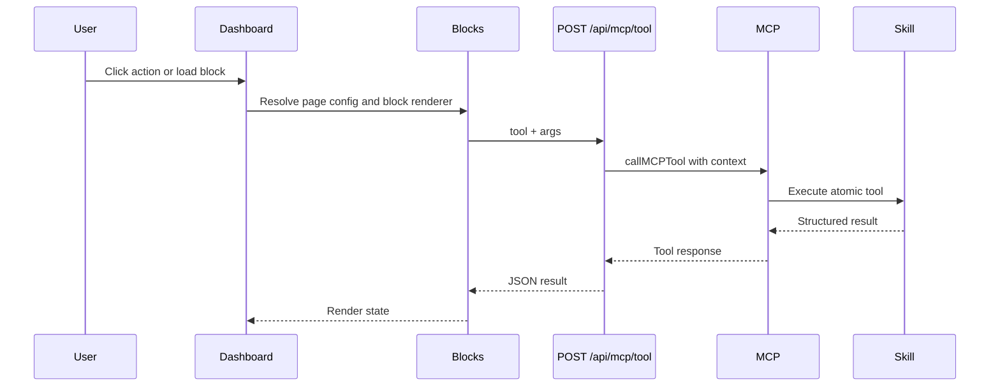

# Dashboard Architecture

The dashboard is Augur's local browser surface. It renders Browse, Workspace, blocks, setup state, actions, and diagnostics without bypassing the same MCP execution path used by AI clients.

```mermaid
sequenceDiagram
  participant User
  participant Dashboard
  participant Blocks
  participant Api as POST /api/mcp/tool
  participant MCP
  participant Skill

  User->>Dashboard: Click action or load block
  Dashboard->>Blocks: Resolve page config and block renderer
  Blocks->>Api: tool + args
  Api->>MCP: callMCPTool with context
  MCP->>Skill: Execute atomic tool
  Skill-->>MCP: Structured result
  MCP-->>Api: Tool response
  Api-->>Blocks: JSON result
  Blocks-->>Dashboard: Render state
```

## Import architecture (@/ vs @/features/)

ADR-490 partitions dashboard imports by stability:

- `@/` points at stable dashboard framework code: UI primitives, MCP clients, plugin runtime, block renderer, server utilities.
- `@/features/` points at volatile feature code: domain components, hooks, pages, and local feature libraries.

Framework code must not import feature code. Feature code may import framework code. Generated registry files are the narrow exception.

## MCP-only data flow

Dashboard data flows through MCP. It should not call LLM APIs directly, read arbitrary files with `fs`, spawn Python scripts, or hide workflow execution in API routes.

The dashboard can render, dispatch, validate, and transport. It does not become a second executor. This keeps dashboard clicks aligned with CLI and AI-client behavior.

## The /api/mcp/tool boundary

`apps/dashboard/app/api/mcp/tool/route.ts` is the generic transport boundary. It accepts `tool` plus `args` or `params`, extracts MCP context from the request, calls `callMCPTool`, and returns JSON.

The route also handles compatibility envelopes and plugin fallback responses for unavailable tools. It does not decide workflows; it forwards one MCP tool call and reports the result.

## Rule-11 exemptions (ADR-817)

Rule 11 forbids the dashboard server from owning `spawn`/`exec`/direct-`fs`/LLM calls; data flows via `callMCPTool` (server-side) → MCP. Each server-side spawn/exec/fs site gets one of three dispositions:

- **Migrate** — anything an MCP tool already covers routes through `callMCPTool`. Examples: the capabilities route sources skills from `list-skills`; file/dir/settings opening goes through `system-open`.
- **Delete** — utilities that become dead after migration are removed (e.g. the former `lib/server/{cliRunner,pythonRunner}.ts`).
- **Permanent exemption** — surfaces that genuinely require a process and have no request/response MCP equivalent stay, marked with a `@spawn-exempt` or `@fs-exempt` comment naming the reason + ADR-817.

**Marker convention:** put `// @spawn-exempt: <why>. See ADR-817.` (or `@fs-exempt`) directly above the call. Current permanent exemptions:

| Surface | Marker | Why |
|---|---|---|
| Interactive PTY terminal (`api/cli/route.ts`, `api/cli/actions.ts`, `api/cli/exec/route.ts`) | `@spawn-exempt` | A live interactive terminal needs a long-lived bidirectional process; not a request/response tool. Buffers bounded (ADR Phase 1). |
| Preferred-editor / cross-platform open (`app/actions.ts` `spawnCommand`) | `@spawn-exempt` | Opens a file in the user's chosen editor (app-specific invocation), not a default-open. |
| Native file-picker dialog (`lib/server/spawn.ts` `runCommand` → `pickAudioFile`) | `@spawn-exempt` | Interactive OS dialog (`osascript`), like the terminal. |
| Native terminal launcher (`lib/server/nativeTerminal.ts`) | `@spawn-exempt` | Intentional handoff to a native terminal app. |
| CLI session-state write + local config read (`api/cli/cli-config.ts`) | `@fs-exempt` | Hot, PTY-coupled session write; read-only local YAML config. |
| ADR archive extraction (`api/adrs/extract/route.ts`) | `@spawn-exempt` (ADR-642) | Unzips archived ADRs. |
| Upload/ingest staging writes (`api/ingest/upload`, `api/cli/upload`) | `@fs-exempt` | Persists uploaded bytes to the staging dir. |

A new server-side spawn/exec/fs without one of these markers is rule-11 debt.

## Two-surface model and skill page declaration

The dashboard has exactly two surfaces: **Browse** (`/browse`) and **Workspace** (`/workspace`). There is no hub-nav concept. Skills declare their Workspace pages via `x-augur-dashboard-pages` in SKILL.md frontmatter; dashboard mount scripts discover those declarations and generate route registries and tab entries.

Sidebar navigation (ADR-821): Browse is the fixed top nav entry. Workspace is **not** a sidebar nav link — it is reached via Browse → **Pages** or by direct URL. Below Browse, the sidebar surfaces a **Pinned** section that lists pinned Browse items grouped by category (journey order), newest-pinned first, with a deep-link to `/browse?category=&item=` that preselects the card.

Generated files under `apps/dashboard/app/workspace/` or generated registries should be treated as output. Source edits belong in the skill, feature, page YAML, or dashboard framework file that generated them.

## Block renderer and config-driven pages

ADR-491 makes config-driven pages first-class. Page YAML and block configs describe what to render; framework renderers such as `components/blocks/BlockRenderer.tsx` and plugin section renderers load data through MCP-backed hooks.

This lets skills add pages without writing bespoke route code for every view, while preserving a single dashboard shell and MCP data path.

## Browse page taxonomy

Browse is the user's index of Augur content and system surfaces. ADR-541 splits taxonomy, visibility, and logs; ADR-728 adds lifecycle ordering and journey group delimiters.

Browse rows are not just navigation cards. They carry ownership, exposure, management, status, and action metadata used by capability policy and drift tooling.

### Discovery contract — every tab is the shared file-card mechanism

Browse is a **discovery surface**. Every tab renders the same primitive: a grid (or
table) of *file cards*, one card per indexed item, built from a `BrowseItem` whose
`metadata` drives the card's badges, tags, and actions. A tab is a filter over a
category of items — not a place to mount a bespoke panel.

When a new signal needs to reach the user (an audit result, a health score, a drift
finding), it **rides an existing file card** — it does not get its own `ViewMode`.
Concretely:

- **Per-item findings** join onto that item's `BrowseItem.metadata` and surface as a
  card tag/badge plus a section in the detail panel. The transforms that build the
  tags (`getSkillStateTags`, `BrowseCard.collectBadges`) are metadata-driven, so the
  join is just additional metadata keys — no new rendering path.
- **Findings with no owning item** ride the nearest related card. Example: ADR-741
  check-resolvable `stale_capability_entries` point at deleted skills, so they ride
  the `mcp-tools` capability card, not a skill card. The audit has **no browse view
  of its own** — see `apps/dashboard/lib/browse/skillCoverage.ts`.
- **Catalog aggregates** belong on a hub dashboard card or stay in CLI/MCP — not as a
  browse tab.

The single sanctioned exception is a genuine **manager surface** — an interactive
install/configure/rebuild console such as `extensions-bundles`. Those are action
surfaces, not discovery content, and may render a custom panel. A bespoke,
`devOnly`-gated browse view that bypasses the file-card grid (the original ADR-741
`skill-coverage` view, since removed) is an architecture violation: it splits the
discovery mechanism and needs out-of-band toggles to even render.

Rule of thumb when adding a browse signal: *which existing card does this belong on?*
If the answer is "none," it is probably a hub dashboard card or a CLI/MCP report — not
a new tab.

Per-item Browse actions follow the same ownership rule. Skill-specific action
catalogs live in the owning skill at `augur/browse-actions.yaml`; the dashboard
build validates and merges those files into the ignored
`apps/dashboard/lib/browse/generated-item-actions.ts` registry. Use `kind: ai`
for editable chat drafts and `kind: direct` only for MCP tools exposed to the
dashboard route. CLI-only, destructive, credential, or raw-runner flows must stay
AI-guided unless a governed dashboard MCP surface exists.

## Setup Completeness Widget

ADR-722 adds a persistent setup signal in the sidebar and settings header. The widget tracks 11 milestones across Foundation, Knowledge, and Personalization. It consumes setup status through MCP rather than reading local files from React or a dashboard API route.

The widget quiets as setup completes and re-asserts in amber when previously completed evidence regresses.

## Implementation pointers

- `apps/dashboard/app/api/mcp/tool/route.ts` is the MCP transport route.
- `apps/dashboard/lib/mcp/` contains dashboard MCP clients and hooks.
- `apps/dashboard/components/blocks/` and `apps/dashboard/components/plugin/` contain renderer infrastructure.
- `apps/dashboard/scripts/mount-plugins.ts` and `apps/dashboard/scripts/mount/` generate mounted pages and registries.
- See [architecture-capability-exposure.md](./architecture-capability-exposure.md) for exposure policy and [architecture-onboarding.md](./architecture-onboarding.md) for setup state.
