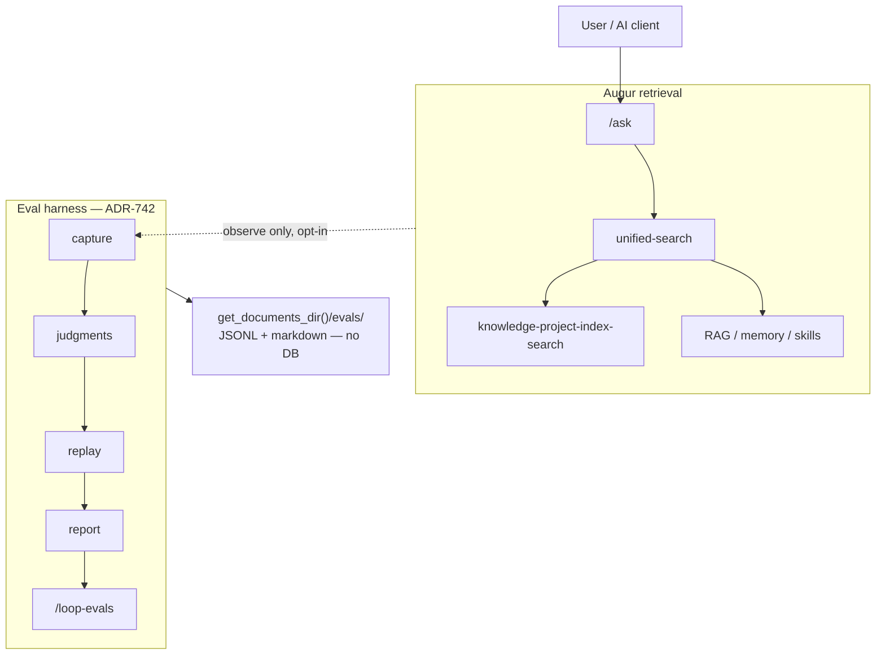
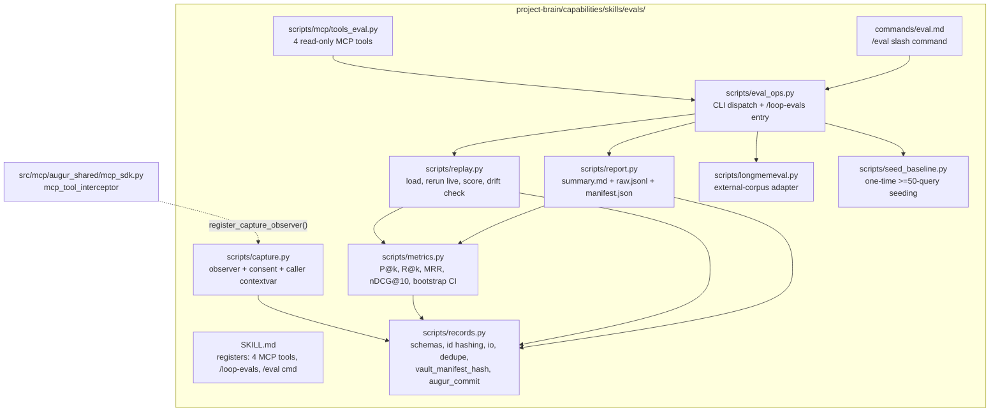
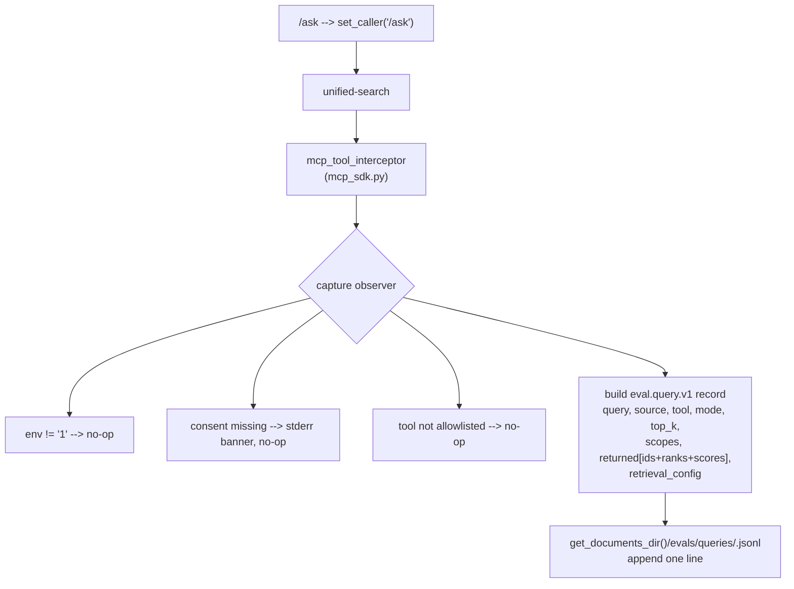
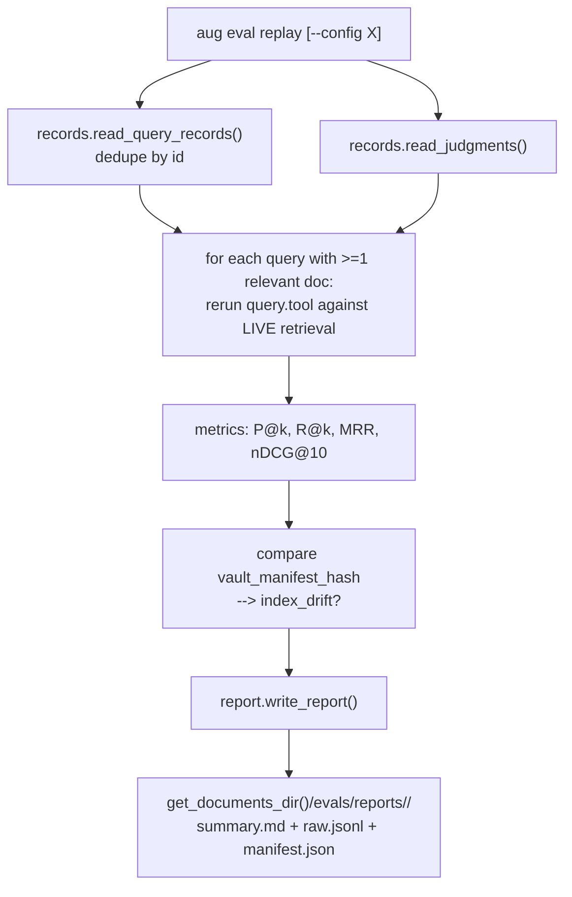
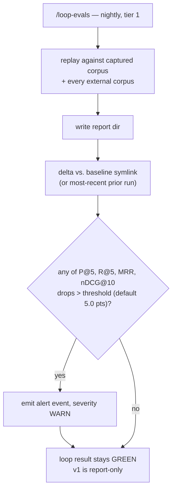

# Eval Harness Architecture

The eval harness is Augur's retrieval regression safety net. It captures real queries (opt-in, with consent), replays them against current retrieval, and scores precision/recall@k, MRR, and nDCG@10 — so any regression in `unified-search` or `/ask` quality is measured instead of merely felt. It sits beside retrieval, never inside it: it observes and replays, but never alters how retrieval behaves.

> **Design spec**: `docs/superpowers/specs/2026-05-13-eval-harness-design.md` is normative for the measurement contract. **Implementation plan**: `docs/superpowers/plans/2026-05-13-eval-harness.md`. **Slate context**: `docs/superpowers/plans/2026-05-13-gbrain-borrow-slate.md` (Phase 2).

## System context



Three principles, inherited from the gbrain borrow slate's boundary rules and non-negotiable:

1. **File-first.** Every artifact is append-only JSONL or markdown. The `cat <file>` test passes everywhere. No SQLite, no PGLite, no pgvector.
2. **No Augur-side LLM calls.** Capture observes; replay measures. Neither calls a model. Future label-assist via `oneshot` dispatch is out of v1 scope.
3. **Off by default.** Capture is inert unless `AUGUR_CONTRIBUTOR_MODE=1` *and* an explicit `consent.md` exists.

## Component map

Everything ships inside one new skill, `project-brain/capabilities/skills/evals/` (group `dev`). Exactly one line of code lands outside the skill — the observer registration in `src/mcp/augur_shared/mcp_sdk.py`.



`records.py` is the leaf — everything depends on the schemas, nothing depends back up. `eval_ops.py` is the orchestrator. `capture.py` is the only module the rest of Augur imports.

## Capture path — opt-in, write side



The observer is wrapped in `try/except` — a broken eval skill logs WARN and is swallowed; it can never break live search. The env var is read per call, so the user can toggle contributor mode mid-session. `/ask` dispatches into `unified-search` internally, so capture happens once, at the retrieval-tool boundary, tagged with a `source` field via a contextvar — never double-captured.

## Replay path — measurement, read side



Replay reruns each captured query against *current* retrieval — that is the point: it tests today's code, not the returned set frozen at capture time. Queries with no labeled relevant docs are skipped and counted under `unlabeled_queries` — they measure a labeling gap, not retrieval quality.

## Loop path — nightly, report-only



v1 is report-only; CI-blocking is a v2 evolution after one stabilization release, mirroring the ADR-741 pattern.

## Storage layout

All under `get_documents_dir()/evals/` — user-controlled, deletable, gitignored.

```
get_documents_dir()/evals/
├── consent.md ─────────────── opt-in record (UTC timestamp + terms);
│                              capture is suppressed until this file exists
├── queries/
│   └── <YYYY-MM-DD>.jsonl ─── append-only eval.query.v1 records, daily rotation
├── judgments/
│   └── <query-id>.md ──────── eval.judgment.v1 — frontmatter lists relevant_doc_ids,
│                              hand-labeled, composable
├── reports/
│   ├── <run-id>/ ──────────── summary.md + raw.jsonl + manifest.json per replay
│   └── baseline/ ──────────── user-managed symlink → the chosen baseline run
├── external/
│   └── <corpus-id>/ ───────── LongMemEval drop, adapted to query.v1 + judgment.v1
└── exports/
    └── <run-id>.zip ───────── eval-export bundles (date-range portable archives)
```

Rationale:

- **Daily JSONL rotation** — a torn tail never corrupts the prefix; queries are recoverable from logs.
- **One judgment file per query id** — `id = sha1(query+source)[:12]`, so the same query folds into the same id and one judgment covers every future invocation.
- **Report as a directory, not a file** — `raw.jsonl` lets you recompute aggregates without rerunning replay; `manifest.json` pins the index state.

## Integration points

The harness touches the rest of Augur in exactly five places; everything else is self-contained inside the skill.

| # | Touchpoint | Change | Why |
|---|---|---|---|
| 1 | `src/mcp/augur_shared/mcp_sdk.py` | One guarded import + one observer-consult line inside `mcp_tool_interceptor` | The interceptor already wraps every MCP tool — the cleanest single hook point for opt-in capture |
| 2 | `plugins/augur/skills/ask/` command body | `capture.set_caller("/ask")` before its `unified-search` dispatch | Tags captured records with `source: "/ask"` so the report can bucket `/ask` vs. direct calls — avoids double-capture |
| 3 | `config/system/capability_exposure.yaml` | 4 × `mcp-tool:eval-*` entries + 1 × `command:eval:` entry | New MCP tools *and* new slash commands both need a capability entry to project to client surfaces |
| 4 | Loop registry (`x-augur-loop` in `SKILL.md`, possibly a registry file) | `/loop-evals` — tier 1, nightly | Nightly regression check |
| 5 | Internal decision index + ADR-742 frontmatter | Status flip Proposed to Accepted to Implemented; set `spec_file` / `plan_file` | Status discipline per the slate plan |

The asymmetry is deliberate: the harness reads broadly (every retrieval call, the whole vault manifest) but writes narrowly (only under `get_documents_dir()/evals/`, plus the five integration points above).

## Boundaries — what the harness does not do

- **Does not** alter retrieval behaviour. `--config` lets *replay* swap configs; live `unified-search` is never touched.
- **Does not** capture vault content. Records hold query text + doc *ids* + ranks + scores + timestamps + retrieval config. Never document bodies, never LLM responses.
- **Does not** call an LLM. Not in capture, not in replay, not in the loop.
- **Does not** use a database. JSONL + markdown only.
- **Does not** tune retrieval. It reports; humans (or a later `oneshot` dispatch) decide.
- **Does not** ship a dashboard page in v1. CLI + nightly loop only; a `/dev` browse card is a v2 addendum once enough captured data exists to make it meaningful.
- **Does not** block merges in v1. `/loop-evals` is report-only; CI-blocking is a v2 evolution.

## The measurement contract

The design spec §4.4 is normative; this is the shape every later slate ADR is tested against.

```
eval.query.v1     ─── what retrieval returned, at capture time
eval.judgment.v1  ─── what SHOULD have been returned, hand-labeled
      │
      └──► replay scores the gap:
               P@k    = |top_k ∩ relevant| / k          (denominator is k, always)
               R@k    = |top_k ∩ relevant| / |relevant| (skip if |relevant| == 0)
               MRR    = 1 / rank_of_first_relevant       (over the FULL retrieved list)
               nDCG@10= DCG@10 / IDCG@10                 (binary gain, v1)
      │
      └──► aggregate = unweighted mean across labeled queries
                        + stderr (cheap, every run)
                        + bootstrap 95% CI (baseline + nightly only)
```

Two choices ripple downstream and are worth flagging at the architecture level:

- **P@k denominator is `k`, not `min(k, |retrieved|)`** — a system that returns too few results is penalized. Matches the gbrain reference and the IR literature.
- **MRR is computed over the full retrieved list** — a relevant doc at rank 50 yields 1/50, not 0. This keeps MRR sensitive to deep-rank regressions that P@5 would miss.

## Forward-compatibility surface

Later slate ADRs extend the harness; they do not replace it. The query schema is intentionally minimal and additive.

| ADR | Extension | Schema impact |
|---|---|---|
| ADR-738 typed graph | `retrieval_config` gains optional `graph_axis_weight` | Additive — no `_schema` bump |
| ADR-739 RRF + modes | `mode` values acquire semantic meaning (conservative/balanced/tokenmax); `rrf_k` / `rrf_weights` populate (reserved, null in v1); per-mode breakdown becomes meaningful | Additive — no `_schema` bump |
| ADR-740 compiled-truth | New doc-id namespace `timeline://` | Scoring unchanged |
| ADR-744 dream cycle | Emits queries via the same allowlist, new `source: "dream-cycle"` | Additive |

Rule: any change to the *meaning* of a captured field is a `_schema` bump plus a migration script — never silent. Additive fields need neither.

## Failure modes and safety

| Failure | Containment |
|---|---|
| Capture observer throws on a malformed result | `try/except` → WARN log, swallowed. Live search is unaffected. |
| Eval skill missing or broken at import time | Guarded import in `mcp_sdk.py` → no-op observer. MCP tool registration still succeeds. |
| Contributor mode left on accidentally | Still gated by `consent.md`. No consent file → no capture, regardless of env var. |
| Vault changes between capture and replay | `vault_manifest_hash` mismatch → report flags `index_drift: true` with an add/remove/modify count. The number is still produced but marked non-comparable. |
| Unseeded randomness in a retrieval path | Documented requirement: seed RNG from `query.id`. Non-determinism surfaces as wide `bootstrap_ci_95`. |
| Baseline ossifies into a ceiling | Baseline is a user-managed symlink, not enforcement. The loop alerts; it never blocks. |

## Rollback

Clean and reversible — no schema migration, no vault touch.

1. Revert merge commit(s).
2. Remove the five integration-point changes (capability entries, `mcp_sdk.py` line, `/ask` `set_caller`).
3. Delete `project-brain/capabilities/skills/evals/`.
4. Captured data under `get_documents_dir()/evals/` is preserved by default — rollback does not destroy the user's work.
5. Flip ADR-742 back to Proposed.
