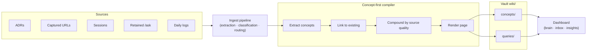
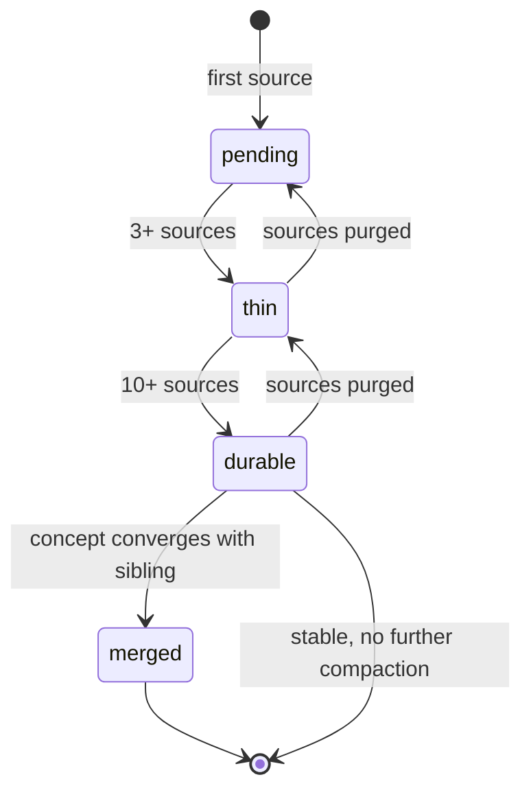

# Augur LLM Wiki

The **LLM Wiki** is Augur's compiled knowledge layer. Inputs (ADRs, captured URLs, sessions, retained `/ask` outcomes, daily logs) flow through a concept-first compiler into durable concept pages weighted by source quality. Two claims anchor this document: re-asking a question retrieves the **synthesized concept**, not the source — knowledge that compounds — and the wiki lives on the user's machine, exposed through MCP, so any AI client can read from the same compiled base. Compounding knowledge is the user benefit; local-first portability is the moat.

## What the LLM Wiki is

The wiki is a **compiled knowledge base**, not a note-taking app. Notes are an input; the wiki is the output of a synthesis pipeline.

Inputs flow from the ingest pipeline (URLs and files captured through the dashboard or `/ingest-url`), from session retention (durable conversation outcomes), from ADRs (architectural decisions stored in the user's external documents repo), from retained `/ask` outcomes, and from daily logs. The pipeline extracts concepts, links them against existing concepts, and compounds sources into pages weighted by source quality.

The wiki lives under the user's vault (`wiki/concepts/`, `wiki/queries/`, `wiki/sources/`). It is not a hosted service. Re-installing Augur does not lose the wiki; switching machines does not lose the wiki — it travels with the vault.

This distinguishes the wiki from RAG-over-raw-sources: RAG retrieves the source chunk; the wiki retrieves the **synthesized concept** with its provenance. Both surfaces co-exist; the wiki is the durable layer.

## How the pipeline works

Four compiler phases run sequentially. **Extraction** turns raw source into candidate concepts. **Linking** matches candidates against existing concept pages so duplicate ideas merge instead of forking. **Compounding** weighs sources by quality and confidence — a single high-confidence ADR carries more weight than ten weak captures of the same topic. **Rendering** writes the page to the vault.

ADR-559 added ambient file import as an ingest source. ADR-560 was the original semantic page compiler; it was superseded by ADR-561, which introduced the concept-first compiler. ADR-564 surfaces the brain/inbox/wiki insights through the dashboard so the user sees compounding mechanics and health metrics in real time.

The dashboard reads from `wiki/concepts/` and `wiki/queries/` directly; the same files are exposed to AI clients through MCP, so a Claude or Codex session retrieves from the same compiled knowledge the dashboard renders.

## Concept page lifecycle

A concept page evolves as it accumulates sources. **Pending** (1–2 sources) means the concept exists but is not yet usable for retrieval — the wiki holds it as a stub. **Thin** (3–5 sources) means the page is real but undercompounded; retrieval works but quality is variable. **Durable** (10–15 sources) is the target state — the page is dense enough that re-asking returns the synthesized answer rather than a single source. **Merged** is the terminal state for sibling concepts that converge: when two pages describe the same idea from different framings, the compiler folds them into one.

The arrows backward exist on purpose. If sources are purged (a captured URL becomes stale, a session is forgotten), a page can drop from `durable` back to `thin`. The system tracks compounding health (average sources per page, thin-page count, orphan-page count, duplicate-cluster count) and surfaces it in the dashboard.

## Compounding mechanics — the worked example

A user captures a URL on day 1 → the wiki creates a `pending` concept page. On day 5, a retained `/ask` outcome references the same idea → the page reaches `thin`. On day 12, an ADR ingestion adds three more sources → still `thin`. Six more sessions over the next month each touch the topic → the page reaches `durable`. On day 35, the user re-asks the original question through any MCP-capable client → retrieval returns the durable concept page with its synthesis, not the original URL.

The compounding effect is not linear. A single high-confidence ADR can carry a page from `pending` directly through `thin` because the source quality weighting accounts for type. Casual captures need volume; structured decisions don't.

## Why this is defensible

**Concept-compounding is the user benefit.** Re-asking a question retrieves the synthesized concept, not the source. The wiki gets denser per-input as it grows — the same input produces more value once a concept page is `durable` than when it was `pending`. Compounding knowledge is rare in the AI-tools category; most products treat each query as fresh.

**Local-first, MCP-exposed is the moat.** The wiki is the user's knowledge, on their machine, exposed through MCP so any AI client reads from the same compiled base. No vendor silo. Portability is structural, not a roadmap promise — the vault is files in directories, versioned with git, owned by the user. A competitor with a hosted-only wiki cannot copy this without reversing their data-ownership model. A competitor that ships local files but not MCP-exposed cannot give the user multi-client portability without rebuilding their integration model.

## Where this lives in the repo

- `skills/ingest/scripts/wiki_*.py` — concept-first compiler (extraction, linking, compounding, page rendering).
- `skills/knowledge/` — RAG over the vault and the wiki.
- ADR-559 (ambient ingest), ADR-560 (semantic compiler, superseded), ADR-561 (concept-first compiler), ADR-564 (insights surface).
- Vault paths: `wiki/concepts/`, `wiki/queries/`, `wiki/sources/`.

## Where to go next

- [architecture-overview.md](./architecture-overview.md) — the three-layer model and named subsystems.
- [architecture-autoloops.md](./architecture-autoloops.md) — the other architecture deep-dive.
- [ROADMAP.md](../ROADMAP.md) — public release plan with status markers.
