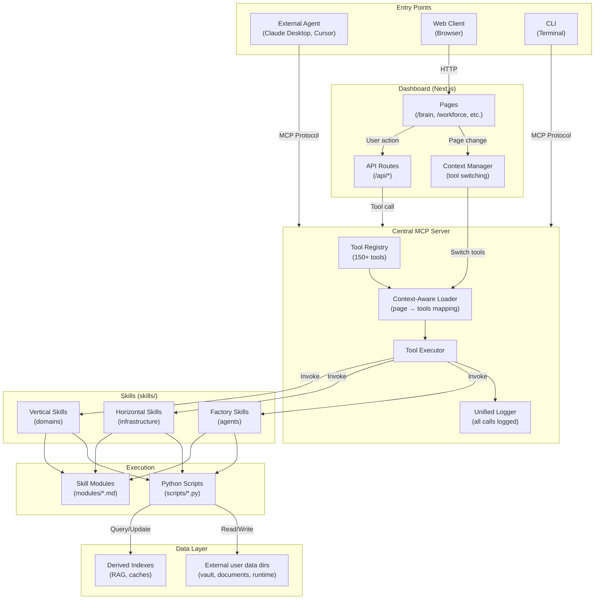
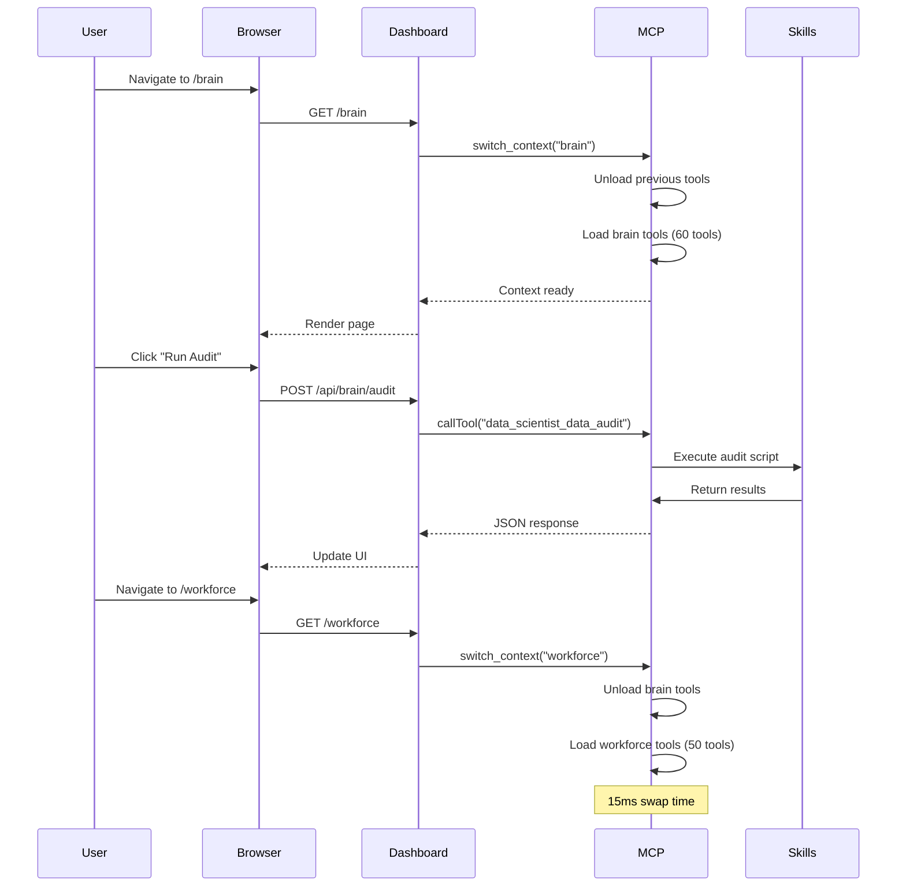

# Central MCP Gateway Architecture

**Date**: 2026-01-13
**Status**: Active (Phase 4 migration in progress)

This document describes the Central MCP Gateway pattern - the architectural decision to route supported execution through a single MCP server.

This is the current soft-launch architecture story: supported user-facing paths should route through MCP, while documented transition paths may still exist during migration.

## Core Principle

> **All supported execution flows route through MCP.**

```
┌─────────────────────────────────────────────────────────────────┐
│                    SINGLE POINT OF EXECUTION                    │
│                                                                 │
│   External Agent ──┐                                            │
│   (Claude, GPT)    │                                            │
│                    │      ┌──────────────────────┐              │
│   Dashboard UI ────┼─────►│   CENTRAL MCP SERVER │──► Skills    │
│   (Next.js)        │      │                      │              │
│                    │      │  • Unified logging   │              │
│   CLI ─────────────┘      │  • Context switching │              │
│   (Terminal)              │  • Tool registry     │              │
│                           └──────────────────────┘              │
└─────────────────────────────────────────────────────────────────┘
```

## Why Central MCP?

### The Core Problem: Context Repository

Augur is fundamentally a **context repository** - a unified knowledge base that serves both humans and AI agents. The central challenge is enabling users to work seamlessly whether they're:
- Clicking buttons in the Dashboard UI
- Chatting with Claude Desktop or Cursor
- Running CLI commands

**Without Central MCP**, each entry point would have its own execution path, leading to:
- Different behavior between GUI and agent interactions
- Fragmented context (agent doesn't know what user did in UI)
- No single source of truth for what actions were taken

**With Central MCP**, supported execution flows go through one gateway, ensuring:
- **Identical context and flow** - Same skill executes whether triggered by button click or agent command
- **Unified history** - Complete audit trail regardless of entry point
- **Seamless switching** - User can start in GUI, continue with agent, return to GUI

### Problems with Direct Execution

Before MCP centralization, the dashboard called Python scripts directly:

```typescript
// ❌ OLD PATTERN - Scattered execution
const result = spawn('python', ['skills/example/scripts/audit.py']);
```

**Issues:**
- No unified logging (debugging nightmare)
- No permission control
- Duplicate error handling in every route
- No context awareness
- Can't track what's running
- **GUI and agents see different state**

### Benefits of Central MCP

```typescript
// ✅ NEW PATTERN - Central gateway
const result = await mcpClient.callTool('skill_action', params);
```

**Benefits:**
- **Seamless GUI ↔ Agent experience** - Same execution path, same context
- **Single log stream** - All tool calls visible in one place
- **Context-aware loading** - Only relevant tools loaded per page
- **Unified error handling** - Consistent responses
- **Permission model** - Tools declare read/write intent

## Component Flow Diagram



## Context-Aware Tool Loading

When user navigates the dashboard, MCP dynamically loads relevant tools:



## Tool Context Mapping

Each dashboard page maps to a set of MCP tools:

| Page | Tools Loaded | Count |
|------|--------------|-------|
| `/brain` | RAG, bugs, intelligence, metrics | ~60 |
| `/workforce` | Chains, agents, weights, telemetry | ~50 |
| `/careers` | Job analyzer, interview prep, contacts | ~40 |
| `/settings` | Skills management, config | ~20 |
| *Closed* | Core tools only | ~10 |

**Implementation**: `src/mcp/augur_mcp/tool_controller.py`

## API Route Pattern

All API routes now use one of two patterns:

### Pattern 1: MCP Tool Call (Preferred)

```typescript
// lib/mcp/createAPIRoute.ts
export const POST = createAPIRoute({
  tool: 'data_scientist_data_audit',
  params: (req) => ({ scope: req.query.scope }),
});
```

### Pattern 2: Python Runner (Transition)

For complex cases not yet migrated to MCP tools:

```typescript
// lib/server/pythonRunner.ts
import { runPythonScript } from '@/lib/server/pythonRunner';

export async function POST(req: Request) {
  const result = await runPythonScript(
    'skills/example/scripts/data_audit.py',
    ['--scope', scope]
  );
  return Response.json(result);
}
```

## Debugging

All MCP calls are logged centrally:

```bash
# View MCP logs
python -c "from pathlib import Path; from src.config.paths import get_logs_dir; print(Path(get_logs_dir()) / 'mcp.log')"

# Or in dashboard
http://localhost:3000/dev/mcp-logs
```

Log format:
```json
{
  "timestamp": "2026-01-13T14:30:00Z",
  "tool": "data_scientist_data_audit",
  "params": {"scope": "all"},
  "duration_ms": 1234,
  "status": "success",
  "source": "dashboard:/brain"
}
```

## Anti-Patterns

### ❌ Direct subprocess calls

```typescript
// WRONG - bypasses MCP
import { spawn } from 'child_process';
const proc = spawn('python', ['script.py']);
```

### ❌ Importing Python directly

```typescript
// WRONG - no logging, no context
import { runPythonCode } from 'some-lib';
await runPythonCode('import my_script; my_script.run()');
```

### ✅ Correct pattern

```typescript
// RIGHT - goes through MCP
const result = await mcpClient.callTool('skill_action', params);
```

## Related Documents

- ADR-005: MCP Execution Gateway
- Vision: Context-Aware MCP
