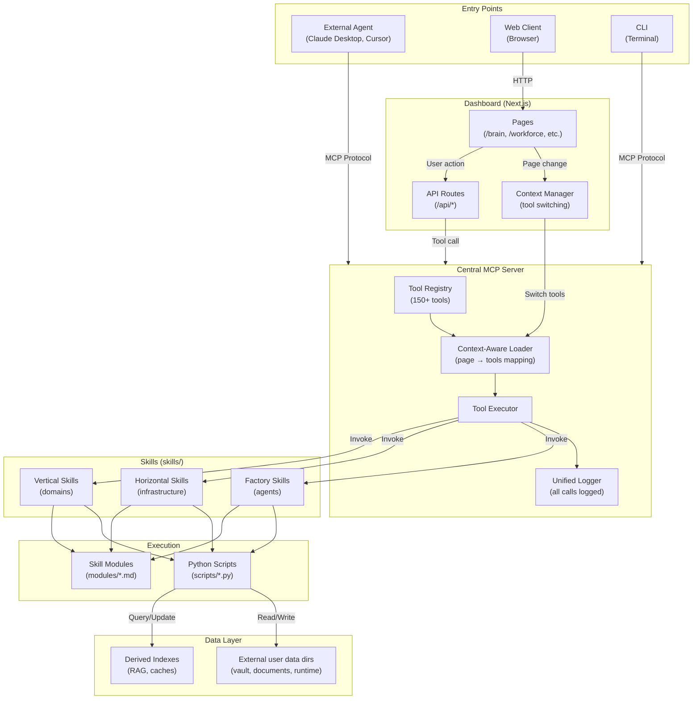
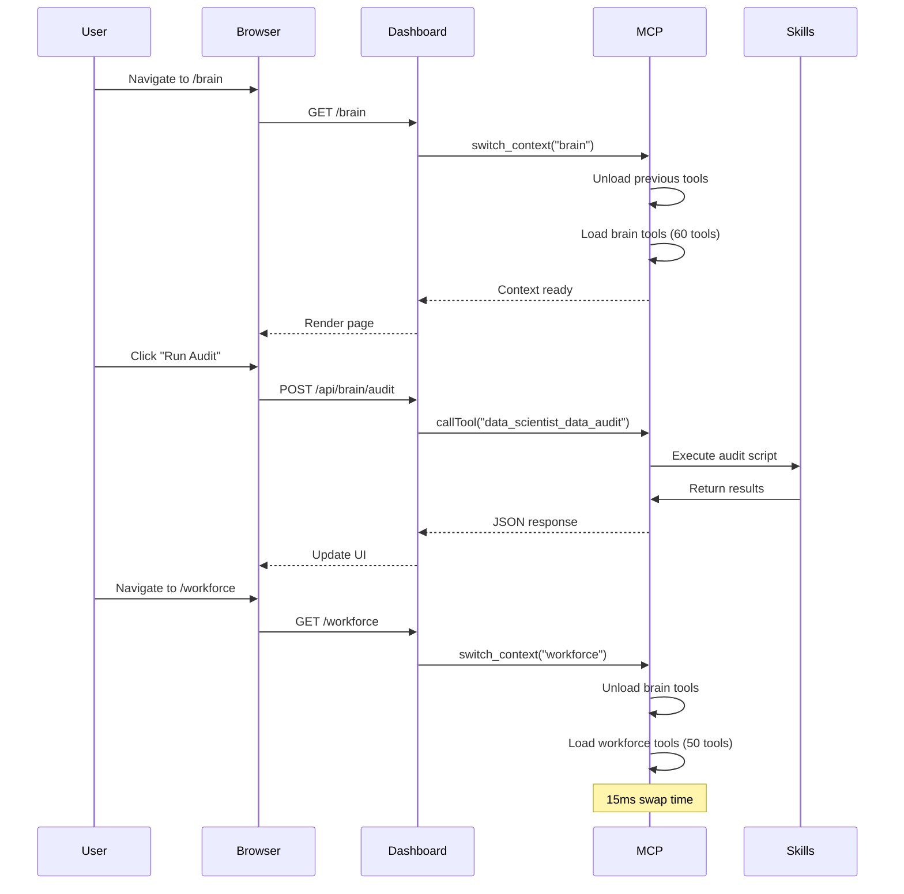

# The Connection Layer (MCP Gateway, sync_agents, CLI, Plugin Packages)

The Connection Layer is every channel by which the effective [Harness](./architecture-overview.md#the-harness) reaches your AI clients. Augur resolves brain layers (Global/User/Team/Project), computes the effective harness, and projects client-native output for each supported AI client. The same MCP server, vault-backed memory, and local execution boundary are shared by every client in the active session.

This document specifies the seven channels of the Connection Layer.

> Filename note: this doc is named `architecture-mcp-gateway.md` for URL stability with the public release allowlist. Its scope is broader than MCP — it covers every channel the Harness uses to reach a client. The MCP server is one of those channels; not the only one.

## The Connection Layer in one diagram

```
              Brain layers: Global + User + Team + Project
                                     │
              Canonical sources: agent rules, skills, commands, agents,
                       MCP policy, memory/profile
                                     │
                            Connection Layer
                                     │
   ┌──────────────┬──────────────┬───┴────┬──────────────┬──────────────┬─────────────┐
   │              │              │        │              │              │             │
 MCP        sync_agents      Augur CLI  Plugin      Hooks sync    Settings sync   Reverse
 server      (per-client     (shell      package     (cross-agent  (per-client    direction
 (atomic     instruction      entry      adapters    git hooks +    config gen)   (clients
 tool       files)           point)      (effective  per-client                  write back
 surface)                                source →    tool hooks)                  to vault)
                                         packages)
   │              │              │        │              │              │             │
   ▼              ▼              ▼        ▼              ▼              ▼             ▼
 Claude Code   Codex CLI   Gemini CLI   Cursor       Copilot     (Antigravity, Windsurf,
                                                                  OpenCode, Cline)
```

## 1. MCP server

The local MCP server in `src/mcp/augur_mcp/` exposes every Augur skill as an atomic tool callable from any MCP-aware client. This is the shared execution surface — the "wrapping all five layers" callout from the Harness model.

Key properties:
- **One trust boundary**: every client connects to the same server.
- **Skill-declared tool surface**: skills declare their MCP tools in SKILL.md frontmatter (`x-augur-mcp-tools`); the server discovers them dynamically.
- **Dashboard parity**: Dashboard data flows through this same MCP server — there is no parallel REST API for skill data (see ADR-490 for the dashboard-MCP boundary).
- **Unified history**: every tool call goes through one path, so the audit trail is complete regardless of whether the trigger was a dashboard click, a CLI invocation, or an AI-client agent command.
- **No hidden reasoning layer**: MCP tools do not become the LLM. If a tool needs judgment or synthesis, it returns an agent handoff or validates agent-supplied output. Direct model/API access is a rare, explicit exception approved by the governing ADR/command/config.

See the **MCP Server — Implementation Reference** section at the bottom of this doc for the detailed Component Flow, Context-Aware Tool Loading, API Route Pattern, Debugging, and Anti-Patterns.

## 2. sync_agents

`sync_agents` (in `project-brain/capabilities/skills/ai/scripts/sync_agents/`) is the per-client instruction-file generator. It reads the canonical sources (the agent rules, project rules, hub map, capability policy) and writes each client's native format:

- **Claude Code**: `CLAUDE.md`, `.claude/skills/`, `.claude/commands/`, `.claude/agents/`
- **Codex CLI**: `CODEX.md`, `AGENTS.md`, `.codex/skills/`, `.codex/prompts/`
- **Gemini CLI**: `.gemini/GEMINI.md`, `.gemini/skills/`, `.gemini/settings.json`
- **Cursor**: `.cursor/rules/augur.mdc`, `.cursor/skills/`, `.cursor/agents/`
- **GitHub Copilot**: `.github/copilot-instructions.md`, `.github/skills/`
- **Also supported**: Antigravity, Windsurf, OpenCode, Cline (each has its own adapter)

This is the Constitution layer of the Harness, in motion.

## 3. Augur CLI

`src/cli.py` is the shell-side entry point. It exposes the skill registry without requiring an AI client to be running — useful for headless operations, scripts, CI, and the daemon. The CLI shares the registry with the MCP server, so a tool callable from Claude Code is also callable from `augur` on the shell.

## 4. Plugin Package Adapters

Per ADR-522 and ADR-553, the package adapters take the effective skill set from the resolved brain layers and produce client-native installable packages. In the current MVP release, those adapters live with the AI skill's `sync_agents` implementation under `project-brain/capabilities/skills/ai/scripts/sync_agents/adapters/` and `project-brain/capabilities/skills/ai/augur/adapters/`.

- **Claude plugin package** (`.claude-plugin/plugin.json`)
- **Codex plugin package** (`.codex-plugin/plugin.json`)
- **Gemini extension**
- **Cowork DXT bundle** — Claude Desktop / Cowork onboarding (see ADR-576)

One install per client, whole project inherits. This is the Plugins layer of the Harness, in motion.

## 5. Hooks sync

Hooks fire deterministically — they're shell, not AI. The Hooks layer of the Harness has two scopes:

- **Cross-agent**: `.githooks/` and `.pre-commit-config.yaml` fire for every client because they're git-time, not tool-time. Pre-commit auto-lint, conflict-marker blockers, dashboard-shortcut guards, worktree-leak detectors. One commit, every agent honored the rule.
- **Per-client**: tool-time enforcement. `.claude/settings.json` PreToolUse/PostToolUse hooks; `.codex/hooks.json` equivalent. These let Claude Code or Codex block a destructive command before it runs.

Cross-agent hooks are the default because they enforce uniformly. Per-client hooks fill in tool-time gaps that git can't see (e.g., a destructive command that doesn't touch the filesystem).

## 6. Settings sync

Generated, not hand-authored:

- `.claude/settings.json` (Claude Code)
- `.codex/config.toml` (Codex CLI)
- `.cursor/mcp.json` (Cursor)
- `.gemini/settings.json` (Gemini CLI)
- `.windsurf/mcp.json` (Windsurf)

The settings sync writes the MCP server config, hook config, and per-client preferences. The user never hand-edits these — they regenerate from the effective harness sources.

## 7. The reverse direction (shared memory)

The Connection Layer is bidirectional. Clients write to the MCP server, the MCP server writes to the vault (your local second brain), and the vault is shared back across every client in the same session.

A `/ask` query in Claude Code retains its answer in the vault. The next session in Codex sees the same retained answer. The wiki compounding signal fires from one client's session; the next client's session loads the updated wiki context at the next session start.

This is what makes "same memory across clients" real — not a marketing claim, but the result of every client writing to and reading from the same local vault through the same MCP server.

---

# MCP Server — Implementation Reference

The remainder of this document is the implementation reference for channel 1 (MCP server). It pre-dates the Connection Layer reframe and is preserved as the canonical detailed reference for the MCP-specific channel.

## Component Flow Diagram


```mermaid
flowchart TB
    subgraph Clients["Entry Points"]
        ExtAgent["External Agent\n(Claude Desktop, Cursor)"]
        WebClient["Web Client\n(Browser)"]
        CLI["CLI\n(Terminal)"]
    end

    subgraph Dashboard["Dashboard (Next.js)"]
        Pages["Pages\n(/brain, /workforce, etc.)"]
        APIRoutes["API Routes\n(/api/*)"]
        ContextMgr["Context Manager\n(tool switching)"]
    end

    subgraph MCP["Central MCP Server"]
        ToolRegistry["Tool Registry\n(150+ tools)"]
        ContextLoader["Context-Aware Loader\n(page → tools mapping)"]
        Logger["Unified Logger\n(all calls logged)"]
        Executor["Tool Executor"]
    end

    subgraph Skills["Skills (skills/)"]
        Factory["Factory Skills\n(agents)"]
        Horizontal["Horizontal Skills\n(infrastructure)"]
        Vertical["Vertical Skills\n(domains)"]
    end

    subgraph Execution["Execution"]
        Scripts["Python Scripts\n(scripts/*.py)"]
        Modules["Skill Modules\n(modules/*.md)"]
    end

    subgraph Data["Data Layer"]
        DataRepo["External user data dirs\n(vault, documents, runtime)"]
        Indexes["Derived Indexes\n(RAG, caches)"]
    end

    %% Client connections
    ExtAgent -->|"MCP Protocol"| MCP
    WebClient -->|"HTTP"| Pages
    CLI -->|"MCP Protocol"| MCP

    %% Dashboard flow
    Pages -->|"Page change"| ContextMgr
    Pages -->|"User action"| APIRoutes
    APIRoutes -->|"Tool call"| MCP
    ContextMgr -->|"Switch tools"| ContextLoader

    %% MCP internal
    ToolRegistry --> ContextLoader
    ContextLoader --> Executor
    Executor --> Logger

    %% MCP to Skills
    Executor -->|"Invoke"| Factory
    Executor -->|"Invoke"| Horizontal
    Executor -->|"Invoke"| Vertical

    %% Skills to Execution
    Factory --> Scripts
    Horizontal --> Scripts
    Vertical --> Scripts
    Factory --> Modules
    Horizontal --> Modules
    Vertical --> Modules

    %% Data access
    Scripts -->|"Read/Write"| DataRepo
    Scripts -->|"Query/Update"| Indexes
```

## Context-Aware Tool Loading

When user navigates the dashboard, MCP dynamically loads relevant tools:


```mermaid
sequenceDiagram
    participant User
    participant Browser
    participant Dashboard
    participant MCP
    participant Skills

    User->>Browser: Navigate to /brain
    Browser->>Dashboard: GET /brain
    Dashboard->>MCP: switch_context("brain")
    MCP->>MCP: Unload previous tools
    MCP->>MCP: Load brain tools (60 tools)
    MCP-->>Dashboard: Context ready
    Dashboard-->>Browser: Render page

    User->>Browser: Click "Run Audit"
    Browser->>Dashboard: POST /api/brain/audit
    Dashboard->>MCP: callTool("data_scientist_data_audit")
    MCP->>Skills: Execute audit script
    Skills->>MCP: Return results
    MCP-->>Dashboard: JSON response
    Dashboard-->>Browser: Update UI

    User->>Browser: Navigate to /workforce
    Browser->>Dashboard: GET /workforce
    Dashboard->>MCP: switch_context("workforce")
    MCP->>MCP: Unload brain tools
    MCP->>MCP: Load workforce tools (50 tools)
    Note over MCP: 15ms swap time
```

## Tool Context Mapping

Each dashboard page maps to a set of MCP tools:

| Page | Tools Loaded | Count |
|------|--------------|-------|
| `/brain` | RAG, bugs, intelligence, metrics | ~60 |
| `/workforce` | Chains, agents, weights, telemetry | ~50 |
| `/careers` | Job analyzer, interview prep, contacts | ~40 |
| `/settings` | Skills management, config | ~20 |
| *Closed* | Core tools only | ~10 |

**Implementation**: `src/mcp/augur_mcp/tool_controller.py`

## API Route Pattern

All API routes now use one of two patterns:

### Pattern 1: MCP Tool Call (Preferred)

```typescript
// lib/mcp/createAPIRoute.ts
export const POST = createAPIRoute({
  tool: 'data_scientist_data_audit',
  params: (req) => ({ scope: req.query.scope }),
});
```

### Pattern 2: Python Runner (Transition)

For complex cases not yet migrated to MCP tools:

```typescript
// lib/server/pythonRunner.ts
import { runPythonScript } from '@/lib/server/pythonRunner';

export async function POST(req: Request) {
  const result = await runPythonScript(
    'skills/example/scripts/data_audit.py',
    ['--scope', scope]
  );
  return Response.json(result);
}
```

## Debugging

All MCP calls are logged centrally:

```bash
# View MCP logs
python -c "from pathlib import Path; from src.config.paths import get_logs_dir; print(Path(get_logs_dir()) / 'mcp.log')"

# Or in dashboard
http://localhost:3000/dev/mcp-logs
```

Log format:
```json
{
  "timestamp": "2026-01-13T14:30:00Z",
  "tool": "data_scientist_data_audit",
  "params": {"scope": "all"},
  "duration_ms": 1234,
  "status": "success",
  "source": "dashboard:/brain"
}
```

## Anti-Patterns

### ❌ Direct subprocess calls

```typescript
// WRONG - bypasses MCP
import { spawn } from 'child_process';
const proc = spawn('python', ['script.py']);
```

### ❌ Importing Python directly

```typescript
// WRONG - no logging, no context
import { runPythonCode } from 'some-lib';
await runPythonCode('import my_script; my_script.run()');
```

### ✅ Correct pattern

```typescript
// RIGHT - goes through MCP
const result = await mcpClient.callTool('skill_action', params);
```

## Related Documents

- ADR-005: MCP Execution Gateway
- Vision: Context-Aware MCP
