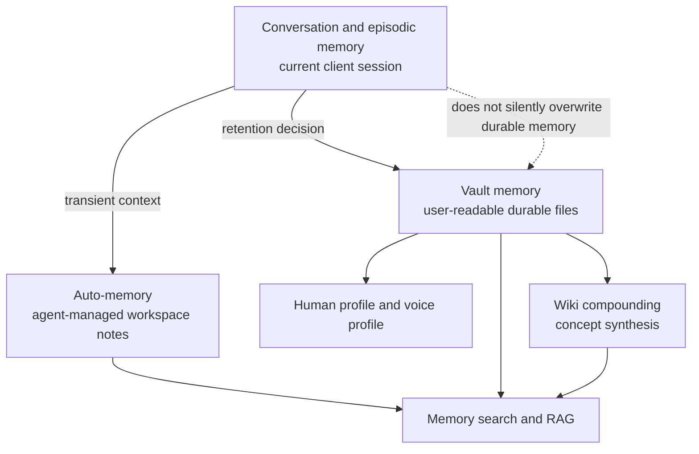

# Memory Architecture

Memory is the durable context layer that lets Augur remember preferences, decisions, profile facts, and reusable synthesis without hiding them in a model transcript. It is split into auto-memory, vault memory, and session-scoped episodic context.

## The three memory tiers

Augur treats memory as three related tiers:

| Tier | Owner | Lifetime | Purpose |
|---|---|---|---|
| Auto-memory | Agent/runtime | Project or client scoped | Working notes, recent operational context, generated instruction memory |
| Vault memory | User vault | Durable | Decisions, preferences, profile, synthesis, and user-curated memory |
| Episodic memory | Active session | Short-lived | Conversation state and task-specific context |

The tiers can feed each other only through explicit retention paths. Session context should not become durable just because it appeared in a transcript.

## Auto-memory

Auto-memory keeps client and project context useful without asking the user to maintain every note. It is generated, synced, and pruned by the agent/client infrastructure. It helps a session resume patterns, repo facts, and recent workflow constraints.

Because auto-memory is generated, it is not the canonical place for user identity, durable decisions, or personal source material. Those belong in the vault.

Client memory is modeled as a set of peer client projections. Claude Code,
Codex, Gemini, Cursor, Copilot, Kimi, and future clients can each have different
native file formats, but none of those locations is the canonical memory store.

## Vault memory

Vault memory lives under `get_memory_dir()` and related vault paths. It is human-readable and local-first. The knowledge skill owns memory tools such as `memory-log-decision`, `memory-log-preference`, `memory-add-decision`, `memory-curate`, `memory-profile-regenerate`, `memory-rebuild-index`, `memory-search`, and `save-synthesis`.

Vault memory is also the bridge to the wiki. Saved synthesis and retained outcomes can later be compounded into concept pages through the wiki engine described in [architecture-wiki.md](./architecture-wiki.md).

## Brain-Scoped Memory

The multi-brain architecture treats durable memory as brain-scoped context. Global memory carries platform defaults, User memory carries personal preferences and durable facts, Team memory is the commercial tier for organization-shared context, and Project memory carries repo-local role/context. Reads are conceptually a union from broad to specific, with more-specific context winning on conflicts. Writes go to the most-specific writable brain: Project when a project brain is active, otherwise User.

Client-native memory is not the canonical store. It is a projection and ingest surface: clients can feed review-gated memory back into Augur, and Augur can project the aggregated context back out to supported clients.

## Conversation and episodic memory

Episodic memory is the context inside the current AI client session. It can include the user's current goal, visible files, tool outputs, and short-term decisions about an in-progress task.

The important boundary is promotion. An agent may decide that something from the session is durable, but it must write that through a memory or synthesis tool with an explicit category and source context. It should not silently overwrite a durable profile or preference.

## Memory profile regeneration

Profile regeneration turns durable memory into a compact human profile that clients can load quickly. The setup journey treats the profile as a first-class milestone because the profile is the "who is this for?" input to many later agent decisions.

ADR-729 adds voice-profile personalization as a related but more specific artifact. Voice profiles can be language-specific and should not be collapsed into one generic profile when separate language artifacts exist.

## Decision and preference logging

Decisions and preferences are explicit memory types. A decision records what was chosen and why. A preference records how the user likes work to be done. Insights and inferred patterns are softer and should retain evidence.

This distinction matters because future agents use memory for behavior. A weak inference should not carry the same authority as a direct preference from the user.

## Memory search and rebuild

Memory search is one retrieval surface inside the broader knowledge layer. Rebuild tools refresh indexes from durable files, not from opaque hidden state. If the index drifts, the source of truth remains the vault files.

The RAG architecture links memory to project and external-file indexes, but memory stays a distinct source type so a search result can preserve provenance.

## Boundary rules

Use vault memory for durable personal facts, stated preferences, explicit decisions, and reusable synthesis. Use auto-memory for generated working context. Use episodic context for the active conversation.

Do not memorize secrets, raw credentials, temporary shell output, or stale guesses. When new information contradicts older memory, preserve the tension or route it for curation instead of overwriting the old value blindly.

## Implementation pointers

- `project-brain/capabilities/skills/knowledge/SKILL.md` owns memory commands and tools.
- `src/config/paths.py` defines `get_memory_dir()` and vault path helpers.
- `docs/agent-topics/CONTEXT.md` carries agent-facing context-management rules.
- `docs/memory/` and the configured vault memory directory are the durable source surfaces.
- See [architecture-vault.md](./architecture-vault.md) for storage and [architecture-wiki.md](./architecture-wiki.md) for compounding.
