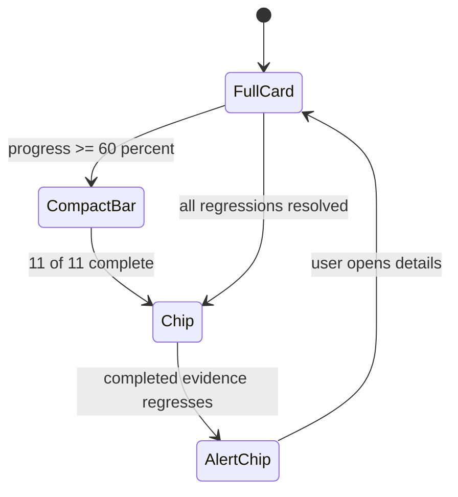

# Onboarding Architecture

Onboarding is a persistent setup-completeness journey, not a one-time wizard. It tracks real evidence that Augur is connected to the user's machine, vault, knowledge sources, profile, and integrations.

## The three phases and 11 milestones

ADR-722 defines three phases:

| Phase | Milestones |
|---|---|
| Foundation | Index machine, create or clone vault, build human profile |
| Knowledge | Configure inbox folders, add document sources, set wiki queries, compound at least five wiki pages |
| Personalization | Create private skill, save first prompt, ask first `/ask` question, connect first integration |

These milestones are evidence-backed. They are not manual checkboxes.

## Milestone state model and persistence

The setup status response includes overall progress, widget state, phases, items, evidence, and regression flags. The widget state is one of `card`, `bar`, `chip`, or `alert`.

Persistence is local-first. Machine-specific setup evidence, bootstrap state, and logs live under platform runtime paths, while durable profile and vault evidence live in the configured vault.

## Setup widget lifecycle (full to compact to chip to amber)

The widget starts as a full card while setup is incomplete. At mid-progress it collapses to a compact bar. At 100 percent it becomes a quiet chip. If a completed setup later regresses, the chip turns amber and surfaces the broken evidence.

This makes setup a health signal. A disconnected vault or empty source folder should reappear without forcing the user through a wizard again.

## Voice profile personalization journey

ADR-729 extends personalization with language-aware voice profile artifacts. Voice profile prompts live with the knowledge skill, and output lives under vault profile paths. A bilingual user can have separate English and Hebrew profiles without one overwriting the other.

The setup milestone for profile readiness should detect real profile evidence, not just that the user clicked through an interview.

## Milestone evidence sources

Evidence comes from MCP tools and small onboard probes:

- client and skill discovery for machine indexing
- vault status for configured private vault readiness
- memory/profile files for human profile readiness
- inbox and source-folder config for knowledge intake
- wiki status for compounded pages
- private skill and prompt discovery for personalization
- integration status for connected platforms

The dashboard reads this through MCP-backed setup status. It should not duplicate probe logic in React.

## Re-assertion and regression detection

Regression is first-class. If setup was complete and a non-skipped item becomes pending, the item is marked regressed and the widget enters alert state. The alert state is amber because the user had a working setup that now needs attention.

Skipped items should not create false regressions, but they should remain visible when the user opens the full card.

## Implementation pointers

- `project-brain/capabilities/skills/onboard/SKILL.md` owns onboarding modes.
- `project-brain/capabilities/skills/onboard/scripts/windows_one_click.py` implements Windows bootstrap.
- `docs/superpowers/specs/2026-05-10-setup-completeness-widget-design.md` defines the widget contract.
- `docs/superpowers/specs/2026-05-11-voice-profile-personalization-design.md` defines voice profile personalization.
- `apps/dashboard/features/setup/` is the intended dashboard feature area for the widget.
- See [architecture-dashboard.md](./architecture-dashboard.md) for dashboard data flow and [architecture-memory.md](./architecture-memory.md) for profile memory.
