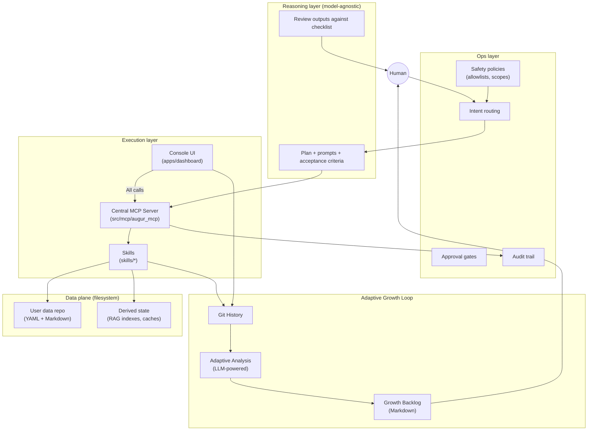
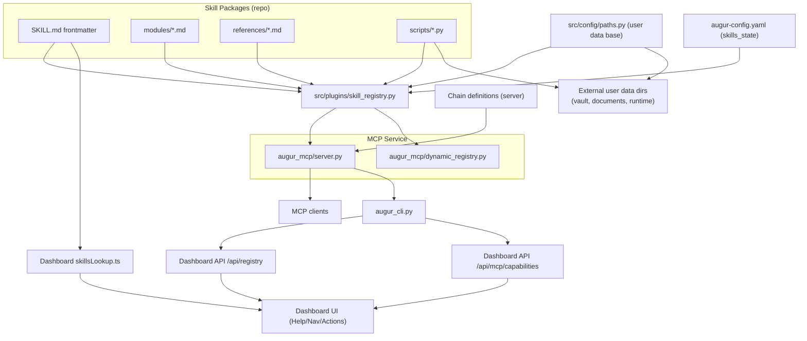

# Augur Architecture (Reasoning, Execution, Ops)

Augur is a personal AI operating system: a local-first way to connect AI clients to real workflows (files, notes, queues) with auditability and human control.

AI clients are the reasoning engines. Augur is the local harness around them: persistent memory, reusable skills, governed tools, workflows, approvals, and auditability exposed through local MCP. It is not an LLM wrapper, and it does not require an Augur API key.

This document reflects the current soft-launch architecture: native macOS support is implemented, native Windows architecture is implemented, and Windows validation is still pending before any firmer support claim.

This document defines a 3-layer architecture and the boundaries between them.

> **Architecture Decision Records**: For detailed rationale behind key decisions, see `get_adr_dir()` (`get_documents_dir()/adrs/`). Key ADRs:
> - ADR-001: Three-Layer Architecture
> - ADR-002: Separate Code and Data Repositories
> - ADR-006: Local-First Architecture

## The 3-layer model

### 1) Reasoning layer

**Role**: Turn an ambiguous user request into a concrete plan and checks.

**Responsibilities**
- Understand intent and constraints.
- Produce a plan, prompts, and acceptance criteria.
- Decide what to ask the human before execution.
- Validate outputs against a checklist (logic, completeness, safety).

**Non-responsibilities**
- Direct file mutation, network calls, or tool execution.
- Managing secrets, approvals, or long-running automation.

This layer is model-agnostic (Claude, Codex, Gemini, Cursor, Ollama, ChatGPT, and local models).

### 2) Execution layer

**Role**: Perform the work deterministically through the local harness: edit files, run commands, call MCP tools, and produce artifacts.

**Responsibilities**
- Execute the plan using tools (skills, scripts, CLI, MCP).
- Make bounded, reviewable changes (small diffs, explicit outputs).
- Run validations (tests, lint, builds) when appropriate.

**Non-responsibilities**
- Deciding policy, approving destructive actions, or redefining goals mid-flight.

This layer is also surface-agnostic: Codex CLI, an agentic IDE, or an MCP client can act as the executor.

### 3) Ops layer

**Role**: Make the system safe and reliable by controlling routing, approvals, and observability.

**Responsibilities**
- Intent routing (which skill or workflow should handle this).
- Approval gates (what requires confirmation, what is read-only).
- Auditability (what ran, what changed, why).
- Policy and safety constraints (allowlists, scopes, idempotency).
- Maintenance automation (health checks, dependency tracking, release workflow).

**Non-responsibilities**
- Writing business logic for any single skill.

In Augur, Ops is src/lib infrastructure: dashboard shell, src/lib config, CI, dependency tracking, and runbooks.

## Principle: reasoning is scarce, execution is cheap

Use expensive reasoning where it matters (planning, reviewing, avoiding mistakes) and keep execution modular and repeatable (scripts, skills, tests, deterministic file changes).

Practically, this shows up as:
- SKILL.md stays small and points to detailed references.
- Durable state is files, not hidden databases.
- Derived indexes (RAG, caches) are rebuildable.
- The system prefers small, composable actions that are easy to audit.

## Human-in-the-loop and safety

Safety is achieved by combining:
- **Bounded tool interfaces**: tools declare read-only vs destructive intent.
- **Allowlisted filesystem roots**: UI and tools can only mutate within configured data roots.
- **Approval gates**: destructive actions require explicit user confirmation.
- **Validation and rollback posture**: prefer changes that are reversible (files, git diffs) and easy to back out.

Some of these exist today (allowlists, safe server actions); others are emerging (structured audit logs, explicit approval workflows, rollback helpers).

## Central MCP Gateway

> **All supported execution flows route through MCP.**

Augur is a **context repository** - users should work seamlessly whether clicking buttons in the Dashboard or chatting with AI agents. The Central MCP Gateway ensures identical execution flow across the supported entry points, so GUI actions and agent commands share the same context and history.

See [architecture-mcp-gateway.md](./architecture-mcp-gateway.md) for the complete specification, including sequence diagrams and API patterns.

## Repository mapping to layers

This is how the current repo structure maps onto the model:

- `skills/`: execution (skills, logic, tests, scripts, skill-owned UI)
- `skills/{skill}/augur/dashboard/`: skill-owned UI source that ships with each skill
- `src/mcp/augur_mcp/`: central execution gateway (exposes skills as tools via MCP, handles context switching, logging, and background jobs) — see ADR-005
- `apps/dashboard/`: ops UI shell (Next.js App Router) that hosts skill UIs and provides src/lib components, navigation, and bounded execution actions
- `src/config/paths.py`: ops configuration for user data locations
- `scripts/` and `.github/scripts/`: ops automation, bootstrap, release tooling, dependency tracking, and generators
- `docs/`: ops documentation and runbooks (this file, guides, ADRs)

## Architecture diagram

## Registry flow (current implementation)

## Skill-owned UI pattern

> See ADR-003 for the decision rationale.

The dashboard follows a **skill-owned UI** pattern to keep the interface growing with capability:

- **Host app**: `apps/dashboard/` (Next.js) provides the shell: layout, navigation, src/lib UI components, and server actions
- **Skill UI modules**: `skills/{skill}/augur/dashboard/` contains skill-specific pages/components
- **Routing strategy**: Stable routes in `apps/dashboard/app/**` mount or import skill UI from `skills/**/augur/dashboard/**`

This keeps routes stable while letting each skill "own" its UI implementation. Shared ops pages (like the agent backlog dashboard) can live directly in the dashboard when they orchestrate cross-skill workflows.

See `apps/dashboard/README.md` for implementation details.

## Universal interoperability

Skills are portable. You can import a skill from a zip file or URL, and export your own skills to share. The `skill_porter` tool ensures that skills can move between Augur instances without lock-in.

See `apps/dashboard/scripts/skill-scripts/skill_porter.py` for the implementation.

## What to implement next

To move toward reliable delegation (Stage 5), the Ops layer needs explicit task classes with:
- clear input/output schemas
- a validation checklist
- an approval model
- auditable traces of tool execution

See `docs/delegation.md` for the first delegated task class definition.
