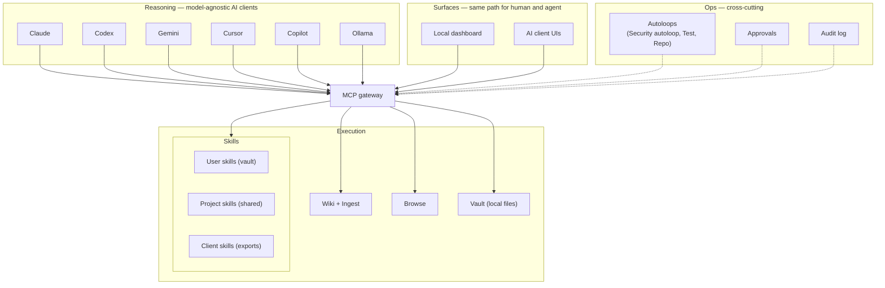
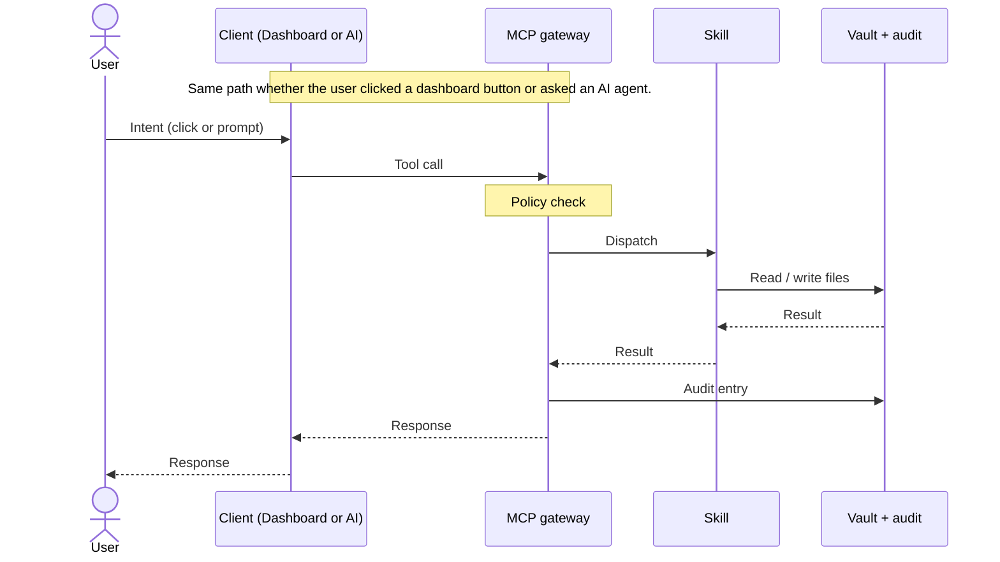
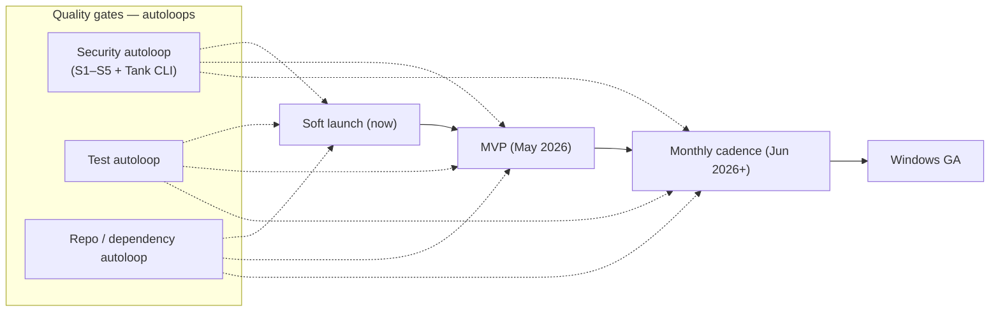

# Augur Architecture

Augur is a local-first personal AI operating system: a harness around the AI clients you already use (Claude, Codex, Gemini, Cursor, Copilot, Ollama). It gives those clients a shared skill layer, a persistent local knowledge base, governed local tools, automated quality gates, and a local dashboard, all exposed through Model Context Protocol. Augur is not an LLM wrapper, and it does not require an Augur API key.

This document defines the layered architecture, the named subsystems, and how an action flows through the system.

> **Architecture Decision Records:** for the rationale behind specific decisions, see the ADR index. Key ADRs referenced throughout: ADR-001 (three-layer architecture), ADR-002 (separate code and data repositories), ADR-005 (central MCP gateway), ADR-006 (local-first), ADR-557 (MVP staged release payloads), ADR-559–564 (wiki and ingest), ADR-550 (Windows hardening), ADR-553 (Gemini extension), ADR-562 (runtime IDE registry).

## At a glance

The diagram shows the three layers and the named subsystems they contain. AI clients sit in the **Reasoning** layer as model-agnostic consumers. The **MCP gateway** is the single point through which all execution flows. Underneath the gateway live the execution subsystems: Skills (split by ownership), Wiki + Ingest, Browse, and the local Vault. The **Ops** layer (Autoloops, Approvals, Audit log) cuts across execution, governing what runs and recording what happened. Local dashboard and AI client UIs both connect through the same gateway — there is no separate path for human and agent.

## The three layers

### Reasoning

Turns an ambiguous user request into a concrete plan and acceptance criteria. Model-agnostic — Claude, Codex, Gemini, Cursor, Copilot, Ollama, and other MCP-capable clients all act in this role.

- Understands intent and constraints.
- Produces plans, prompts, and validation checks.
- Decides what to ask the human before execution.

This layer never directly mutates files, makes network calls, or runs tools. It speaks to the gateway only.

### Execution

Performs the work deterministically through the local harness: edits files, runs commands, calls MCP tools, produces artifacts.

- Executes the plan using skills, scripts, CLI, and MCP tools.
- Makes bounded, reviewable changes (small diffs, explicit outputs).
- Runs validations (tests, lint, builds) when appropriate.

This layer is also surface-agnostic: an agentic IDE, a CLI, or a dashboard click can each act as the executor.

### Ops

Makes the system safe and reliable by controlling routing, approvals, and observability.

- Intent routing — which skill or workflow handles a request.
- Approval gates — what requires confirmation, what is read-only.
- Auditability — what ran, what changed, why.
- Policy and safety constraints — allowlists, scopes, idempotency.
- Maintenance automation — health checks, dependency tracking, release workflow.
- Autoloops, including the security autoloop (see Subsystems).

## How an action flows

The same path runs whether a user clicks a dashboard button or asks an AI agent. The dashboard is itself an MCP client; agents are also MCP clients. Both call the gateway, the gateway dispatches to a skill, the skill mutates the vault under allowlisted roots, and the gateway records an audit entry. This shared path is what makes the dashboard and agent surfaces interoperable rather than parallel.

## Subsystems

### 1. Skills

Skills are the primary unit of execution. They are small, composable, file-backed, and grouped under hubs (adaptive, brain, career, command, life, studio).

Skills come in three types:

- **User skills** live in the user's vault and are private to them. They are vault-owned (per ADR-563) and travel with the user, not the codebase.
- **Project skills** are the shared canonical set, versioned with the repo under `skills/`. These are the curated skill library across six hubs that ships with Augur.
- **Client skills** are managed exports tailored to each AI client surface — `.cursor/skills/`, `.gemini/skills/`, `.codex/skills/`, `~/.agents/skills/augur/` — generated from project skills with client-specific framing.

Skills are addressable through MCP and through the `aug` CLI. Skill-owned UI ships inside the skill (`augur/dashboard/`) so a skill is one self-contained unit of code, data, and surface.

### 2. Wiki and ingest

Augur ships a content pipeline that turns inputs (URLs, files, conversations) into durable knowledge. The ingest pipeline (ADR-559 ambient file import) accepts files, URLs, folders, and text and routes them through extraction, classification, renaming, and indexing. The wiki compiler (ADR-560 semantic page compiler, ADR-561 concept-first compiler) synthesizes durable concept pages from sources, weighted by source quality. ADR-564 surfaces the resulting brain/inbox/wiki insights in the dashboard.

*→ See [architecture-llm-wiki.md](./architecture-llm-wiki.md) for the compiler pipeline and concept-page lifecycle.*

### 3. Browse

Browse is the workbench surface for finding skills, clients, and content. ADR-540 redesigned the browse workbench; ADR-541 added the visibility split and logs; ADR-554 added the skills tab and client inventory; ADR-478 added freshness indicators. Browse is the human-facing complement to the agent-facing skill discovery in MCP.

### 4. Multi-client surfaces

AI clients connect through a shared MCP runtime, but each client's local environment differs. The runtime IDE registry (ADR-562) tracks which clients are present and which export targets each needs. Gemini extension support (ADR-553) added Gemini CLI as a first-class client alongside Claude Code, Codex, Cursor, Copilot, and Ollama.

Native platform support is split by maturity: macOS is shipped and validated; Windows architecture is implemented (ADR-550) with validation pending before any firmer public claim.

### 5. Autoloops (with the security autoloop as lead example)

Autoloops are scheduled, scope-bounded automation that keep the system healthy: code health, dependency audit, memory sync, repo loops, test loops, security loops. They run on the user's machine, write structured outputs, and surface findings into the dashboard.

The **security autoloop** is the most-developed example as of April 2026:

- **S1** — prompt-injection detection.
- **S2** — secret scanning, with `detect-secrets` and a fallback scanner.
- **S3** — static code analysis (Bandit + AST fallback).
- **S4** — integrity and trust checks.
- **S5** — permissions and policy checks.
- Tank CLI integration via the existing CLI registry.
- Scan-fix module that proposes corrective changes alongside findings.

The security autoloop runs ahead of releases and is shown explicitly as a quality gate in the release diagram below.

*→ See [architecture-autoloops.md](./architecture-autoloops.md) for the loop anatomy, the catalog, and the trust-and-improvement model.*

### 6. Release and lifecycle

Augur ships through staged release payloads (ADR-557): a candidate payload is built, verified through autoloops, and then promoted. Sync managed-output purge (ADR-558) keeps managed export targets clean across re-installs, and supported-client state purge (ADR-555) handles client-specific artifacts. Skill group and release enablement (ADR-551) controls which skill groups participate in a given release cut.

## Release and lifecycle

Augur is in soft launch (April 2026, now). MVP release targets May 2026; monthly cadence begins June 2026. Windows GA follows once validation is green. Each release passes through the autoloops as quality gates — the security autoloop, the test autoloop, and the repo / dependency autoloop all run ahead of each cut. See `ROADMAP.md` for the per-phase scope.

## Human-in-the-loop and safety

Safety is the combination of bounded interfaces, allowlisted roots, approval gates, validation/rollback posture, and the security autoloop:

- **Bounded tool interfaces** — tools declare read-only vs destructive intent.
- **Allowlisted filesystem roots** — UI and tools can only mutate within configured data roots.
- **Approval gates** — destructive actions require explicit user confirmation.
- **Validation and rollback** — prefer changes that are reversible (files, git diffs).
- **Security autoloop** — the automated half of safety, complementing the human-in-the-loop gates above. See Subsystems §5.

## Repository mapping

How the current repo structure maps to the layers:

- `skills/` — execution (skills, logic, tests, scripts, skill-owned UI).
- `skills/{skill}/augur/dashboard/` — skill-owned UI source that ships with each skill.
- `src/mcp/augur_mcp/` — central execution gateway (exposes skills as tools via MCP, handles context switching, logging, background jobs). See ADR-005.
- `apps/dashboard/` — ops UI shell (Next.js App Router) that hosts skill UIs and provides framework components, navigation, and bounded execution actions.
- `src/config/paths.py` — ops configuration for user data locations.
- `.cursor/`, `.gemini/`, `.codex/`, `~/.agents/skills/augur/` — managed client export targets (Client skills).

## Where to go next

- [ROADMAP.md](../ROADMAP.md) — public release plan with status markers.
- [architecture-llm-wiki.md](./architecture-llm-wiki.md) — concept-first compiler and lifecycle.
- [architecture-autoloops.md](./architecture-autoloops.md) — loop anatomy, catalog, and trust model.
- [architecture-mcp-gateway.md](./architecture-mcp-gateway.md) — gateway-internal detail.
- [getting-started.md](./getting-started.md) — local install and first run.
- [Sessions log](https://augur.run/sessions.html) — recent change log on augur.run.
