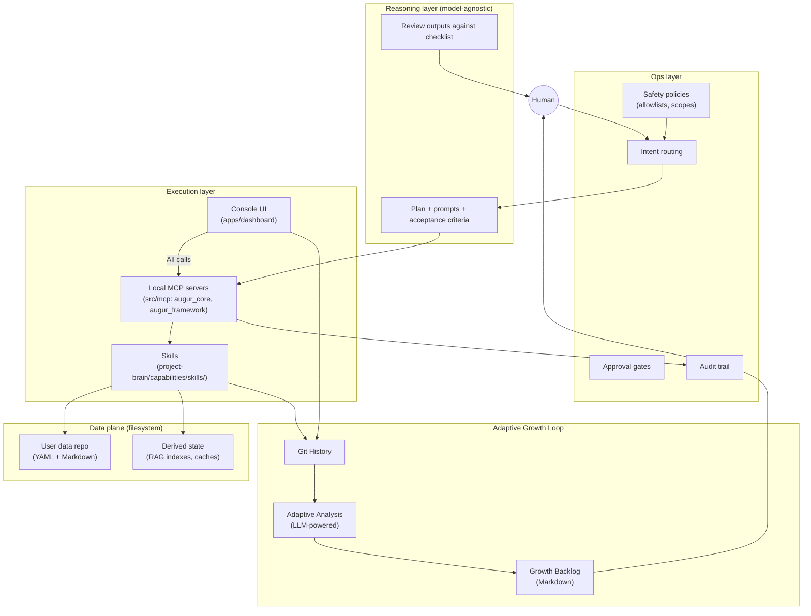
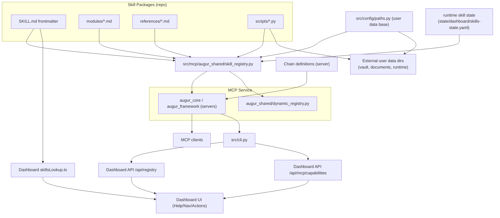

# Augur Architecture — The Harness

Augur is **local-first harness and brain infrastructure for your laptop**. It authors the Harness once, layers brain context across Global/User/Team/Project scopes, and projects the effective result into every supported AI client so the same skills, hooks, subagents, project instructions, memory, and MCP tools work across Claude Code, Codex CLI, Gemini CLI, Cursor, and Copilot.

This document explains the four load-bearing models: the five-layer Harness, the brain-layering model, the Connection Layer that reaches every client, and the runtime substrate underneath.

> If you've never seen Augur before, read [what-is-augur.md](./what-is-augur.md) first — it disambiguates Augur from agents, LLM wrappers, and cloud services.

Native macOS support is implemented. Native Windows architecture is implemented; Windows validation is still pending before a firmer public support claim.

## What users see

The user-facing surface of Augur is two things: a **dashboard browse page** and an **onboarding journey**. Everything below this section explains how the system delivers them.

### The browse page

`/browse` in the dashboard is the user's home. Categories group into three:

| Group | Categories | Purpose |
|---|---|---|
| **Content** | Inbox · Notes · Sources · Wiki · Skills · Actions · Prompts · Drafts · Archive | What the user owns and operates on |
| **System** | Integrations · Extensions & Bundles · Scheduled Executions | What's connected and what runs |
| **Dev** (hidden by default) | ADRs · MCP Tools · Commands · Dashboard Surfaces · etc. | Implementation surface for contributors |

Each category lists items as cards. Clicking a card opens the item; the dashboard dispatches actions through MCP — same execution path as the AI clients use. The browse page is the canonical way to find anything Augur knows about you.

### The 11-milestone onboarding journey

Per ADR-722, the dashboard sidebar carries a Setup Completeness Widget tracking 11 milestones across three phases. It's not a one-time wizard — it's a persistent signal that quiets at 100% (full card → compact bar → tiny chip) and re-asserts in amber if something regresses.

**Foundation** — connect Augur to your laptop:
1. Index your machine (discover clients + skills)
2. Create or clone your vault
3. Build your human profile

**Knowledge** — connect your data, watch the wiki compound:
4. Configure inbox folders
5. Add document source folders
6. Set wiki compounding queries
7. Get to ≥5 compounded wiki pages

**Personalization** — make Augur specifically yours:
8. Create a private skill
9. Save your first prompt
10. Ask your first `/ask` question
11. Connect your first integration

Each milestone is auto-detected against a real source of truth via existing MCP tools. No manual checkboxes.

This is the value the rest of the architecture delivers. What follows below — the Harness, the Connection Layer, the runtime substrate — is the infrastructure that makes the browse page and the onboarding journey work across every supported AI client.

## The Harness

Every modern AI client ships a harness — five architectural layers most engineers never open. Each layer solves a problem the LLM alone can't. Augur authors all five **once** and generates per-client output for every supported client.

| Layer | What it does | Authored in | Generated for each client |
|---|---|---|---|
| **1 · Constitution** | Project rules, conventions, repo map. Always loaded, always active. | `docs/agent-topics/agent-rules.md` (+ project-specific rules) | `CLAUDE.md`, `CODEX.md`, `AGENTS.md`, `.cursor/rules/augur.mdc`, `.github/copilot-instructions.md`, `.gemini/GEMINI.md`, `.windsurfrules` |
| **2 · Skills** | Modular expertise. Matched at runtime, forked into isolated subagents. On-demand, never always-on. | `project-brain/capabilities/skills/<skill-name>/SKILL.md` | `.claude/skills/`, `.codex/skills/`, `.gemini/skills/`, `.cursor/skills/`, Copilot skill packs |
| **3 · Hooks** | Deterministic guardrails. Event-driven shell, not AI. Auto-lint on Write. Hard-block on `rm -rf`. Quality at the infra level. | `.githooks/`, `.pre-commit-config.yaml`, per-client hook entries | Git hooks (cross-agent); `.claude/settings.json`, `.codex/hooks.json` (per-client) |
| **4 · Subagents** | Delegation, bounded. Own context, model, tools, permissions. Main agent delegates down, gets results up. No recursion. | `project-brain/capabilities/skills/<skill-name>/agents/` per-skill agent definitions | `.claude/agents/`, `.codex/agents/`, `.cursor/agents/` |
| **5 · Plugins** | Bundle + distribute. Bundle skills, agents, hooks, commands. One install, whole project inherits. npm for agent behavior. | `project-brain/capabilities/skills/<skill-name>/` bundled by `sync_agents` plugin/package adapters | Claude plugin package, Codex plugin package, Gemini extension, Cowork DXT |

Wrapping all five: a local **MCP server** (one trust boundary; every client connects to the same execution surface) and **agent teams** (parallel orchestration with shared permissions).

## Brain Layering

The Harness is not projected from a single undifferentiated folder. Augur resolves a layered brain stack, then projects the effective result into each client.

| Tier | Meaning | Source shape | OSS/commercial boundary |
|---|---|---|---|
| **Global** | Augur core runtime and shipped capabilities | Installed Augur core / `project-brain` in this repo | Open-source runtime |
| **User** | Personal brain: private skills, memory, profile, knowledge | Configured personal vault / brain root | Open-source runtime |
| **Team** | Organization-shared policy, governance, shared memory/capabilities | Managed team brain | Commercial tier |
| **Project** | Repo-local context, instructions, skills, tools, and overrides | `<repo>/project-brain/` | Open-source runtime |

Precedence is most-specific-wins for capability/content selection: **Project > Team > User > Global**. The open-source runtime exposes the Global/User/Project spine; Team is the commercial architecture tier for organization deployment and governance.

This model matters because a real user does not operate from a single undifferentiated context. They need platform capabilities, personal memory and skills, and project-specific rules at the same time. Augur's projection layer computes the effective stack and writes each client the native files it expects.

### LLM Boundary

Augur is the harness and control layer, not the default reasoning model. The normal path is:

```text
trigger -> native AI-client session -> agent reasons -> MCP tools execute
```

This means classification, summarization, wiki synthesis, planning, and workflow orchestration belong to the active AI client whenever a client session exists. MCP tools prepare prompts, read/write bounded artifacts, validate structured outputs, and perform atomic mutations. Daemons schedule work; dashboards transport and render it.

Direct LLM/API access inside Augur is a named exception. It must be explicitly approved in the governing ADR/command/config, have a clear credential boundary, and be used only when a native-agent handoff is not the right execution shape. Internal examples may include tightly scoped OCR, retry diagnosis, or self-healing tasks. New features should start from native-agent orchestration and justify any direct model call as an exception.

### Today vs. Augur

**Today.** The harness lives inside one vendor — Claude Code, Cursor, Codex CLI. Each vendor has its own format for each layer. Switch tools → rebuild your harness.

**Augur.** The harness lives on your laptop — vendor-neutral, persistent, yours. Switch tools → the harness comes with you, because Augur already generated each client's native format from one source.

## The Inversion

```
TODAY                          AUGUR
─────                          ─────
AI vendor at center            You at center
  Your tools, data, work         Skills, MCP, CLIs, vault
  orbit the vendor.              orbit you. AI is optional.
  Switch vendor → rebuild.       Switch vendor → nothing moves.
```

> **Vendor-neutral by architecture, not by promise.**
>
> **Privacy is structural.** Your vault, your skills, your memory, your MCP server — all on your laptop. Augur uses your native AI client as the default LLM. Direct model/API credentials are rare, explicit infrastructure exceptions, not the normal product path.

## The Connection Layer

Every channel by which the effective Harness reaches your AI clients lives in the Connection Layer: the MCP server, `sync_agents`, the Augur CLI, plugin/package adapters, hooks sync, settings sync, and memory projection. The full specification lives in [architecture-mcp-gateway.md](./architecture-mcp-gateway.md).

## What Augur is not

- Not an agent — it harnesses native AI clients rather than replacing their LLM
- Not a general LLM wrapper — direct model/API calls are rare approved infrastructure exceptions
- Not a cloud service — runs on your laptop
- Not a per-project folder — one Augur runtime, many projects connect to it
- Not vendor-locked — same Harness lands in every supported client
- Not an enterprise product — Augur Enterprise is separate and closed (see [README.md](../README.md))

For the long-form disambiguation, see [what-is-augur.md](./what-is-augur.md).

## The runtime substrate (4-layer model)

The Harness is the cross-client architecture. Underneath, when the Harness fires and your AI client starts working, the runtime separates into four concerns:

### 1) Reasoning layer

**Role**: Turn an ambiguous user request into a concrete plan and checks.

**Responsibilities**
- Understand intent and constraints.
- Produce a plan, prompts, and acceptance criteria.
- Decide what to ask the human before execution.
- Validate outputs against a checklist (logic, completeness, safety).

**Non-responsibilities**
- Direct file mutation, network calls, or tool execution.
- Managing secrets, approvals, or long-running automation.

This layer normally lives in the active AI client and is model-agnostic (ChatGPT, Claude, Gemini, local models). Augur may call a model directly only for explicitly approved internal exceptions; that is not the default architecture for user-facing work.

### 2) Execution layer

**Role**: Perform the work deterministically: edit files, run commands, and produce artifacts.

**Responsibilities**
- Execute the plan using tools (skills, scripts, CLI, MCP).
- Make bounded, reviewable changes (small diffs, explicit outputs).
- Run validations (tests, lint, builds) when appropriate.

**Non-responsibilities**
- Deciding policy, approving destructive actions, or redefining goals mid-flight.

This layer is also surface-agnostic: Codex CLI, an agentic IDE, or an MCP client can act as the executor.

### 3) Knowledge layer

**Role**: Keep long-term context durable, inspectable, and reusable.

**Responsibilities**
- Connect notes, documents, vault folders, source cards, and session memory.
- Build search and RAG indexes from durable local sources.
- Maintain compiled wiki pages and human-readable memory surfaces.
- Preserve the split between durable knowledge and rebuildable runtime artifacts.

**Non-responsibilities**
- Acting as the reasoning model.
- Hiding user data inside opaque cloud storage.

This layer is what separates Augur from a prompt pack or a project-local `.agent/` folder: the second brain is a durable system, not a disposable per-repo context cache. The Harness (see [The Harness](#the-harness) above) is what lets the same knowledge ride on every supported AI client.

### 4) Ops layer

**Role**: Make the system safe and reliable by controlling routing, approvals, and observability.

**Responsibilities**
- Intent routing (which skill or workflow should handle this).
- Approval gates (what requires confirmation, what is read-only).
- Auditability (what ran, what changed, why).
- Policy and safety constraints (allowlists, scopes, idempotency).
- Maintenance automation (health checks, dependency tracking, release workflow).

**Non-responsibilities**
- Writing business logic for any single skill.

In Augur, Ops is src/lib infrastructure: dashboard shell, src/lib config, CI, dependency tracking, and runbooks.

## Principle: reasoning is scarce, execution is cheap

Use expensive reasoning where it matters (planning, reviewing, avoiding mistakes) and keep execution modular and repeatable (scripts, skills, tests, deterministic file changes).

Practically, this shows up as:
- SKILL.md stays small and points to detailed references.
- Durable state is files, not hidden databases.
- Derived indexes (RAG, caches) are rebuildable.
- The system prefers small, composable actions that are easy to audit.

## Human-in-the-loop and safety

Safety is achieved by combining:
- **Bounded tool interfaces**: tools declare read-only vs destructive intent.
- **Allowlisted filesystem roots**: UI and tools can only mutate within configured data roots.
- **Approval gates**: destructive actions require explicit user confirmation.
- **Validation and rollback posture**: prefer changes that are reversible (files, git diffs) and easy to back out.

Some of these exist today (allowlists, safe server actions); others are emerging (structured audit logs, explicit approval workflows, rollback helpers).

## Central MCP Gateway

> **All supported execution flows route through MCP.**

Augur is a **second-brain infrastructure layer** - users should work seamlessly whether clicking buttons in the Dashboard or chatting with AI agents. The Central MCP Gateway ensures identical execution flow across the supported entry points, so GUI actions and agent commands share the same context and history.

See [architecture-mcp-gateway.md](./architecture-mcp-gateway.md) for the complete specification, including sequence diagrams and API patterns.

## Repository mapping to layers

This is how the current repo structure maps onto the model:

- `project-brain/capabilities/skills/`: shared project/core skills, scripts, commands, agents, actions, and skill-owned UI sources
- configured personal vault `capabilities/skills/`: user-owned private skills
- `project-brain/capabilities/skills/<skill-name>/augur/dashboard/`: skill-owned UI source where a skill owns dashboard pages/actions
- `src/mcp/` (`augur_core`, `augur_framework`, sharing `augur_shared/`): the local MCP servers that expose skills as tools, with unified logging — see ADR-005
- `apps/dashboard/`: ops UI shell (Next.js App Router) that hosts skill UIs and provides src/lib components, navigation, and bounded execution actions
- `src/config/paths.py`: ops configuration for user data locations
- external vault/documents/runtime paths: knowledge layer for notes, documents, memory, compiled wiki pages, indexes, and runtime state
- `scripts/` and `.github/scripts/`: ops automation, bootstrap, release tooling, dependency tracking, and generators
- `docs/`: ops documentation and runbooks (this file, guides, ADRs)

## Architecture diagram


```mermaid
flowchart TB
  User((Human))

  subgraph Ops["Ops layer"]
    Router["Intent routing"]
    Gates["Approval gates"]
    Policies["Safety policies\n(allowlists, scopes)"]
    Audit["Audit trail"]
  end

  subgraph Reasoning["Reasoning layer (model-agnostic)"]
    Plan["Plan + prompts + acceptance criteria"]
    Review["Review outputs against checklist"]
  end

  subgraph Exec["Execution layer"]
    MCP["Local MCP servers\n(src/mcp: augur_core, augur_framework)"]
    Skills["Skills\n(project-brain/capabilities/skills/<skill-name>)"]
    Dashboard["Console UI\n(apps/dashboard)"]
  end

  subgraph Data["Data plane (filesystem)"]
    DataRepo["User data repo\n(YAML + Markdown)"]
    Derived["Derived state\n(RAG indexes, caches)"]
  end

  User --> Router
  Policies --> Router
  Router --> Plan
  Plan --> MCP
  Dashboard -->|"All calls"| MCP
  MCP --> Skills
  MCP --> Audit
  Skills --> DataRepo
  Skills --> Derived
  Review --> User

  subgraph Growth["Adaptive Growth Loop"]
    Commits["Git History"]
    Analysis["Adaptive Analysis\n(LLM-powered)"]
    Backlog["Growth Backlog\n(Markdown)"]
  end

  Skills --> Commits
  Dashboard --> Commits
  Commits --> Analysis
  Analysis --> Backlog
  Backlog --> User
```

## Registry flow (current implementation)


```mermaid
flowchart TB
  subgraph Packages["Skill Packages (repo)"]
    SKILL["SKILL.md frontmatter"]
    Modules["modules/*.md"]
    Refs["references/*.md"]
    Scripts["scripts/*.py"]
  end

  PathsPy["src/config/paths.py (user data base)"]
  UserConfig["runtime skill state\n(state/dashboard/skills-state.yaml)"]
  SkillData["External user data dirs\n(vault, documents, runtime)"]

  Registry["src/mcp/augur_shared/skill_registry.py"]

  SKILL --> Registry
  Modules --> Registry
  Refs --> Registry
  Scripts --> Registry
  PathsPy --> Registry
  UserConfig --> Registry

  Scripts --> SkillData
  PathsPy --> SkillData

  subgraph MCP["MCP Service"]
    Server["augur_core / augur_framework (servers)"]
    Dynamic["augur_shared/dynamic_registry.py"]
  end

  Registry --> Server
  Registry --> Dynamic

  Chains["Chain definitions (server)"]
  Chains --> Server

  Server --> MCPClients["MCP clients"]

  CLI["src/cli.py"]
  Server --> CLI

  APIRegistry["Dashboard API /api/registry"]
  APICaps["Dashboard API /api/mcp/capabilities"]
  CLI --> APIRegistry
  CLI --> APICaps

  SkillsLookup["Dashboard skillsLookup.ts"]
  SKILL --> SkillsLookup

  UI["Dashboard UI (Help/Nav/Actions)"]
  APIRegistry --> UI
  APICaps --> UI
  SkillsLookup --> UI
```

## Skill-owned UI pattern

> See ADR-003 for the decision rationale.

The dashboard follows a **skill-owned UI** pattern to keep the interface growing with capability:

- **Host app**: `apps/dashboard/` (Next.js) provides the shell: layout, navigation, src/lib UI components, and server actions
- **Skill UI modules**: `project-brain/capabilities/skills/<skill-name>/augur/dashboard/` contains skill-specific pages/components when the local contract allows source UI.
- **Routing strategy**: stable routes in `apps/dashboard/app/**` mount generated or copied output from skill-owned sources.

This keeps routes stable while letting each skill "own" its UI implementation. Shared ops pages (like the agent backlog dashboard) can live directly in the dashboard when they orchestrate cross-skill workflows.

See `apps/dashboard/README.md` for implementation details.

## Universal interoperability

Skills are portable. You can import a skill from a zip file or URL, and export your own skills to share. Once authored, each skill is projected into every supported client by the [Connection Layer](./architecture-mcp-gateway.md). See `apps/dashboard/scripts/skill-scripts/skill_porter.py` for the porter implementation.

## What to implement next

To move toward reliable delegation (Stage 5), the Ops layer needs explicit task classes with:
- clear input/output schemas
- a validation checklist
- an approval model
- auditable traces of tool execution

These define the first delegated task classes.

## Augur Enterprise

Augur Enterprise is the commercial tier that adds team brains, role brains, organization governance, managed-device policy, multi-user compounding, and enterprise controls on top of the same harness and brain architecture. This open-source repository documents and ships the personal/project runtime; it does not claim the full commercial governance layer is included.
