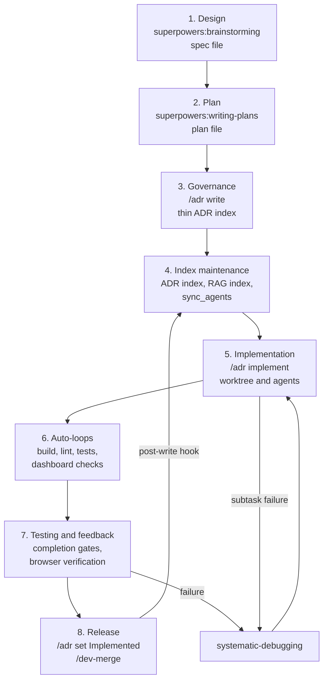

# SDLC Architecture

Augur treats ADRs as universal change records. Features, dashboard work, website updates, bug fixes, debugging sessions, refactors, dependency bumps, and documentation changes all use the same design, plan, ADR, implementation, verification, and release pipeline when the change is non-trivial.

## The Augur SDLC pipeline

The pipeline has eight stages:

1. Design with brainstorming.
2. Plan with writing-plans.
3. Write an ADR as the governance/index record.
4. Regenerate indexes and instruction surfaces.
5. Implement in a worktree through `/adr implement`.
6. Run auto-loops as the build/lint/test substrate.
7. Verify against completion gates and user-visible behavior.
8. Flip status and merge.

The pipeline is intentionally heavier than a raw commit. It creates a durable, searchable record and standardizes verification.

## Stage 1 - Design via brainstorming

Design starts with `superpowers:brainstorming` when the work changes behavior, architecture, or user experience. The output is a spec under `docs/superpowers/specs/`, usually named with the date and topic.

The spec captures problem, goals, non-goals, decisions, risks, and success criteria. It should describe the user's intent before code exists.

## Stage 2 - Plan via writing-plans

`superpowers:writing-plans` turns the spec into an implementation plan under `docs/superpowers/plans/`. The plan names files, tasks, tests, ordering, and verification gates.

Plans are execution artifacts. They are more detailed than ADRs and are suitable for `/adr implement` or direct superpowers execution.

## Stage 3 - Governance via /adr write

`/adr write` creates the ADR record. When a spec and plan already exist, the ADR is intentionally thin: status, date, decision summary, `spec_file`, `plan_file`, related ADRs, and impact manifest.

The ADR is the stable record future readers search. The spec and plan are the canonical design and execution detail.

## Stage 4 - Index maintenance and cross-references

ADR write and status changes run the post-write hook:

- `python .github/scripts/adr_upsert_live.py`
- `python .github/scripts/generate_adr_index.py`
- `python src/lib/index/unified_indexer.py --category adrs`
- `PYTHONPATH=project-brain/capabilities python -m skills.ai.scripts.sync_agents sync agents all`

This keeps internal decision records, generated indexes, RAG pointers, and generated agent instructions aligned.

## Stage 5 - Implementation via /adr implement

`/adr implement ADR-NNN` resolves the ADR's `plan_file`, reuses the current linked Augur worktree when invoked from one, and creates a new isolated worktree only when invoked from the main checkout. Worktrees keep implementation away from `main` and make concurrent sessions possible, but the command must not spawn a second worktree underneath an already-active implementation session.

The implementation loop uses the superpowers stack: `using-git-worktrees`, `subagent-driven-development`, `test-driven-development`, `systematic-debugging`, and `verification-before-completion`. Parallel agents are used only when the work can be split into disjoint, bounded tasks.

## Stage 6 - Auto-loops (build, lint, test)

Auto-loops are the build, lint, and test substrate. Slash commands such as `/dev-build`, `/auto-lint`, `/auto-test-pytest`, `/auto-test-build`, and `/auto-test-dashboard` wrap the real checks with repo-specific safety, diagnostics, and lifecycle handling.

Raw runners such as `pytest`, `pnpm dev`, and manual dashboard restarts are not the workflow contract. The slash commands encode the coordination rules.

## Stage 7 - Testing and feedback

Verification follows the plan and the affected surface. Library changes need focused tests. Dashboard changes need browser-visible verification, not just HTTP 200. Config migrations need reference scans. User-facing docs need link, example, and readability checks.

When a gate fails, the fix path is `superpowers:systematic-debugging`: reproduce, observe, identify root cause, fix, rerun the gate, and only then claim progress.

## Stage 8 - Release

Release flips the ADR to `Implemented`, reruns the post-write hook, merges the feature branch, pushes, and cleans up the worktree. `/dev-merge` owns the broader no-loss merge contract, including merge locks, remote verification, vault coverage in full mode, and cleanup.

The worktree is not done until the target branch contains the intended result and verification evidence is available.

## ADRs for any work

Industry ADRs often mean only large architectural decisions. Augur uses ADRs for any non-trivial change where a future reader would want a record.

Concrete examples:

- ADR-728 is a UI ordering change.
- ADR-729 is a feature journey.
- ADR-730 is pure documentation.
- A website update can be an ADR when it changes public positioning or information architecture.
- A debugging-session ADR can record a recurring incident and the durable fix.
- A dependency-bump ADR can record why a risky upgrade landed and what gates proved it safe.

The escape hatch is trivial work: typo fixes, mechanical formatting, or one-line generated churn do not need ADRs. The threshold is whether the decision should be findable later.

## Implementation pointers

- `project-brain/capabilities/skills/augur-core/commands/adr.md` defines `/adr`.
- `project-brain/capabilities/skills/platform-admin/commands/dev-merge.md` defines merge completion.
- `project-brain/capabilities/skills/platform-admin/commands/dev-build.md` and `dev-debug.md` define dashboard lifecycle and debugging.
- `project-brain/capabilities/skills/daemon/commands/a-loops.md` defines adaptive loop operations.
- `docs/superpowers/specs/` and `docs/superpowers/plans/` store design and execution artifacts.
- See [architecture-agents.md](./architecture-agents.md) for agent orchestration, [architecture-skills.md](./architecture-skills.md) for command ownership, [architecture-capability-exposure.md](./architecture-capability-exposure.md) for exposure policy, and [architecture-daemon.md](./architecture-daemon.md) for loop runtime.
