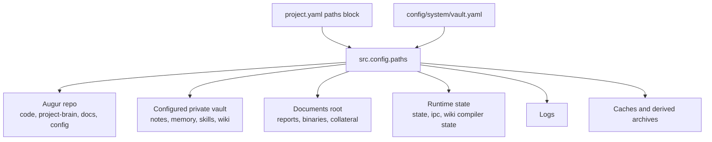

# Vault Architecture

The vault is Augur's user-editable storage layer. It keeps durable notes, skills, drafts, memory, source cards, and compiled wiki pages outside the engine repository while leaving code, generated runtime state, logs, and caches in their own locations.

## ADR-270 path split

ADR-270 separates Augur into explicit storage layers. The repository owns engine code, shared skills, public docs, generated client instructions, and project configuration. The configured private vault owns user-editable data. The documents root owns binary or collateral files. Runtime, logs, cache, RAG indexes, and launch metadata live in platform-specific state locations.

All code resolves these paths through `src.config.paths`. Callers use helpers such as `get_project_root()`, `get_vault_dir()`, `get_documents_dir()`, `get_runtime_dir()`, `get_logs_dir()`, `get_cache_dir()`, `get_memory_dir()`, `get_wiki_dir()`, `get_shared_vault_dir()`, and `get_configured_vault_dir()` instead of hardcoded local paths.

## Vault layout

The private vault is the user's long-lived, editable brain. Common top-level areas are:

| Area | Purpose |
|---|---|
| `skills/` | Private user skills and private skill-owned data |
| `memory/` | Durable memory, profiles, preferences, decisions, and synthesis inputs |
| `wiki/` | Compiled concept/query wiki pages, per `get_wiki_dir()` |
| `notes/` | Human-readable notes and skill-owned note trees |
| `sources/` | Source cards created by ingestion and URL capture |
| `drafts/staging/` | Draft skill/page/content staging before publish |
| `archive/` | User-visible archive, not disposable cache |
| `config/` | User-editable private configuration such as CLI agent preferences |

The repository also has `project-brain/`. That directory is version-controlled team/shared content, not the user's private vault. It includes shared skills, shared wiki seed material, shared config, and source assets that ship with Augur.

## Shared vs private vault

ADR-563 gives the private vault ownership of user skills, pages, and draft staging. ADR-601 adds the project-brain overlay for team and enterprise distributions. Discovery reads both roots:

- project/team content: `project-brain/capabilities/skills/{skill}/`
- private user content: `<vault>/skills/{skill}/`

Shared content is portable and versioned with the repo. Private content is local-first user data and should not be mixed into code commits.

## Frontmatter conventions

ADR-571 defines how user-facing vault markdown stores metadata. Human fields remain plain. Augur-managed system fields use leading underscore keys and are merged through frontmatter helpers so user-authored fields are not overwritten.

The `x-augur-*` fields in `SKILL.md` are a different contract: they describe skill packaging, grouping, MCP tools, and dashboard exposure. Vault note frontmatter should not be migrated into skill metadata, and skill metadata should not be applied to user notes.

## Draft staging and publish flow

Draft staging keeps generated or in-progress material separate from live user content. Work starts under `drafts/staging/`, gets reviewed, and only then moves into the owning live area such as `skills/`, `notes/`, `sources/`, or `wiki/`.

This split matters because the same vault is read by agents, dashboard browse pages, wiki compilation, memory search, and `/dev-merge full`. Drafts can be noisy; live areas should be durable and intentionally published.

## Vault sync

`config/system/vault.yaml` points at the configured vault path and git remote. `/dev-merge full` includes the vault repository when it exists, so meaningful vault changes can be committed and pushed alongside code changes.

The repo and vault are still separate git repositories. That is intentional: the public Augur repo can ship shared code and docs without publishing a user's private notes, profile, or memory.

## Implementation pointers

- `src/config/paths.py` is the source of truth for path helpers.
- `config/system/vault.yaml` configures the local private vault and remote.
- `project-brain/capabilities/skills/vault/` owns vault MCP tools such as read, write, search, scaffold, and health repairs.
- `docs/agent-topics/ARCHITECTURE.md` carries agent-facing placement rules.
- See [architecture-wiki.md](./architecture-wiki.md) for compiled knowledge and [architecture-memory.md](./architecture-memory.md) for durable memory inside the vault.
