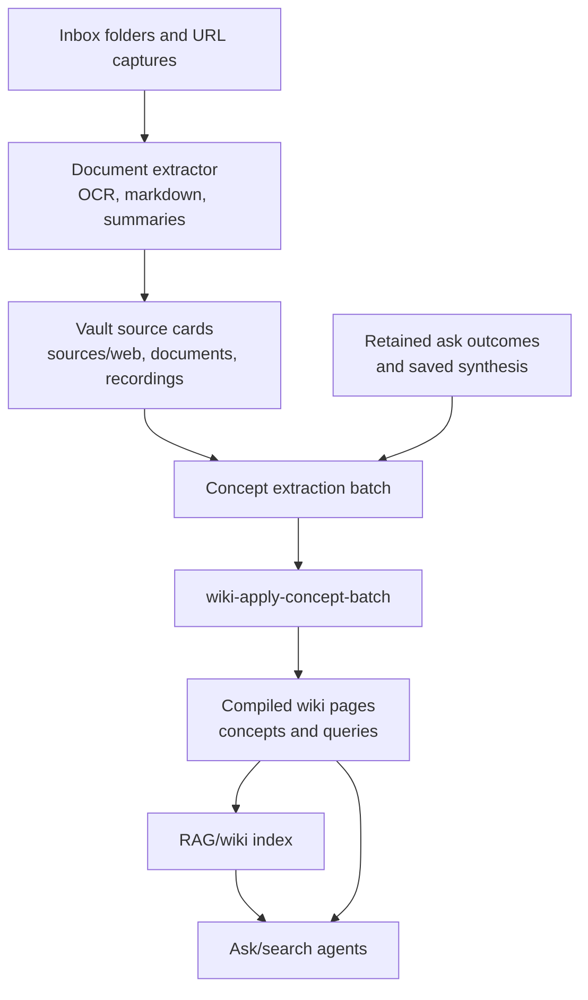

# Wiki Architecture

The wiki is Augur's compiled knowledge surface. It turns inbox files, retained `/ask` outcomes, source cards, and durable synthesis into queryable concept pages that agents and users can read before falling back to raw sources.

## Pipeline overview

Wiki compounding is deliberately slower than chat. The system gathers sources, extracts durable facts, groups them into concepts, applies an agent-reviewed concept batch, writes compiled pages, and then refreshes search indexes. The result is a small set of strengthened idea pages rather than a folder of one-off summaries.

The wiki stores long-term compiled pages in `get_wiki_dir()` inside the configured vault. Runtime compiler state, flags, and batch metadata use `get_runtime_wiki_dir()`.

## Inbox scanning and consumption

The ingest skill owns watched folders and source intake. Folder tools such as `inbox-folders`, `inbox-scan-folder`, `inbox-consume-folder`, `inbox-run-history`, and `inbox-run-detail` provide the atomic MCP surface. Agents decide what to route, what to extract, and when a wiki update is warranted.

URL ingestion follows the same model. ADR-724 adds URL capture as a durable ingest path: URLs become source cards with frontmatter, summary, routing evidence, and follow-up actions before they are eligible for wiki compilation.

## Document extraction

The document-extractor skill converts PDFs, Office files, images, audio, HTML, URLs, YouTube, and podcasts into structured markdown. OCR and LLM-assisted extraction are execution tools, not the wiki compiler itself.

Extraction produces usable source material. Wiki compilation decides which durable concepts should be strengthened by that material.

## Wiki rewrite proposals and concept batches

The modern wiki flow is concept-first. `wiki-rebuild` and `wiki-update` prepare extraction batches. An agent reviews or produces concept JSON. `wiki-apply-concept-batch` then applies that batch to compiler state and page material.

Rewrite proposal tools such as `wiki-rewrite-candidates`, `wiki-rewrite-proposals`, and `wiki-apply-top-rewrite-proposal` exist for targeted maintenance, but the intended compounding path is batched and evidence-preserving.

## Wiki page compiler

ADR-560 introduced the semantic wiki compiler. ADR-731 consolidates memory synthesis into the wiki engine so retained `/ask` outcomes, saved synthesis, and query registry signals feed one compounding path instead of several competing memory writers.

Compiled wiki pages should be concept articles. Thin pages, orphan concepts, and duplicate clusters are health signals, not acceptable end state. `wiki-status` reports whether compounding should run; `wiki-lint` checks the resulting surface.

## RAG reindex and search surface

`wiki-reindex` updates browse/search indexes for existing pages. It does not rebuild page content. RAG tools keep three retrieval surfaces aligned: raw source markdown, extracted documents, and compiled wiki knowledge.

Agents should read `wiki/overview.md`, `wiki/index.md`, `wiki-status`, targeted wiki pages, or `wiki-search` before falling back to raw files when a durable knowledge question is likely.

## Ask retention loop

`/ask` answers can produce retained decisions, preferences, insights, inferred patterns, or synthesis material. The answer itself does not directly rewrite wiki pages. Retained outputs become candidates for later session-end or scheduled compounding.

This keeps `/ask` fast and conversational while still letting durable knowledge accumulate into the wiki.

## Implementation pointers

- `project-brain/capabilities/skills/ingest/SKILL.md` owns inbox, URL, and wiki MCP tools.
- `project-brain/capabilities/skills/document-extractor/SKILL.md` owns extraction.
- `project-brain/capabilities/skills/rag/SKILL.md` owns indexing and retrieval.
- `docs/agent-topics/WIKI.md` is the agent-facing rule surface.
- See [architecture-vault.md](./architecture-vault.md) for storage roots and [architecture-memory.md](./architecture-memory.md) for retained memory inputs.
