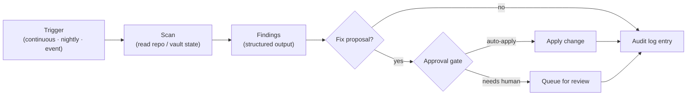
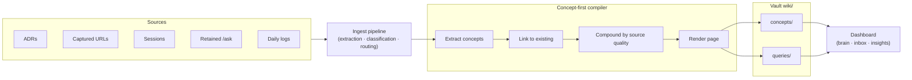
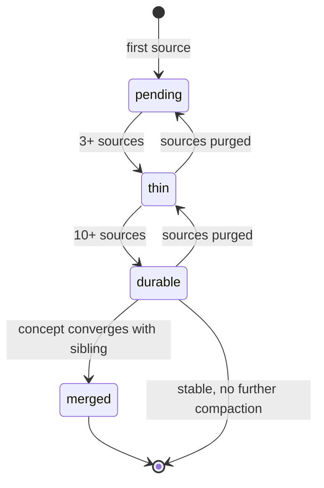

# augur-os architecture deep-dives — autoloops + LLM Wiki

## Goal

Add two architecture deep-dive docs to `~/Projects/augur-os/docs/` that pay off the two strongest claims in the investor pitch:

- **Autoloops** as continuous-improvement-and-trust moat (a3: continuous improvement is the user benefit; trust-through-automation is the moat).
- **LLM Wiki** as concept-compounding-and-portability moat (w3: concept-compounding is the user benefit; local-first MCP-exposed is the moat).

Both docs sit one click below `architecture-overview.md` on the investor read-path.

## In scope (4 artifacts)

1. `~/Projects/augur-os/docs/architecture-autoloops.md` — new file, ~800–1200 words, two visuals (1 Mermaid + 1 Markdown table).
2. `~/Projects/augur-os/docs/architecture-llm-wiki.md` — new file, ~800–1200 words, two Mermaid diagrams (pipeline + concept-page state).
3. `~/Projects/augur-os/docs/architecture-overview.md` — three small edits: append `→ See ...` arrow at end of Subsystem §2 (Wiki and ingest), append `→ See ...` arrow at end of Subsystem §5 (Autoloops), expand the "Where to go next" list to include both new docs above the gateway link.
4. `~/Projects/augur-os/README.md` — single-sentence addition after the existing "For a deeper dive" line, naming both new docs as subsystem deep-dives.

## Out of scope (explicitly)

- ROADMAP changes (already published; no new public commitments).
- New ADRs (these docs reference existing ADRs, don't replace them).
- Rewriting `architecture-mcp-gateway.md` (untouched).
- Changes to the `Augur` main repo.
- Site (`augur.run`) changes.
- New commitments about future autoloops or wiki capabilities — descriptive of current state only.
- Per-loop and per-script reference docs (those would be spec-grade, which we explicitly rejected in Q1).
- New section in the README for "Architecture deep-dives" (rejected via Q5-C).

## Tone

Same as the overview: confident-but-factual, hedge only where genuinely uncertain. Each doc must visibly answer *what is it*, *how does it work*, and *why is it defensible*.

## Approach per artifact

### 1. `architecture-autoloops.md`

Document structure:

```
# Augur Autoloops

Lead paragraph (~80 words). What autoloops are; the two-claim hook
(continuous improvement = user benefit; trust-through-automation = moat).

## What an autoloop is

3 paragraphs (~120 words). Scan-fix protocol; scope-bounded; runs on the
user's machine via the daemon (launchd / Task Scheduler).

## How a loop runs

[Diagram 1 — Loop anatomy, Mermaid flowchart LR]

~150 words. Walks the diagram: Trigger → Scan → Findings → Fix proposal →
Approval gate (auto vs human) → Apply → Audit log. Notes the three
decision points where loop policy decides what auto-applies vs what
waits for the user.

## The autoloop catalog (current state, April 2026)

[Diagram 2 — Catalog table, Markdown]

| Tier | Cadence    | Loops                                                  |
|------|------------|--------------------------------------------------------|
| T0   | Continuous | self-heal, security autoloop                           |
| T0   | Nightly    | hardening (page mounts, runtime checks)                |
| T1   | Nightly    | code-quality, repo, hub-coverage, self-heal escalation |
| T2   | Nightly    | skill-standards, observability                         |
| T4   | Nightly    | docs, wiring                                           |

~80 words framing. Each loop has its own SKILL.md in the project repo;
this doc points to it for source-of-truth.

## The security autoloop as the worked example

~150 words. S1 prompt-injection · S2 secrets · S3 static analysis ·
S4 integrity · S5 permissions/policy · Tank CLI · scan-fix module.
Names this as the most-developed autoloop and the model the others
are converging on.

## Why this is defensible

~150 words. Two paragraphs:

- Continuous improvement is the user benefit. Drift caught without
  user driving it. Compound advantage as loops grow.
- Trust-through-automation is the moat. Approved, audit-logged,
  sandbox-bounded loops that move toward known-good states with
  human-in-the-loop on destructive changes. Trust as a feature.

## Where this lives in the repo

- `skills/daemon/` — scheduler, launchd / Task Scheduler integration.
- `skills/loop-*/` — current loops (loop-security, loop-test, loop-quality,
  loop-repo, loop-ops, loop-memory, loop-observability, loop-docs,
  loop-wiring, loop-hub-coverage).
- ADR-245 — ops loops centralized issue inventory.

## Where to go next

- architecture-overview.md
- architecture-llm-wiki.md
- ROADMAP.md
```

#### Diagram 1 — Loop anatomy (Mermaid)



#### Catalog accuracy

The table reflects what's actually in `skills/loop-*` today. Before commit, the table is reconciled against `ls skills/loop-*` and `grep loop:` in skill SKILL.md files. "Tier" terminology in the table matches the SKILL.md `tier:` integer field (0/1/2/4). No invented loops.

### 2. `architecture-llm-wiki.md`

Document structure:

```
# Augur LLM Wiki

Lead paragraph (~80 words). What the LLM Wiki is — durable, compiled
knowledge that grows denser as you use Augur — and the two-claim hook
(concept-compounding = user benefit; local-first MCP-exposed = moat).

## What the LLM Wiki is

~120 words. The wiki is a compiled knowledge base, not a note-taking app.
Inputs (ADRs, captured URLs, sessions, retained /ask outcomes, daily
logs) are ingested, extracted into concepts, and compiled into durable
concept pages weighted by source quality. Lives under the user's vault
(`wiki/`). Distinguishes from RAG over raw sources: the wiki retrieves
the concept, not the source.

## How the pipeline works

[Diagram 1 — Source-to-concept pipeline, Mermaid flowchart LR]

~180 words. Walks the diagram from raw inputs through the concept-first
compiler to dashboard surfaces. Names the four compiler phases:
extraction → linking → compounding → page rendering. Notes that ADR-560
was the semantic page compiler (now superseded); ADR-561 introduced the
concept-first compiler that replaced it; ADR-559 added ambient file
import; ADR-564 added the brain/inbox/wiki insights surface.

## Concept page lifecycle

[Diagram 2 — Concept page state diagram, Mermaid stateDiagram-v2]

~150 words. Walks through the four states (`pending` 1–2 sources,
`thin` 3–5, `durable` 10–15, `merged` consolidated). Names the
compounding-health metric the system tracks: average sources per page,
thin-page count, orphan-page count, duplicate-cluster count.

The same page can move backward (durable → thin) if sources are purged,
or be merged into a sibling when concepts converge. Source quality
weighting means a single high-confidence source can carry a page out
of pending without ten weak ones.

## Compounding mechanics — the worked example

~120 words. Concrete walk-through. Day 1: capture URL → pending concept
page. Day 5: retained /ask outcome references it → thin. Day 12: ADR
ingestion adds three more sources → still thin. Six more sessions over
a month → durable. Day 35: re-ask retrieves the durable concept page,
not the original URL.

## Why this is defensible

~150 words. Two paragraphs:

- Concept-compounding is the user benefit. Re-asking retrieves the
  synthesized concept, not the source. Wiki gets denser per-input as
  it grows. Compounding knowledge is rare in the AI-tools category.
- Local-first, MCP-exposed is the moat. Your knowledge, on your machine,
  exposed through MCP so any AI client reads from the same compiled
  base. No vendor silo. Portability is structural, not a roadmap promise.
  A competitor with a hosted-only wiki cannot copy this without
  reversing their data-ownership model.

## Where this lives in the repo

- `skills/ingest/scripts/wiki_*.py` — concept-first compiler (extraction,
  linking, compounding, page rendering).
- `skills/knowledge/` — RAG over the vault and the wiki.
- ADR-559 (ambient ingest), ADR-560 (semantic compiler, superseded),
  ADR-561 (concept-first compiler), ADR-564 (insights surface).
- Vault path: `wiki/concepts/`, `wiki/queries/`, `wiki/sources/`.

## Where to go next

- architecture-overview.md
- architecture-autoloops.md
- ROADMAP.md
```

#### Diagram 1 — Source-to-concept pipeline (Mermaid)



#### Diagram 2 — Concept page lifecycle (Mermaid stateDiagram-v2)



#### Source-to-pipeline accuracy

Every phase named in the diagram must map to a real script in `skills/ingest/scripts/wiki_*.py`: `wiki_concept_extraction.py`, `wiki_concept_links.py`, `wiki_compound_policy.py`, `wiki_concept_pages.py`. Verified before commit. The 1–2 / 3–5 / 10–15 source thresholds match the wiki guidance in `CLAUDE.md`. ADR-560 phrased as "superseded" (rather than "retired") for public-repo tone.

### 3. `architecture-overview.md` cross-link edits

**Edit 1 — Subsystems §2 (Wiki and ingest).** Currently ends with `... ADR-564 surfaces the resulting brain/inbox/wiki insights in the dashboard.`

Append at the end of that paragraph:

> *→ See architecture-llm-wiki.md for the compiler pipeline and concept-page lifecycle.*

**Edit 2 — Subsystems §5 (Autoloops).** Currently ends with `... shown explicitly as a quality gate in the release diagram below.` (after the security autoloop sub-list).

Append a new paragraph after that block:

> *→ See architecture-autoloops.md for the loop anatomy, the catalog, and the trust-and-improvement model.*

**Edit 3 — "Where to go next" section.** Replace the existing list with:

```markdown
- ROADMAP.md — public release plan with status markers.
- architecture-llm-wiki.md — concept-first compiler and lifecycle.
- architecture-autoloops.md — loop anatomy, catalog, and trust model.
- architecture-mcp-gateway.md — gateway-internal detail.
- getting-started.md — local install and first run.
- [Sessions log](https://augur.run/sessions.html) — recent change log on augur.run.
```

Wiki and Autoloops surface above the gateway doc because tomorrow's reader will hit them more often than the gateway internals.

### 4. `README.md` cross-link edit

After the existing line `For a deeper dive, see docs/architecture-overview.md.`, append a parallel sentence:

> *Subsystem deep-dives: llm-wiki · autoloops.*

Single line, parallel structure to the existing line, no new section header.

## Sequencing

1. Write `architecture-autoloops.md`. Verify catalog against `ls skills/loop-*` and `tier:` fields. Local commit.
2. Write `architecture-llm-wiki.md`. Verify referenced scripts and ADRs. Local commit.
3. `architecture-overview.md` cross-link edits (3 small edits). Local commit.
4. `README.md` cross-link edit (1 line appended). Local commit.
5. Push all four commits to `augur-os` origin/main. Fast-forward push.
6. Verify on github.com — both new docs render, all three Mermaid blocks render, the overview's new arrows resolve, README link block resolves.

## Verification

- **Catalog accuracy:** the autoloops table reflects what's actually in `skills/loop-*`. Reconciled before commit by listing the dirs and grepping `tier:` fields.
- **Wiki claim accuracy:** every referenced script (`wiki_concept_extraction.py`, `wiki_concept_links.py`, `wiki_compound_policy.py`, `wiki_concept_pages.py`) exists on disk. Every ADR (559/560/561/564) exists in `~/Projects/Au-docs/adrs/`.
- **Mermaid render:** three Mermaid blocks total across the two new docs (1 in autoloops, 2 in wiki). The autoloops doc uses a Markdown table for its second diagram. Each verified on github.com after push. The `stateDiagram-v2` is the riskiest syntax-wise — verify first.
- **Cross-link resolution:** the four new arrow links in the overview and README all resolve to real files.
- **Tone audit:** same hedge-only-on-Windows-validation rule. No "soft launch" or "coming month" phrases survive.
- **Length check:** each doc is ~800–1200 words per Q1-B. If a doc balloons past 1500, cut.
- **No drift with the overview:** subsystem names match exactly. The autoloops doc uses "Security autoloop (S1–S5 + Tank CLI)" identical to the overview. The wiki doc uses "concept-first compiler" identical to the overview's Subsystem §2.

## Risks and mitigations

| Risk | Mitigation |
|------|-----------|
| Catalog table claims a loop that doesn't exist | Reconcile against `ls skills/loop-*` before commit |
| Mermaid `stateDiagram-v2` fails to render on github.com | Verify after push; if fails, simplify to `flowchart LR` showing the same states as nodes |
| The wiki doc claims a pipeline phase that's not in code | Each phase named in the diagram maps to a real script in `skills/ingest/scripts/wiki_*.py`; verify before commit |
| Overview gets too cluttered with cross-link arrows | Single italic line per arrow; no multiple links per paragraph |
| README link addition breaks the existing flow | Insert as a new sentence after the existing "deeper dive" line, not as a replacement |
| ADR-560 phrasing reads negatively in a public repo | Use "superseded" not "retired" |

## Decisions log

- Q1 — depth: **B** (architecture deep-dive, ~800–1200 words each, 2 visuals each).
- Q2 — file naming: **B** (`architecture-autoloops.md` + `architecture-llm-wiki.md`).
- Q3 — defensible claim: **a3 + w3** (both user-benefit + moat in each doc).
- Q4 — diagrams: approved as listed (loop anatomy + catalog table; pipeline + concept-page state diagram).
- Q5 — cross-linking: **B** (cross-link plus tighten Subsystems §2 and §5 with `→ See ...` arrows; expanded "Where to go next").
- ADR-560 phrasing: "superseded" rather than "retired".

## Where the work lands

- Augur main repo (this repo): only this spec lands here.
- `~/Projects/augur-os/docs/`: two new files + one edit (overview).
- `~/Projects/augur-os/README.md`: one-line addition.
- Push: `git push origin main` to `github.com/augur-os/augur-os`.
