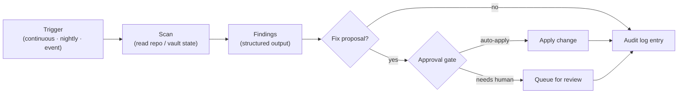
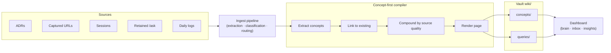
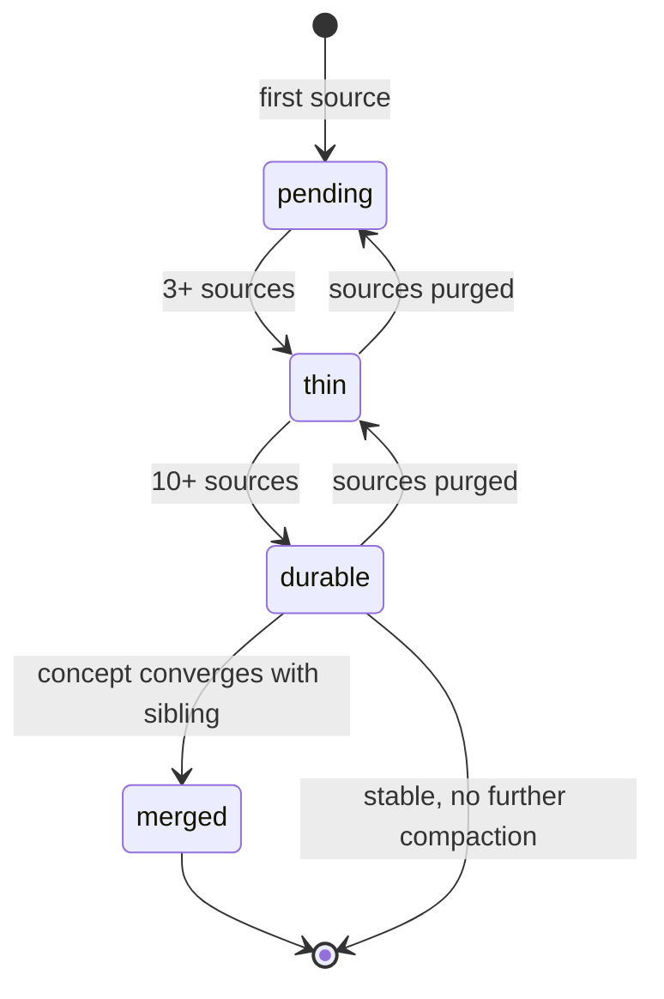

# augur-os Architecture Deep-Dives Implementation Plan

> **For agentic workers:** REQUIRED SUB-SKILL: Use superpowers:subagent-driven-development (recommended) or superpowers:executing-plans to implement this plan task-by-task. Steps use checkbox (`- [ ]`) syntax for tracking.

**Goal:** Add two architecture deep-dive docs to the public `augur-os` repo (`architecture-autoloops.md` + `architecture-llm-wiki.md`), each ~800–1200 words with diagrams, plus minimal cross-link edits in the overview and README so they're discoverable from the investor read-path.

**Architecture:** Six bite-sized tasks. Each new doc is one task (write + verify catalog/script accuracy + commit). Cross-link edits are two more tasks (overview + README). Then push and verify github.com Mermaid render. Sequenced so the deep-dives are committed before the cross-links to avoid broken `→ See ...` arrows mid-push.

**Tech Stack:** Markdown, Mermaid (rendered natively on github.com), git. Repo is `~/Projects/augur-os`. Local main is currently at `a130960` and synced with origin (we just finished a previous push session).

**Worktree note:** edits are entirely in `~/Projects/augur-os`; the Augur main repo is untouched after this plan and the spec land. Run from `~/Projects/augur-os/` for all git operations.

**Spec:** `docs/superpowers/specs/2026-04-27-augur-os-architecture-deep-dives-design.md`

---

## File Structure

| File | Repo / location | Action |
|------|-----------------|--------|
| `docs/architecture-autoloops.md` | `~/Projects/augur-os/` | Create |
| `docs/architecture-llm-wiki.md` | `~/Projects/augur-os/` | Create |
| `docs/architecture-overview.md` | `~/Projects/augur-os/` | 3 small edits (2 arrow appends + 1 list rewrite) |
| `README.md` | `~/Projects/augur-os/` | 1 line appended |

---

## Task 1: Pre-flight verification of catalog and script claims

**Files:** read-only verification, no mutations.

This task gathers evidence so Tasks 2 and 3 can write the docs without claiming things that don't exist. No commits.

- [ ] **Step 1: Confirm the loop catalog**

Run from the main `Augur` repo (where the loop skills actually live):

```bash
cd ~/Projects/Augur
ls -d skills/loop-*
```

Expected: 10 directories — `loop-docs`, `loop-hub-coverage`, `loop-memory`, `loop-observability`, `loop-ops`, `loop-quality`, `loop-repo`, `loop-security`, `loop-test`, `loop-wiring`.

- [ ] **Step 2: Confirm tier and trigger fields per loop**

Run from the same repo:

```bash
cd ~/Projects/Augur
grep -A2 "loop:" skills/daemon/SKILL.md | grep -E "tier:|trigger:" | head -30
for d in skills/loop-*; do echo "=== $d ==="; grep -E "  loop:|tier:|trigger:" "$d/SKILL.md" 2>/dev/null | head -10; done
```

Expected: each loop's `tier:` (0/1/2/4) and `trigger:` (continuous/nightly/event) is visible. Note any mismatch with the catalog table in Task 2 step 3 — adjust the table to match real values before commit.

- [ ] **Step 3: Confirm wiki compiler scripts exist**

```bash
ls ~/Projects/Augur/skills/ingest/scripts/wiki_concept_extraction.py
ls ~/Projects/Augur/skills/ingest/scripts/wiki_concept_links.py
ls ~/Projects/Augur/skills/ingest/scripts/wiki_compound_policy.py
ls ~/Projects/Augur/skills/ingest/scripts/wiki_concept_pages.py
ls ~/Projects/Augur/skills/ingest/scripts/wiki_concept_compiler.py
```

Expected: all 5 files print without error. If any is missing, the diagram in Task 3 must drop or rename the corresponding phase before commit.

- [ ] **Step 4: Confirm ADR files exist**

```bash
ls ~/Projects/Au-docs/adrs/ADR-{245,559,560,561,564}-*.md
```

Expected: all 5 print.

- [ ] **Step 5: Confirm `architecture-overview.md` anchor language for cross-link arrows**

```bash
cd ~/Projects/augur-os
grep -n "ADR-564 surfaces the resulting" docs/architecture-overview.md
grep -n "shown explicitly as a quality gate" docs/architecture-overview.md
grep -n "## Where to go next" docs/architecture-overview.md
```

Expected: each grep returns exactly one line number. These are the anchor points Task 4 will edit. If any of these strings has been changed since the spec, Task 4 must adapt.

- [ ] **Step 6: Confirm README anchor for Task 5**

```bash
cd ~/Projects/augur-os
grep -n "For a deeper dive, see \[docs/architecture-overview.md\]" README.md
```

Expected: exactly one line. This is the anchor Task 5 will append after.

- [ ] **Step 7: No commit. Notes carried into Tasks 2–5.**

---

## Task 2: Write `architecture-autoloops.md`

**Files:**
- Create: `~/Projects/augur-os/docs/architecture-autoloops.md`

- [ ] **Step 1: Confirm the file does not already exist**

```bash
ls ~/Projects/augur-os/docs/architecture-autoloops.md 2>&1
```

Expected: `No such file or directory`. If the file exists, stop and check whether a previous run partially landed.

- [ ] **Step 2: Write the file**

Write `~/Projects/augur-os/docs/architecture-autoloops.md` with EXACTLY this content. Adjust the catalog table in the "current state" section if Task 1 step 2 surfaced a mismatch (e.g., a loop is tier 2 not tier 1).

```markdown
# Augur Autoloops

Augur ships a small set of scheduled, scope-bounded automations called **autoloops**. They run on the user's machine, inspect repo and vault state, propose corrective changes, and write structured outputs. Two claims anchor this document: autoloops give the user **continuous improvement without driving it themselves**, and the approval-gated, audit-logged execution model makes **trust-through-automation** a structural property rather than a marketing line.

## What an autoloop is

An autoloop is a single skill that follows the **scan-fix protocol**: read state, produce findings, optionally propose a corrective change, and either auto-apply or queue for human review. Each loop has a clear scope (security, code quality, repo hygiene, test coverage, documentation, etc.) and never crosses into other loops' domains.

Loops run via the unified daemon — launchd on macOS, Windows Task Scheduler on Windows. Each loop declares its `tier` (priority) and `trigger` (continuous, nightly, event) in its `SKILL.md`. The daemon owns scheduling; loops own logic; the MCP gateway owns dispatch and audit.

Loops never run destructive actions without an explicit approval gate. The default is "find and report"; "find and fix" is opt-in per loop and per finding type.

## How a loop runs



The diagram shows the three decision points where loop policy controls the system. **Findings → Fix proposal** decides whether the loop is read-only or fix-capable. **Approval gate** decides whether a fix auto-applies or waits for the user. **Audit log entry** is non-optional — every run writes structured output regardless of outcome, so the dashboard and downstream loops always see a consistent history.

A loop that finds nothing still produces an audit entry. This matters: the audit stream is the substrate the rest of the ops layer reads from.

## The autoloop catalog (current state, April 2026)

| Tier | Cadence    | Loops                                                  |
|------|------------|--------------------------------------------------------|
| T0   | Continuous | self-heal, security autoloop                           |
| T0   | Nightly    | hardening (page mounts, runtime checks)                |
| T1   | Nightly    | code-quality, repo, hub-coverage, self-heal escalation |
| T2   | Nightly    | skill-standards, observability                         |
| T4   | Nightly    | docs, wiring                                           |

Each loop has its own `SKILL.md` in `skills/loop-*/` (and the daemon-internal loops in `skills/daemon/`). The table is descriptive, not prescriptive — adding a new loop adds a row; deprecating a loop removes one.

## The security autoloop as the worked example

The **security autoloop** is the most-developed loop as of April 2026 and the model the others are converging on. It runs continuously at tier 0 and covers five orthogonal scan stages:

- **S1** — prompt-injection detection.
- **S2** — secret scanning, with `detect-secrets` plus a fallback scanner.
- **S3** — static code analysis (Bandit + AST fallback).
- **S4** — integrity and trust checks.
- **S5** — permissions and policy checks.

Tank CLI integration plugs the loop into the existing CLI registry, and a scan-fix module proposes corrective changes alongside findings. The security autoloop runs ahead of releases as a quality gate (see architecture-overview.md §Release and lifecycle).

## Why this is defensible

**Continuous improvement is the user benefit.** Drift gets caught without the user driving it: regressions in security, code quality, repo hygiene, test coverage, and documentation surface as findings the user can review or auto-apply. As the loop catalog grows, the system gets better at maintaining itself. This is a compound advantage — every loop added is one less category of drift the user has to remember to check.

**Trust-through-automation is the moat.** Most agent platforms ship "do anything" tools that defer trust questions to the user. Augur ships approved, audit-logged, sandbox-bounded loops that move the system toward known-good states with human-in-the-loop on destructive changes. Trust is a structural property, not a roadmap promise. A competitor with a broad-permission "let the agent decide" model cannot copy this without rebuilding their permission model from the ground up.

## Where this lives in the repo

- `skills/daemon/` — scheduler, launchd / Task Scheduler integration, loop dispatch.
- `skills/loop-*/` — current loops: `loop-security`, `loop-test`, `loop-quality`, `loop-repo`, `loop-ops`, `loop-memory`, `loop-observability`, `loop-docs`, `loop-wiring`, `loop-hub-coverage`.
- ADR-245 — ops loops centralized issue inventory.

## Where to go next

- architecture-overview.md — the three-layer model and named subsystems.
- architecture-llm-wiki.md — the other architecture deep-dive.
- ROADMAP.md — public release plan with status markers.
```

- [ ] **Step 3: Verify the file**

```bash
cd ~/Projects/augur-os
wc -w docs/architecture-autoloops.md     # expect 700–1200 words
grep -c '^## ' docs/architecture-autoloops.md     # expect 7 (lead + 6 H2 + Where to go)
grep -c '^```mermaid' docs/architecture-autoloops.md     # expect 1
grep -c "S1\|S2\|S3\|S4\|S5" docs/architecture-autoloops.md     # expect at least 5
grep -c "scan-fix" docs/architecture-autoloops.md     # expect at least 2
```

If word count is < 700 or > 1500, tighten or expand the §"What an autoloop is" / §"Why this is defensible" sections.

- [ ] **Step 4: Catalog accuracy gate**

If Task 1 step 2 found that a loop's tier or trigger differs from the catalog table, edit the table now. The table must match `tier:` and `trigger:` fields in the SKILL.md files. No invented loops.

- [ ] **Step 5: Commit**

```bash
cd ~/Projects/augur-os
git add docs/architecture-autoloops.md
git commit -m "docs(architecture): add architecture-autoloops deep-dive

Architecture deep-dive for the autoloop subsystem. Covers the scan-fix
protocol, loop anatomy diagram, current catalog (T0/T1/T2/T4 cadences),
security autoloop as the worked example (S1-S5 + Tank CLI), and the
two-claim hook (continuous improvement + trust-through-automation as
moat). Cross-linked from architecture-overview.md in a follow-up commit."
```

---

## Task 3: Write `architecture-llm-wiki.md`

**Files:**
- Create: `~/Projects/augur-os/docs/architecture-llm-wiki.md`

- [ ] **Step 1: Confirm the file does not already exist**

```bash
ls ~/Projects/augur-os/docs/architecture-llm-wiki.md 2>&1
```

Expected: `No such file or directory`.

- [ ] **Step 2: Write the file**

Write `~/Projects/augur-os/docs/architecture-llm-wiki.md` with EXACTLY this content:

```markdown
# Augur LLM Wiki

The **LLM Wiki** is Augur's compiled knowledge layer. Inputs (ADRs, captured URLs, sessions, retained `/ask` outcomes, daily logs) flow through a concept-first compiler into durable concept pages weighted by source quality. Two claims anchor this document: re-asking a question retrieves the **synthesized concept**, not the source — knowledge that compounds — and the wiki lives on the user's machine, exposed through MCP, so any AI client can read from the same compiled base. Compounding knowledge is the user benefit; local-first portability is the moat.

## What the LLM Wiki is

The wiki is a **compiled knowledge base**, not a note-taking app. Notes are an input; the wiki is the output of a synthesis pipeline.

Inputs flow from the ingest pipeline (URLs and files captured through the dashboard or `/ingest-url`), from session retention (durable conversation outcomes), from ADRs (architectural decisions stored in the user's external documents repo), from retained `/ask` outcomes, and from daily logs. The pipeline extracts concepts, links them against existing concepts, and compounds sources into pages weighted by source quality.

The wiki lives under the user's vault (`wiki/concepts/`, `wiki/queries/`, `wiki/sources/`). It is not a hosted service. Re-installing Augur does not lose the wiki; switching machines does not lose the wiki — it travels with the vault.

This distinguishes the wiki from RAG-over-raw-sources: RAG retrieves the source chunk; the wiki retrieves the **synthesized concept** with its provenance. Both surfaces co-exist; the wiki is the durable layer.

## How the pipeline works



Four compiler phases run sequentially. **Extraction** turns raw source into candidate concepts. **Linking** matches candidates against existing concept pages so duplicate ideas merge instead of forking. **Compounding** weighs sources by quality and confidence — a single high-confidence ADR carries more weight than ten weak captures of the same topic. **Rendering** writes the page to the vault.

ADR-559 added ambient file import as an ingest source. ADR-560 was the original semantic page compiler; it was superseded by ADR-561, which introduced the concept-first compiler. ADR-564 surfaces the brain/inbox/wiki insights through the dashboard so the user sees compounding mechanics and health metrics in real time.

The dashboard reads from `wiki/concepts/` and `wiki/queries/` directly; the same files are exposed to AI clients through MCP, so a Claude or Codex session retrieves from the same compiled knowledge the dashboard renders.

## Concept page lifecycle



A concept page evolves as it accumulates sources. **Pending** (1–2 sources) means the concept exists but is not yet usable for retrieval — the wiki holds it as a stub. **Thin** (3–5 sources) means the page is real but undercompounded; retrieval works but quality is variable. **Durable** (10–15 sources) is the target state — the page is dense enough that re-asking returns the synthesized answer rather than a single source. **Merged** is the terminal state for sibling concepts that converge: when two pages describe the same idea from different framings, the compiler folds them into one.

The arrows backward exist on purpose. If sources are purged (a captured URL becomes stale, a session is forgotten), a page can drop from `durable` back to `thin`. The system tracks compounding health (average sources per page, thin-page count, orphan-page count, duplicate-cluster count) and surfaces it in the dashboard.

## Compounding mechanics — the worked example

A user captures a URL on day 1 → the wiki creates a `pending` concept page. On day 5, a retained `/ask` outcome references the same idea → the page reaches `thin`. On day 12, an ADR ingestion adds three more sources → still `thin`. Six more sessions over the next month each touch the topic → the page reaches `durable`. On day 35, the user re-asks the original question through any MCP-capable client → retrieval returns the durable concept page with its synthesis, not the original URL.

The compounding effect is not linear. A single high-confidence ADR can carry a page from `pending` directly through `thin` because the source quality weighting accounts for type. Casual captures need volume; structured decisions don't.

## Why this is defensible

**Concept-compounding is the user benefit.** Re-asking a question retrieves the synthesized concept, not the source. The wiki gets denser per-input as it grows — the same input produces more value once a concept page is `durable` than when it was `pending`. Compounding knowledge is rare in the AI-tools category; most products treat each query as fresh.

**Local-first, MCP-exposed is the moat.** The wiki is the user's knowledge, on their machine, exposed through MCP so any AI client reads from the same compiled base. No vendor silo. Portability is structural, not a roadmap promise — the vault is files in directories, versioned with git, owned by the user. A competitor with a hosted-only wiki cannot copy this without reversing their data-ownership model. A competitor that ships local files but not MCP-exposed cannot give the user multi-client portability without rebuilding their integration model.

## Where this lives in the repo

- `skills/ingest/scripts/wiki_*.py` — concept-first compiler (extraction, linking, compounding, page rendering).
- `skills/knowledge/` — RAG over the vault and the wiki.
- ADR-559 (ambient ingest), ADR-560 (semantic compiler, superseded), ADR-561 (concept-first compiler), ADR-564 (insights surface).
- Vault paths: `wiki/concepts/`, `wiki/queries/`, `wiki/sources/`.

## Where to go next

- architecture-overview.md — the three-layer model and named subsystems.
- architecture-autoloops.md — the other architecture deep-dive.
- ROADMAP.md — public release plan with status markers.
```

- [ ] **Step 3: Verify the file**

```bash
cd ~/Projects/augur-os
wc -w docs/architecture-llm-wiki.md     # expect 800–1300 words
grep -c '^## ' docs/architecture-llm-wiki.md     # expect 7
grep -c '^```mermaid' docs/architecture-llm-wiki.md     # expect 2
grep -c "stateDiagram-v2" docs/architecture-llm-wiki.md     # expect 1
grep -c "pending\|thin\|durable\|merged" docs/architecture-llm-wiki.md     # expect at least 8
grep -c "concept-first compiler" docs/architecture-llm-wiki.md     # expect at least 2
grep -c "superseded" docs/architecture-llm-wiki.md     # expect 1 (ADR-560 phrasing)
grep -c "retired" docs/architecture-llm-wiki.md     # expect 0
```

If word count is < 800 or > 1500, tighten or expand the §"What the LLM Wiki is" / §"Why this is defensible" sections.

- [ ] **Step 4: Wiki claim accuracy gate**

Each phase named in Diagram 1 must map to a real script. Confirm again from Task 1 step 3 that `wiki_concept_extraction.py`, `wiki_concept_links.py`, `wiki_compound_policy.py`, `wiki_concept_pages.py` all exist. If any has been renamed, update the diagram phase name to match.

- [ ] **Step 5: Commit**

```bash
cd ~/Projects/augur-os
git add docs/architecture-llm-wiki.md
git commit -m "docs(architecture): add architecture-llm-wiki deep-dive

Architecture deep-dive for the LLM Wiki subsystem. Covers the
concept-first compiler pipeline, the four compiler phases (extraction,
linking, compounding, rendering), the concept page lifecycle (pending →
thin → durable → merged) as a Mermaid stateDiagram-v2, a worked
compounding example, and the two-claim hook (concept-compounding +
local-first MCP-exposed as moat). Cross-linked from
architecture-overview.md in a follow-up commit."
```

---

## Task 4: Cross-link `architecture-overview.md`

**Files:**
- Modify: `~/Projects/augur-os/docs/architecture-overview.md` (3 small edits)

- [ ] **Step 1: Append the wiki arrow at end of Subsystems §2**

Find the line:

```
ADR-564 surfaces the resulting brain/inbox/wiki insights in the dashboard.
```

Append a new paragraph immediately after it (preserve a blank line before the new paragraph):

```
*→ See architecture-llm-wiki.md for the compiler pipeline and concept-page lifecycle.*
```

- [ ] **Step 2: Append the autoloops arrow at end of Subsystems §5**

Find the line:

```
The security autoloop runs ahead of releases and is shown explicitly as a quality gate in the release diagram below.
```

Append a new paragraph immediately after it (preserve a blank line):

```
*→ See architecture-autoloops.md for the loop anatomy, the catalog, and the trust-and-improvement model.*
```

- [ ] **Step 3: Replace the "Where to go next" list**

Find the section heading `## Where to go next` and the four-bullet list directly under it. Replace the four bullets with these six:

```markdown
- ROADMAP.md — public release plan with status markers.
- architecture-llm-wiki.md — concept-first compiler and lifecycle.
- architecture-autoloops.md — loop anatomy, catalog, and trust model.
- architecture-mcp-gateway.md — gateway-internal detail.
- getting-started.md — local install and first run.
- [Sessions log](https://augur.run/sessions.html) — recent change log on augur.run.
```

- [ ] **Step 4: Verify the edits**

```bash
cd ~/Projects/augur-os
grep -c "→ See \[architecture-llm-wiki.md\]" docs/architecture-overview.md     # expect 1
grep -c "→ See \[architecture-autoloops.md\]" docs/architecture-overview.md     # expect 1
grep -c "architecture-llm-wiki.md" docs/architecture-overview.md     # expect 2
grep -c "architecture-autoloops.md" docs/architecture-overview.md     # expect 2
```

- [ ] **Step 5: Commit**

```bash
cd ~/Projects/augur-os
git add docs/architecture-overview.md
git commit -m "docs(architecture): cross-link new deep-dives in overview

Subsystems §2 (Wiki and ingest) and §5 (Autoloops) now end with
'→ See ...' arrows pointing at architecture-llm-wiki.md and
architecture-autoloops.md respectively. 'Where to go next' list
expanded to surface the deep-dives above the gateway-internal doc,
matching the investor read-path priority."
```

---

## Task 5: Cross-link `README.md`

**Files:**
- Modify: `~/Projects/augur-os/README.md` (1 line appended)

- [ ] **Step 1: Find the anchor line**

```bash
cd ~/Projects/augur-os
grep -n "For a deeper dive, see \[docs/architecture-overview.md\]" README.md
```

Expected: one line number.

- [ ] **Step 2: Append a new sentence after that line**

Find:

```
For a deeper dive, see docs/architecture-overview.md.
```

Append a new line immediately after (with a single newline separator, no blank line):

```
Subsystem deep-dives: llm-wiki · autoloops.
```

The result should read:

```
For a deeper dive, see docs/architecture-overview.md.
Subsystem deep-dives: llm-wiki · autoloops.
```

- [ ] **Step 3: Verify**

```bash
cd ~/Projects/augur-os
grep -c "Subsystem deep-dives:" README.md     # expect 1
grep -c "architecture-llm-wiki.md" README.md     # expect 1
grep -c "architecture-autoloops.md" README.md     # expect 1
```

- [ ] **Step 4: Commit**

```bash
cd ~/Projects/augur-os
git add README.md
git commit -m "docs(readme): link to llm-wiki and autoloops deep-dives

Single-line addition under the existing 'For a deeper dive' sentence.
No new section header — keeps the README flow intact while making the
two new architecture docs discoverable from the project landing page."
```

---

## Task 6: Push and verify github.com Mermaid render

**Files:** no file edits.

- [ ] **Step 1: Confirm four commits ahead of origin**

```bash
cd ~/Projects/augur-os
git status -sb
git log --oneline origin/main..HEAD
```

Expected: `## main...origin/main [ahead 4]` and four commits in `git log` (autoloops, wiki, overview, README).

- [ ] **Step 2: Push**

```bash
cd ~/Projects/augur-os
git push origin main
```

Expected: clean fast-forward push of four commits.

- [ ] **Step 3: Confirm the new files on github.com**

```bash
curl -sI https://raw.githubusercontent.com/augur-os/augur-os/main/docs/architecture-autoloops.md | head -1
curl -sI https://raw.githubusercontent.com/augur-os/augur-os/main/docs/architecture-llm-wiki.md | head -1
```

Expected: both return `HTTP/2 200`.

- [ ] **Step 4: Confirm Mermaid blocks land in the raw markdown**

```bash
curl -s https://raw.githubusercontent.com/augur-os/augur-os/main/docs/architecture-autoloops.md | grep -c '^```mermaid'   # expect 1
curl -s https://raw.githubusercontent.com/augur-os/augur-os/main/docs/architecture-llm-wiki.md | grep -c '^```mermaid'   # expect 2
curl -s https://raw.githubusercontent.com/augur-os/augur-os/main/docs/architecture-llm-wiki.md | grep -c "stateDiagram-v2"   # expect 1
```

- [ ] **Step 5: Visual render check (manual)**

Open in a browser:
- `https://github.com/augur-os/augur-os/blob/main/docs/architecture-autoloops.md` — confirm the loop-anatomy flowchart renders. The `<br/>` line breaks inside quoted node labels should show as line breaks; if they show as literal text, edit those nodes to remove `<br/>` and re-push.
- `https://github.com/augur-os/augur-os/blob/main/docs/architecture-llm-wiki.md` — confirm the source-to-concept flowchart renders AND the concept-page state diagram renders. The state diagram is the riskiest — `stateDiagram-v2` is supported by github.com Mermaid but typos in transition labels will silently fail.

If a diagram fails to render: edit the source, commit a fix, push, re-check.

- [ ] **Step 6: Cross-link resolution check**

Open `https://github.com/augur-os/augur-os/blob/main/docs/architecture-overview.md`. Confirm the two new `→ See ...` arrow links resolve (click each — both should open the corresponding new doc). Confirm the expanded "Where to go next" list resolves all six links.

Open `https://github.com/augur-os/augur-os/blob/main/README.md`. Confirm the new "Subsystem deep-dives" line resolves both links.

- [ ] **Step 7: Cross-doc consistency final pass**

```bash
cd ~/Projects/augur-os
echo "=== subsystem-name presence ==="
for term in "Security autoloop" "concept-first compiler" "scan-fix" "stateDiagram-v2" "User skills" "MCP gateway"; do
  echo "--- $term ---"
  for f in README.md ROADMAP.md docs/architecture-overview.md docs/architecture-mcp-gateway.md docs/architecture-autoloops.md docs/architecture-llm-wiki.md; do
    [ -f "$f" ] && echo "  $f: $(grep -c "$term" "$f")"
  done
done
echo "=== tone audit ==="
grep -nHi "soft launch\|coming month\|coming weeks\|hopefully" README.md ROADMAP.md docs/architecture-*.md 2>&1 | grep -v "^docs/architecture-overview.md:179\|^docs/architecture-overview.md:200\|^ROADMAP.md:13"
```

Expected: subsystem names present where they belong; tone audit shows no NEW hits beyond the three known acceptable phase-name references already in the overview and ROADMAP.

---

## Self-Review Notes

**Spec coverage:**
- Spec §"In scope" artifact 1 (autoloops doc) → Task 2.
- Artifact 2 (llm-wiki doc) → Task 3.
- Artifact 3 (overview cross-link edits) → Task 4.
- Artifact 4 (README cross-link) → Task 5.
- Verification gates from spec §"Verification" → Task 1 (pre-flight), Task 2 step 4, Task 3 step 4, Task 6 (Mermaid render + cross-doc consistency).
- Risks from spec §"Risks and mitigations" all addressed: catalog accuracy gate (Task 1 step 2 + Task 2 step 4), state-diagram render (Task 6 step 5 with explicit fallback note), pipeline-phase script existence (Task 1 step 3 + Task 3 step 4), arrow-link clutter (single italic line per spec), README placement (sentence appended, line not replaced — Task 5 step 2), ADR-560 phrasing (verified via `grep -c "superseded"` and `grep -c "retired"` in Task 3 step 3).

**Type / name consistency:**
- "Security autoloop", "scan-fix", "concept-first compiler", "stateDiagram-v2", "MCP gateway" used consistently across Tasks 2, 3, 4, 6.
- ADR-560 phrased as "superseded" in Task 3 step 2, verified in Task 3 step 3, never appears as "retired".
- Source-to-concept compiler phase names (extraction, linking, compounding, rendering) match the file names verified in Task 1 step 3 (`wiki_concept_extraction.py`, `wiki_concept_links.py`, `wiki_compound_policy.py`, `wiki_concept_pages.py`).

**Placeholder scan:** no "TBD", "TODO", "fill in", "implement later", or "similar to Task N" patterns. Each step has the actual content.
