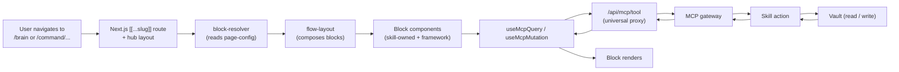
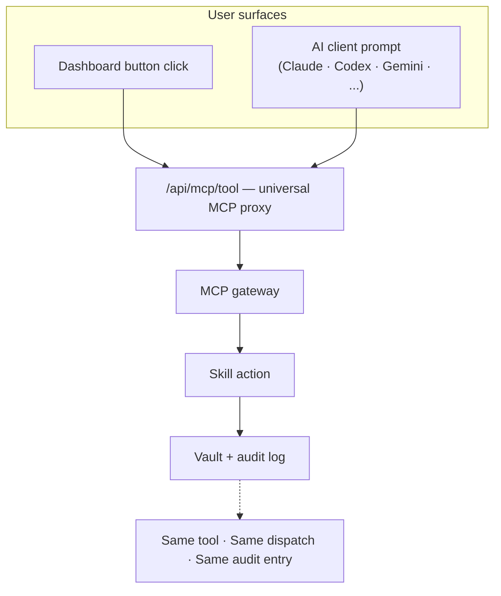
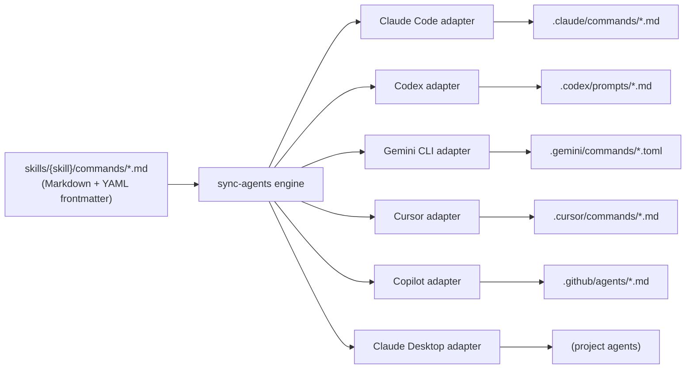

# augur-os architecture deep-dives — dashboard + commands

## Goal

Add two more architecture deep-dive docs to `~/Projects/augur-os/docs/`, extending the investor read-path established by the `llm-wiki` and `autoloops` deep-dives:

- **`architecture-dashboard.md`** — page-as-blocks model + GUI/agent parity. Two-claim hook: GUI/agent parity (user benefit 1) + config-driven blocks (user benefit 2) + MCP-as-substrate (the moat that enables both).
- **`architecture-commands.md`** — deep-dive on commands and per-client native schemas. Two-claim hook: single-source multi-client portability (user benefit 1) + read/mutate semantics visible at the command layer (user benefit 2) + per-client adapters and approval gating (the moat).

## In scope (4 artifacts)

1. `~/Projects/augur-os/docs/architecture-dashboard.md` — new file, ~800–1200 words, two Mermaid diagrams (page-as-blocks pipeline + GUI/agent parity).
2. `~/Projects/augur-os/docs/architecture-commands.md` — new file, ~800–1200 words, one Mermaid diagram (source-of-truth fan-out) + one Markdown table (per-client schema).
3. `~/Projects/augur-os/docs/architecture-overview.md` — three small edits: append `→ See architecture-dashboard.md` arrow at end of Subsystem §3 (Browse); append `→ See architecture-commands.md` arrow at end of Subsystem §4 (Multi-client surfaces); expand "Where to go next" to add both new docs above the gateway link.
4. `~/Projects/augur-os/README.md` — extend the existing "Subsystem deep-dives" line to include `[dashboard]` and `[commands]` after `[autoloops]`.

## Out of scope (explicitly)

- Per-page reference docs (each hub page is not its own deep-dive).
- New skills, new ADRs, or any code changes in the main `Augur` repo.
- Site (`augur.run`) changes.
- ROADMAP changes.
- Rewriting `architecture-mcp-gateway.md`.
- Edits to the prior deep-dives' "Where to go next" sections.
- Documentation of the dashboard's CSS/design system, accessibility, or visual guidelines (those are presentation; this doc is about the architecture pattern below the visuals).
- Per-AI-client setup or installation guides.

## Tone

Same as prior deep-dives: confident-but-factual, hedge only where genuinely uncertain. Each doc visibly answers *what is it*, *how does it work*, and *why is it defensible*. Two-claim hooks: dashboard = GUI/agent parity + config-driven blocks (both); commands = single-source multi-client portability + read/mutate trust semantics (both).

## Approach per artifact

### 1. `architecture-dashboard.md`

Document structure:

```
# Augur Dashboard

Lead paragraph (~80 words). Next.js App Router shell hosting skill-owned
UIs that read everything through MCP. Two-claim hook: GUI/agent parity
+ config-driven blocks (both benefits) + MCP-as-substrate (the moat).

## What the dashboard is

~120 words. Next.js 15 App Router; six hub namespaces (adaptive, brain,
command, life, studio, settings/dev) as [[...slug]] catch-all routes.
Shell is small (global navigation, error boundary, MCP context manager).
Substance lives in skill-owned blocks composed into pages. The
dashboard does not own business logic; every read and every action
goes through MCP.

## Page-as-blocks model

[Diagram 1 — Page rendering pipeline, Mermaid flowchart LR]

~180 words. Walks the diagram: URL → [[...slug]] route → block-resolver
→ flow-layout → blocks → mcpCall → MCP gateway → skill → vault. Names:
block-resolver, flow-layout, generated-block-registry,
custom-block-registry. ADR-491 (config-driven page declarations) and
ADR-490 (framework vs feature import boundaries).

## GUI/agent parity

[Diagram 2 — GUI vs agent paths converging on MCP, Mermaid flowchart TB]

~150 words. Two parallel user surfaces (dashboard click vs AI agent
prompt) converge on /api/mcp/tool. Same execution path; same audit
log entry; same context. The dashboard is itself an MCP client.

## How a click becomes an MCP call

~150 words. Concrete walk-through. User opens /brain. Hub layout mounts.
block-resolver loads page-config. One block reads via useMcpQuery; one
block writes via useMcpMutation. Both flow through /api/mcp/tool.
ContextManager swaps the active MCP toolset on hub navigation.

## Why this is defensible

~150 words. Three points:

- GUI/agent parity is the user benefit. Click or ask — same outcome.
- Config-driven blocks are the user benefit (for skill authors). YAML
  ships UI without React.
- MCP-as-substrate is the moat. Competitor with separate-stack GUI
  can't retrofit parity without rebuilding their backend; competitor
  with hand-coded pages can't keep up with a growing skill catalog.

## Where this lives in the repo

- apps/dashboard/app/ — Next.js routes, including hub [[...slug]].
- apps/dashboard/lib/blocks/ — block resolver, flow layout, registries.
- apps/dashboard/lib/mcp/ — universal MCP proxy client (mcpCall,
  useMcpQuery, useMcpMutation, useMcpPoll).
- apps/dashboard/components/ContextManager.tsx — navigation context switch.
- skills/{skill}/augur/dashboard/ — skill-owned UI source.
- skills/{skill}/augur/pages/*.yaml — config-driven page declarations.
- ADR-490 (framework vs feature boundaries), ADR-491 (config-driven pages).

## Where to go next

- architecture-overview.md
- architecture-commands.md — how commands work across AI clients.
- architecture-mcp-gateway.md — gateway-internal detail.
- ROADMAP.md
```

#### Diagram 1 — Page rendering pipeline (Mermaid)



#### Diagram 2 — GUI/agent parity (Mermaid)



#### Scope-language footnote

The "every read and every action goes through MCP" claim is scoped to *user actions* — auth, CSRF, and other framework infrastructure routes are deliberately not MCP-routed. The doc names this scope explicitly so the claim isn't misread.

### 2. `architecture-commands.md`

Document structure:

```
# Augur Commands and Per-Client Schemas

Lead paragraph (~80 words). Augur commands are skill-declared,
source-of-truth Markdown files. The sync engine fans them out to every
supported AI client in that client's native command schema. Two-claim
hook: single-source multi-client portability + read/mutate semantics
visible at the command layer + per-client adapters + approval gating
(the moat).

## What an Augur command is

~120 words. Markdown file under skills/{skill}/commands/ with YAML
frontmatter (description, visibility). Body is the prompt. Frontmatter
is the metadata each client adapter needs. Command is the interface;
MCP is the substrate.

## Visibility and read/mutate semantics

~150 words. Visibility ladder (ops, auto, workflow, hidden). Read-vs-
mutate semantics encoded in the underlying MCP tool, not the command
file. MCP gateway applies approval gates regardless of which client
invoked the command. This is the trust property that makes the
multi-client surface safe.

## Source-of-truth fan-out

[Diagram 1 — Source-of-truth fan-out, Mermaid flowchart LR]

~180 words. Single source file fans out through the sync engine to six
per-client adapters in skills/ai/scripts/sync_agents/adapters/. Each
adapter writes to its native target dir. ADR-553 (Gemini extension);
ADR-558 (managed-output purge).

## Per-client schema reference

[Diagram 2 — Per-client schema table, Markdown]

~80 words framing.

| Client          | Target dir                      | Format        | Frontmatter style        | Activation       |
|-----------------|---------------------------------|---------------|--------------------------|------------------|
| Claude Code     | .claude/commands/*.md           | Markdown      | YAML frontmatter         | /command-name    |
| Codex           | .codex/prompts/*.md             | Markdown      | YAML frontmatter         | /command-name    |
| Gemini CLI      | .gemini/commands/*.toml         | TOML          | TOML keys                | /command-name    |
| Cursor          | .cursor/commands/*.md           | Markdown      | YAML frontmatter         | /command-name    |
| Copilot         | .github/agents/*.md             | Markdown      | YAML frontmatter         | @-mention        |
| Claude Desktop  | (project agents only)           | Markdown      | YAML frontmatter         | invoked by name  |

Footnote: activation form is the simplest case; some clients support
namespacing (e.g. cursor `/cmd:`) — see the client's own docs.

## Worked example — auto-security-audit

~150 words. Source: skills/loop-security/commands/auto-security-audit.md
with frontmatter (description: "Scan all skills...", visibility: auto).
Sync engine writes the per-client targets. Same dispatch, same result,
same audit entry — regardless of which client started it.

## Why this is defensible

~150 words. Three points:

- Single-source multi-client portability is the user benefit.
- Read/mutate trust at the protocol level is the user benefit.
- Per-client adapters + approval gating are the moat.

## Where this lives in the repo

- skills/{skill}/commands/*.md — source commands.
- skills/ai/scripts/sync_agents/ — sync engine + per-client adapters.
- skills/ai/scripts/sync_agents/adapters/{claude_code,codex,gemini,
  cursor,copilot,claude_desktop}.py — one adapter per client.
- ADR-553 (Gemini extension), ADR-558 (managed-output purge),
  ADR-562 (runtime IDE registry).

## Where to go next

- architecture-overview.md
- architecture-dashboard.md — page model and GUI/agent parity.
- architecture-mcp-gateway.md — gateway internals.
- ROADMAP.md
```

#### Diagram 1 — Source-of-truth fan-out (Mermaid)



If the fan-out renders too cramped on github.com, fall back to a simpler version that collapses the six output paths into a single "client target dirs" node and lists targets only in the schema table.

#### Visibility-ladder accuracy

Pre-flight `grep -h "^visibility:" skills/*/commands/*.md | sort -u` to confirm `ops`, `auto`, `workflow`, `hidden` match what's actually in use. If new values appear, update the ladder.

#### Adapter accuracy

Pre-flight `ls skills/ai/scripts/sync_agents/adapters/*.py` to confirm the six adapters listed in the diagram and the schema table all exist (`claude_code.py`, `codex.py`, `gemini.py`, `cursor.py`, `copilot.py`, `claude_desktop.py`). Internal-only adapters (`base.py`, `cline.py`, `kimi.py`, `windsurf.py`, `opencode.py`, `antigravity.py`, `cowork.py`, `codex_plugin.py`, `gemini_plugin.py`) are not surfaced in the public doc.

### 3. `architecture-overview.md` cross-link edits

**Edit 1 — Subsystem §3 (Browse).** After `... Browse is the human-facing complement to the agent-facing skill discovery in MCP.`, append:

> *→ See architecture-dashboard.md for the page-as-blocks model and GUI/agent parity.*

**Edit 2 — Subsystem §4 (Multi-client surfaces).** After `... Native platform support is split by maturity: macOS is shipped and validated; Windows architecture is implemented (ADR-550) with validation pending before any firmer public claim.`, append:

> *→ See architecture-commands.md for the per-client command schemas and the source-of-truth fan-out.*

**Edit 3 — "Where to go next" replacement.** Replace the existing list with:

```markdown
- ROADMAP.md — public release plan with status markers.
- architecture-llm-wiki.md — concept-first compiler and lifecycle.
- architecture-autoloops.md — loop anatomy, catalog, and trust model.
- architecture-dashboard.md — page model and GUI/agent parity.
- architecture-commands.md — per-client command schemas and fan-out.
- architecture-mcp-gateway.md — gateway-internal detail.
- getting-started.md — local install and first run.
- [Sessions log](https://augur.run/sessions.html) — recent change log on augur.run.
```

### 4. `README.md` cross-link edit

Replace:

```
Subsystem deep-dives: llm-wiki · autoloops.
```

with:

```
Subsystem deep-dives: llm-wiki · autoloops · dashboard · commands.
```

## Sequencing

1. Pre-flight verification (block-resolver / mcpCall / ContextManager paths exist; six adapters exist; visibility ladder values match real usage; auto-security-audit.md worked-example exists; overview anchor strings findable).
2. Write `architecture-dashboard.md` with both Mermaid diagrams. Local commit.
3. Write `architecture-commands.md` with Mermaid fan-out + Markdown schema table. Local commit.
4. `architecture-overview.md` cross-link edits. Local commit.
5. `README.md` cross-link edit. Local commit.
6. Push all four commits to `augur-os` origin/main.
7. Verify on github.com — both new docs render, all three Mermaid diagrams render correctly, the overview's two new arrows resolve, README link block resolves.

## Verification

- **Adapter accuracy:** six adapters listed in the commands doc all exist as `.py` files in `skills/ai/scripts/sync_agents/adapters/`.
- **Visibility ladder accuracy:** values listed match `grep -h "^visibility:" skills/*/commands/*.md | sort -u`.
- **Worked-example file exists:** `skills/loop-security/commands/auto-security-audit.md` is real.
- **Block-resolver and useMcpQuery references:** `apps/dashboard/lib/blocks/block-resolver.ts`, `apps/dashboard/lib/mcp/useMcpQuery.ts`, `apps/dashboard/components/ContextManager.tsx` all exist.
- **Mermaid render:** three Mermaid diagrams (2 in dashboard, 1 in commands) render correctly on github.com after push. The fan-out has the most arrows; if it renders cramped, fall back to a simpler version.
- **Cross-link resolution:** four new arrow links + two new "Where to go next" entries + two new README entries all resolve to real files.
- **Tone audit:** no new "soft launch" or "coming month" phrases. Hedge only on Windows-validation context.
- **Length check:** each doc 800–1300 words. Tighten if past 1500.
- **No drift with prior docs:** "MCP gateway", "scan-fix", "concept-first compiler", "block-resolver" used consistently. The dashboard doc and the mcp-gateway doc must not contradict on the gateway's role.
- **Defensible-claim parity:** each doc's "Why this is defensible" section has both a *user benefit* paragraph and a *moat* paragraph. Same shape as the autoloops and wiki docs.

## Risks and mitigations

| Risk | Mitigation |
|------|-----------|
| Visibility values don't match real usage | Pre-flight grep before writing the section; edit ladder to match |
| Adapter list misses or invents an adapter | Pre-flight `ls adapters/*.py`; reconcile before writing fan-out |
| Mermaid fan-out renders cramped | Fall back to simpler version; collapse outputs into single node |
| "Thin wrapper above MCP" claim overstated for non-MCP routes | Explicit scope sentence: "Auth, CSRF, and similar shell concerns are not MCP-routed; they're framework infrastructure" |
| Activation form table over-simplifies | Footnote under table: "some clients support namespacing — see the client's own docs" |
| Dashboard doc strays into design-system territory | Out-of-scope line in spec; structure deliberately covers architecture pattern only |
| Reader interprets "config-driven blocks" as "no React anywhere" | Doc explicitly distinguishes generated-block-registry from custom-block-registry |
| Block-resolver / mcpCall path drift since last verification | Pre-flight verifies actual paths before writing |

## Decisions log

- Q1 — depth: **B was rejected**, **C selected** (split into two docs).
- Q2 — depth: **C** (two docs, each ~800–1200 words).
- Q3 — two-claim hooks: **da3 + co3** (both user benefits + moat in each doc).
- Q4 — diagrams: approved as listed (page rendering pipeline + GUI/agent parity for dashboard; source-of-truth fan-out + Markdown schema table for commands).
- Q5 — cross-linking: **A** (single arrow per relevant subsystem; commands → §4 Multi-client; dashboard → §3 Browse; expanded "Where to go next"; extended README deep-dives line).

## Where the work lands

- Augur main repo (this repo): only this spec lands here.
- `~/Projects/augur-os/docs/`: two new files + one edit (overview).
- `~/Projects/augur-os/README.md`: one-line edit.
- Push: `git push origin main` to `github.com/augur-os/augur-os`.
