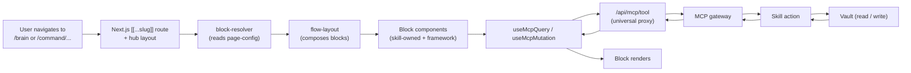
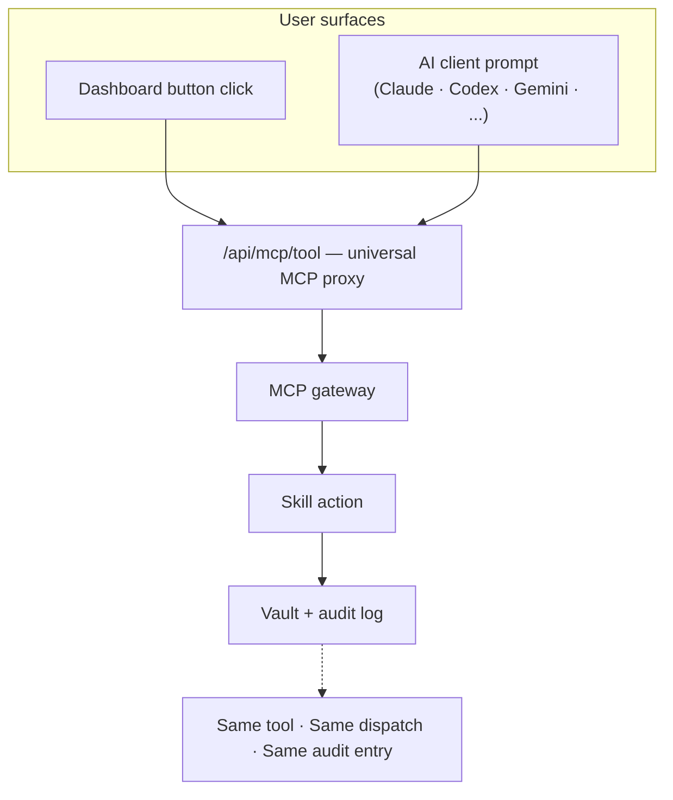
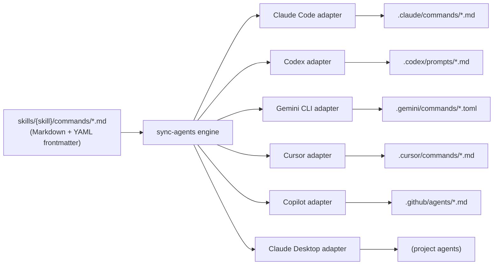

# augur-os Dashboard + Commands Deep-Dives Implementation Plan

> **For agentic workers:** REQUIRED SUB-SKILL: Use superpowers:subagent-driven-development (recommended) or superpowers:executing-plans to implement this plan task-by-task. Steps use checkbox (`- [ ]`) syntax for tracking.

**Goal:** Add two more architecture deep-dive docs to public `augur-os` (`architecture-dashboard.md` for the page-as-blocks model + GUI/agent parity; `architecture-commands.md` for commands and per-client native schemas), plus minimal cross-link edits in the overview and README.

**Architecture:** Six bite-sized tasks. Each new doc gets one task (write + verify + commit). Cross-link edits are two more tasks (overview + README). Then push four commits and verify github.com Mermaid render. Sequenced so deep-dives commit before cross-links — no broken `→ See ...` arrows mid-push.

**Tech Stack:** Markdown, Mermaid (rendered natively on github.com), git. Repo is `~/Projects/augur-os`. Local main is currently at `6f0426c` (after the prior round of deep-dives) and synced with origin.

**Spec:** `docs/superpowers/specs/2026-04-27-augur-os-dashboard-and-commands-deep-dives-design.md`

**Pre-flight finding (already done):**
- All 3 dashboard files exist: `apps/dashboard/lib/blocks/block-resolver.ts`, `apps/dashboard/lib/mcp/useMcpQuery.ts`, `apps/dashboard/components/ContextManager.tsx`.
- All 6 adapters exist: `claude_code.py`, `codex.py`, `gemini.py`, `cursor.py`, `copilot.py`, `claude_desktop.py` in `skills/ai/scripts/sync_agents/adapters/`.
- **Real visibility values across all skill commands**: `auto`, `core`, `dev`, `ops`, `orch`, `public`, `test`. The spec's "workflow" and "hidden" are not real — the plan uses the actual values.

---

## File Structure

| File | Action |
|------|--------|
| `~/Projects/augur-os/docs/architecture-dashboard.md` | Create |
| `~/Projects/augur-os/docs/architecture-commands.md` | Create |
| `~/Projects/augur-os/docs/architecture-overview.md` | 3 small edits (2 arrow appends + 1 list rewrite) |
| `~/Projects/augur-os/README.md` | 1-line edit (extend deep-dives line) |

---

## Task 1: Write `architecture-dashboard.md`

**Files:**
- Create: `~/Projects/augur-os/docs/architecture-dashboard.md`

- [ ] **Step 1: Confirm the file does not already exist**

```bash
ls ~/Projects/augur-os/docs/architecture-dashboard.md 2>&1
```
Expected: `No such file or directory`. Stop if it exists.

- [ ] **Step 2: Write the file**

Write `~/Projects/augur-os/docs/architecture-dashboard.md` with EXACTLY this content:

```markdown
# Augur Dashboard

The Augur dashboard is a Next.js App Router shell that hosts skill-owned UIs and reads everything through MCP. Two claims anchor this document: a user can **click a button or ask an AI agent and get the same outcome** (GUI/agent parity), and a skill author can **ship a UI by declaring it in YAML** (config-driven blocks). The structural property that makes both possible is that the dashboard is itself an MCP client — there is no separate execution path for the GUI.

## What the dashboard is

Built on Next.js 15 App Router under `apps/dashboard/`. Six hub namespaces — adaptive, brain, command, life, studio, plus settings/dev — each implemented as a `[[...slug]]` catch-all route with a hub layout. The shell is small: global navigation, error boundary, and an invisible MCP context manager. The substance lives in skill-owned blocks composed into pages.

The dashboard does not own business logic. It does not call Python scripts directly. Every user-action read and every user-action write goes through MCP. (Auth, CSRF, and similar shell concerns are framework infrastructure and are not MCP-routed.)

## Page-as-blocks model



The diagram shows the data path from URL to pixel. **block-resolver** turns a page-config (YAML) into a list of block component instances. **flow-layout** composes them into a Next-friendly layout with ordering, sections, and suspense boundaries. Each block calls **useMcpQuery** or **useMcpMutation** — thin React hooks over the universal MCP proxy at `/api/mcp/tool`. The proxy speaks to the MCP gateway, which dispatches to a skill, which reads or writes the vault.

Two block registries cover the two ways a UI can ship. **generated-block-registry** is built at scan time from skills declaring config-driven pages in `augur/pages/*.yaml` (per ADR-491). **custom-block-registry** is for hand-written React blocks when a skill needs interactivity beyond what config can express. The dashboard shell never imports skill-specific code; it resolves through the registry at runtime.

## GUI/agent parity



Two parallel user surfaces — a click on a dashboard button, an instruction to an AI agent — converge on the same `/api/mcp/tool` proxy. From there the path is identical: gateway → skill → vault → audit. Same execution path. Same audit log entry. Same context.

This isn't a coincidence. The dashboard is itself an MCP client. Calling `mcpCall` from a React component is functionally identical to an agent calling the tool through stdio JSON-RPC. The proxy is the universal interface; the client just chooses the transport.

Practical consequence: a user who clicks "Run audit" in the dashboard and a user who asks "run the audit" through Claude Code see the same result, the same audit entry, and (after navigating back) the same post-action UI state.

## How a click becomes an MCP call

A user opens `/brain`. The hub layout mounts. `block-resolver` loads the page-config for `/brain`. One block on the page is a "recent ingestions" reader; on mount it calls `useMcpQuery("get-recent-ingestions")`. Another block is a "run knowledge memory cleanup" button; on click it calls `useMcpMutation("knowledge-memory-cleanup")`. Both flow through `/api/mcp/tool`. The gateway dispatches. The skill runs. The vault is read or written. The response returns. The block re-renders. The audit log gets one entry per call.

The `ContextManager` component (mounted at the root layout) silently swaps the active MCP tool context as the user navigates between hubs, so the agent surface and the dashboard see the same active toolset at the same time.

## Why this is defensible

**GUI/agent parity is the user benefit.** Click or ask — same outcome, same audit. A user is not penalized for choosing a surface; agents are not blackboxed away from what the dashboard sees. Switching from "I clicked it yesterday" to "ask the agent to do it again" is trivial because the audit entry is the same.

**Config-driven blocks are the user benefit (for skill authors).** A skill author ships a UI by declaring it in YAML; no React unless the block needs custom interactivity. As the catalog grows, the dashboard surface grows with it without bespoke page work.

**MCP-as-substrate is the moat that enables both.** A competitor with a separate-stack GUI can't retrofit parity without rebuilding their backend — every action a button takes is hard-coded into a server route, separate from whatever the agent calls. A competitor with hand-coded pages can't keep up with a growing skill catalog without rewriting the dashboard each release. Bolting either on later is a ground-up rebuild, not an iteration.

## Where this lives in the repo

- `apps/dashboard/app/` — Next.js routes, including hub `[[...slug]]` catch-alls.
- `apps/dashboard/lib/blocks/` — block resolver, flow layout, generated and custom registries.
- `apps/dashboard/lib/mcp/` — universal MCP proxy client (`mcpCall`, `useMcpQuery`, `useMcpMutation`, `useMcpPoll`).
- `apps/dashboard/components/ContextManager.tsx` — context switching on navigation.
- `skills/{skill}/augur/dashboard/` — skill-owned UI source.
- `skills/{skill}/augur/pages/*.yaml` — config-driven page declarations.
- ADR-490 (framework vs feature import boundaries), ADR-491 (config-driven page declarations).

## Where to go next

- architecture-overview.md — the three-layer model and named subsystems.
- architecture-commands.md — how commands work across AI clients.
- architecture-mcp-gateway.md — gateway-internal detail.
- ROADMAP.md — public release plan with status markers.
```

- [ ] **Step 3: Verify**

```bash
cd ~/Projects/augur-os
wc -w docs/architecture-dashboard.md      # expect 700–1300
grep -c '^## ' docs/architecture-dashboard.md             # expect 7
grep -c '^```mermaid' docs/architecture-dashboard.md      # expect 2
grep -c "200+" docs/architecture-dashboard.md             # expect 0
grep -c "soft launch\|coming month" docs/architecture-dashboard.md     # expect 0
grep -c "block-resolver\|useMcpQuery\|useMcpMutation\|ContextManager" docs/architecture-dashboard.md   # expect at least 4
grep -c "MCP gateway" docs/architecture-dashboard.md      # expect at least 2
```

If word count is < 700 or > 1500, tighten or expand. Run `grep` with `|| true` chained if you pipeline checks.

- [ ] **Step 4: Commit**

```bash
cd ~/Projects/augur-os
git add docs/architecture-dashboard.md
git commit -m "docs(architecture): add architecture-dashboard deep-dive

Architecture deep-dive for the dashboard. Covers the page-as-blocks
model (block-resolver, flow-layout, generated-block-registry,
custom-block-registry, useMcpQuery/Mutation hooks, /api/mcp/tool
universal proxy, ContextManager), GUI/agent parity (both surfaces
converge on the same MCP path), and the two-claim hook (parity +
config-driven blocks as user benefits; MCP-as-substrate as moat).
Cross-linked from architecture-overview.md in a follow-up commit."
```

---

## Task 2: Write `architecture-commands.md`

**Files:**
- Create: `~/Projects/augur-os/docs/architecture-commands.md`

- [ ] **Step 1: Confirm the file does not already exist**

```bash
ls ~/Projects/augur-os/docs/architecture-commands.md 2>&1
```
Expected: `No such file or directory`.

- [ ] **Step 2: Write the file**

Write `~/Projects/augur-os/docs/architecture-commands.md` with EXACTLY this content. Note the visibility ladder uses **real values** confirmed by pre-flight (`auto`, `core`, `dev`, `ops`, `orch`, `public`, `test`).

```markdown
# Augur Commands and Per-Client Schemas

Augur commands are skill-declared, source-of-truth Markdown files. The sync engine fans them out to every supported AI client in that client's native command schema. Two claims anchor this document: a user gets **the same command in every client they connect** (single-source multi-client portability), and a command's **read-vs-mutate trust is enforced at the protocol level**, not the UI. The substrate is per-client adapters plus the MCP approval gates that apply identically regardless of which client invoked the command.

## What an Augur command is

A command is a Markdown file under `skills/{skill}/commands/` with YAML frontmatter declaring at minimum a `description` and a `visibility` level. The body is the prompt the AI client should follow when the command is invoked. The frontmatter is the metadata each client adapter needs to render the command in its own native schema (slash command, prompt, tool, etc.).

A command file is the *interface*. The *runtime* is MCP — when a user actually invokes the command, dispatch happens through the MCP gateway. This separation is what makes the same command work identically across clients.

## Visibility ladder

Commands declare visibility in frontmatter. The current ladder, with the most-used levels first:

- `visibility: ops` — operations the user runs by hand. Most browse, status, and search commands sit here. Safe to invoke.
- `visibility: auto` — runs on a daemon schedule (autoloop). Not directly user-invoked, but visible in the catalog.
- `visibility: orch` — orchestration; usually a multi-step wrapper around several MCP tools.
- `visibility: public` — public-facing commands, exported broadly to user-installed clients.
- `visibility: core` — core platform commands, available across all hubs.
- `visibility: dev` — development-only; gated to the dev surface.
- `visibility: test` — test-only; not exported to user-installed clients.

Read-vs-mutate semantics are not a separate field — they are encoded in the underlying MCP tool the command dispatches to. The MCP gateway applies approval gates to mutations regardless of which client invoked the command. So a user clicking the command in the dashboard and a Claude Code agent calling `/command` both hit the same approval logic. This is the trust property that makes the multi-client surface safe.

## Source-of-truth fan-out



The diagram shows the single skill `commands/*.md` file fanning out through the sync engine into six per-client adapters, each writing to its native target dir. Adapters live in `skills/ai/scripts/sync_agents/adapters/` and are pluggable.

The sync engine's contract: it reads source commands, applies adapter-specific transforms (Markdown → TOML for Gemini; frontmatter shape adjustments for Codex; etc.), and writes generated files marked with a header that identifies them as Augur-managed. ADR-553 added Gemini extension support; ADR-558 added managed-output purge so re-installs can clean up stale adapter outputs.

A user who writes one command in `skills/loop-security/commands/auto-security-audit.md` sees that command appear as `/auto-security-audit` in Claude Code, in Codex, in Gemini CLI, in Cursor, and via `@-mention` in Copilot — all running the same underlying MCP tool through the same dispatch path.

## Per-client schema reference

Concrete reference for each client's native command schema. Augur's adapters target each format precisely so the command "feels native" in the client.

| Client          | Target dir                      | Format        | Frontmatter style        | Activation       |
|-----------------|---------------------------------|---------------|--------------------------|------------------|
| Claude Code     | `.claude/commands/*.md`         | Markdown      | YAML frontmatter         | `/command-name`  |
| Codex           | `.codex/prompts/*.md`           | Markdown      | YAML frontmatter         | `/command-name`  |
| Gemini CLI      | `.gemini/commands/*.toml`       | TOML          | TOML keys                | `/command-name`  |
| Cursor          | `.cursor/commands/*.md`         | Markdown      | YAML frontmatter         | `/command-name`  |
| Copilot         | `.github/agents/*.md`           | Markdown      | YAML frontmatter         | `@-mention`      |
| Claude Desktop  | (project agents only)           | Markdown      | YAML frontmatter         | invoked by name  |

Activation form differs (slash for most, `@-mention` for Copilot, direct-name for Claude Desktop), but the underlying dispatch is identical: each client calls into MCP, the gateway routes, the skill runs.

> Activation form is the simplest case; some clients support namespacing — see the client's own docs.

## Worked example — auto-security-audit

The source file lives at `skills/loop-security/commands/auto-security-audit.md` with frontmatter:

```yaml
---
description: Scan all skills for security vulnerabilities and auto-quarantine/block findings
visibility: auto
---
```

The sync engine reads this and writes:

- `.claude/commands/auto-security-audit.md` (Markdown + frontmatter)
- `.codex/prompts/auto-security-audit.md` (Markdown + frontmatter)
- `.gemini/commands/auto-security-audit.toml` (TOML transform)
- `.cursor/commands/auto-security-audit.md` (Markdown + frontmatter)

A user in any client types `/auto-security-audit`. The client invokes the command's prompt. The agent (or daemon, since this is auto-visibility) executes the underlying MCP tool. Same dispatch, same result, same audit entry — regardless of which client started it.

## Why this is defensible

**Single-source multi-client portability is the user benefit.** One command file, every client. A user who switches from Claude Code to Codex to Gemini doesn't lose their commands — they're already there. A skill author who ships a new command doesn't have to maintain six parallel files in six different formats.

**Read/mutate trust at the protocol level is the user benefit.** The command interface declares visibility; the MCP gateway applies approval gates to mutations. An `/install-skill` command is gated identically whether triggered by a dashboard click or a slash command in any client. Trust does not depend on which surface invoked the command.

**Per-client adapters plus protocol-level approval gating are the moat.** A competitor with hand-built integrations has to maintain N format adapters as each client's native schema evolves. A competitor without protocol-level approval gates ends up reinventing trust per client. Both are ground-up rebuilds, not bolt-ons.

## Where this lives in the repo

- `skills/{skill}/commands/*.md` — source commands.
- `skills/ai/scripts/sync_agents/` — sync engine + per-client adapters.
- `skills/ai/scripts/sync_agents/adapters/{claude_code,codex,gemini,cursor,copilot,claude_desktop}.py` — one adapter per client.
- ADR-553 (Gemini extension), ADR-558 (managed-output purge), ADR-562 (runtime IDE registry).

## Where to go next

- architecture-overview.md — the three-layer model and named subsystems.
- architecture-dashboard.md — page model and GUI/agent parity.
- architecture-mcp-gateway.md — gateway internals.
- ROADMAP.md — public release plan with status markers.
```

- [ ] **Step 3: Verify**

```bash
cd ~/Projects/augur-os
wc -w docs/architecture-commands.md       # expect 800–1400
grep -c '^## ' docs/architecture-commands.md             # expect 7
grep -c '^```mermaid' docs/architecture-commands.md      # expect 1
grep -c "200+" docs/architecture-commands.md             # expect 0
grep -c "soft launch\|coming month" docs/architecture-commands.md     # expect 0
grep -c "visibility:" docs/architecture-commands.md      # expect at least 8
grep -c "auto-security-audit" docs/architecture-commands.md     # expect at least 4
grep -c "Claude Code\|Codex\|Gemini CLI\|Cursor\|Copilot\|Claude Desktop" docs/architecture-commands.md     # expect at least 6
```

- [ ] **Step 4: Commit**

```bash
cd ~/Projects/augur-os
git add docs/architecture-commands.md
git commit -m "docs(architecture): add architecture-commands deep-dive

Architecture deep-dive for the commands subsystem. Covers the
visibility ladder (auto, core, dev, ops, orch, public, test), the
source-of-truth fan-out from skills/{skill}/commands/*.md through
the sync-agents engine to six per-client adapters, the per-client
schema table, the auto-security-audit worked example, and the
two-claim hook (multi-client portability + protocol-level read/
mutate trust as user benefits; per-client adapters + approval
gating as moat). Cross-linked from architecture-overview.md in a
follow-up commit."
```

---

## Task 3: Cross-link `architecture-overview.md`

**Files:**
- Modify: `~/Projects/augur-os/docs/architecture-overview.md` (3 small edits)

- [ ] **Step 1: Locate anchor lines**

```bash
cd ~/Projects/augur-os
grep -n "Browse is the human-facing complement" docs/architecture-overview.md
grep -n "validation pending before any firmer public claim" docs/architecture-overview.md
grep -n "## Where to go next" docs/architecture-overview.md
```
Expected: each grep returns one line number. Use these to locate each edit.

- [ ] **Step 2: Append the dashboard arrow at end of Subsystem §3 (Browse)**

Find the line:
```
ADR-540 redesigned the browse workbench; ADR-541 added the visibility split and logs; ADR-554 added the skills tab and client inventory; ADR-478 added freshness indicators. Browse is the human-facing complement to the agent-facing skill discovery in MCP.
```

Insert a NEW PARAGRAPH immediately after that line (with a blank line before and after the new paragraph). The new paragraph is exactly:

```
*→ See architecture-dashboard.md for the page-as-blocks model and GUI/agent parity.*
```

- [ ] **Step 3: Append the commands arrow at end of Subsystem §4 (Multi-client surfaces)**

Find the paragraph that ends with:
```
Native platform support is split by maturity: macOS is shipped and validated; Windows architecture is implemented (ADR-550) with validation pending before any firmer public claim.
```

Insert a NEW PARAGRAPH immediately after that line (blank line separator before and after):

```
*→ See architecture-commands.md for the per-client command schemas and the source-of-truth fan-out.*
```

- [ ] **Step 4: Replace the "Where to go next" list**

Find the section heading `## Where to go next`. The current list (after the prior round) has 6 items: ROADMAP, llm-wiki, autoloops, mcp-gateway, getting-started, sessions log.

Replace the 6 bullets with these 8, in this order:

```markdown
- ROADMAP.md — public release plan with status markers.
- architecture-llm-wiki.md — concept-first compiler and lifecycle.
- architecture-autoloops.md — loop anatomy, catalog, and trust model.
- architecture-dashboard.md — page model and GUI/agent parity.
- architecture-commands.md — per-client command schemas and fan-out.
- architecture-mcp-gateway.md — gateway-internal detail.
- getting-started.md — local install and first run.
- [Sessions log](https://augur.run/sessions.html) — recent change log on augur.run.
```

- [ ] **Step 5: Verify**

```bash
cd ~/Projects/augur-os
grep -c "→ See \[architecture-dashboard.md\]" docs/architecture-overview.md     # expect 1
grep -c "→ See \[architecture-commands.md\]" docs/architecture-overview.md      # expect 1
grep -c "architecture-dashboard.md" docs/architecture-overview.md               # expect 2 (arrow + Where to go)
grep -c "architecture-commands.md" docs/architecture-overview.md                # expect 2
```

If counts don't match, locate the missing edit and re-apply.

- [ ] **Step 6: Commit**

```bash
cd ~/Projects/augur-os
git add docs/architecture-overview.md
git commit -m "docs(architecture): cross-link dashboard and commands deep-dives in overview

Subsystems §3 (Browse) and §4 (Multi-client surfaces) now end with
'→ See ...' arrows pointing at architecture-dashboard.md and
architecture-commands.md respectively. 'Where to go next' list
expanded to 8 items, with the new docs surfaced above the
gateway-internal doc."
```

---

## Task 4: Cross-link `README.md`

**Files:**
- Modify: `~/Projects/augur-os/README.md` (extend the existing deep-dives line)

- [ ] **Step 1: Locate the current line**

```bash
cd ~/Projects/augur-os
grep -n "Subsystem deep-dives:" README.md
```
Expected: one line number containing the current 2-link list.

- [ ] **Step 2: Replace the line**

Find:
```
Subsystem deep-dives: llm-wiki · autoloops.
```

Replace with:
```
Subsystem deep-dives: llm-wiki · autoloops · dashboard · commands.
```

- [ ] **Step 3: Verify**

```bash
cd ~/Projects/augur-os
grep -c "Subsystem deep-dives:" README.md                          # expect 1
grep -c "architecture-dashboard.md" README.md                      # expect 1
grep -c "architecture-commands.md" README.md                       # expect 1
grep -c "architecture-llm-wiki.md" README.md                       # expect 1
grep -c "architecture-autoloops.md" README.md                      # expect 1
```

- [ ] **Step 4: Commit**

```bash
cd ~/Projects/augur-os
git add README.md
git commit -m "docs(readme): link to dashboard and commands deep-dives

Extends the existing 'Subsystem deep-dives' line to include the two
new architecture deep-dives (dashboard, commands). Single-line edit;
no new section."
```

---

## Task 5: Push and verify github.com Mermaid render

**Files:** no file edits.

- [ ] **Step 1: Confirm 4 commits ahead of origin**

```bash
cd ~/Projects/augur-os
git status -sb
git log --oneline origin/main..HEAD
```
Expected: `## main...origin/main [ahead 4]` with the four commits in order (dashboard, commands, overview, README).

- [ ] **Step 2: Push**

```bash
cd ~/Projects/augur-os
git push origin main
```
Expected: clean fast-forward push of four commits.

- [ ] **Step 3: Confirm new files on github.com**

```bash
curl -sI "https://raw.githubusercontent.com/augur-os/augur-os/main/docs/architecture-dashboard.md" | head -1
curl -sI "https://raw.githubusercontent.com/augur-os/augur-os/main/docs/architecture-commands.md" | head -1
```
Expected: both return `HTTP/2 200`.

- [ ] **Step 4: Confirm Mermaid blocks land in raw markdown**

```bash
curl -s "https://raw.githubusercontent.com/augur-os/augur-os/main/docs/architecture-dashboard.md" | grep -c '^```mermaid'   # expect 2
curl -s "https://raw.githubusercontent.com/augur-os/augur-os/main/docs/architecture-commands.md" | grep -c '^```mermaid'    # expect 1
```

- [ ] **Step 5: Visual render check (manual)**

Open in a browser:
- `https://github.com/augur-os/augur-os/blob/main/docs/architecture-dashboard.md` — confirm both flowcharts render. The page-rendering pipeline has many nodes; if it looks cramped, that's acceptable as long as labels are readable.
- `https://github.com/augur-os/augur-os/blob/main/docs/architecture-commands.md` — confirm the fan-out flowchart renders. This has 6 parallel branches; if it renders cramped or the labels collide, fall back to the simpler version: collapse the six output paths into a single node `"Native target dirs<br/>(see schema table)"`.

If a diagram fails to render: edit the source, commit a fix, push, re-check.

- [ ] **Step 6: Cross-link resolution check**

Open `https://github.com/augur-os/augur-os/blob/main/docs/architecture-overview.md`. Confirm both new `→ See ...` arrow links resolve (click each — both should open the corresponding new doc). Confirm the expanded 8-item "Where to go next" list resolves all entries.

Open `https://github.com/augur-os/augur-os/blob/main/README.md`. Confirm the extended "Subsystem deep-dives" line resolves all 4 links.

- [ ] **Step 7: Cross-doc consistency final pass**

```bash
cd ~/Projects/augur-os
echo "=== subsystem-name presence ==="
for term in "block-resolver" "useMcpQuery" "MCP gateway" "ContextManager" "Security autoloop" "concept-first compiler" "scan-fix" "stateDiagram-v2"; do
  echo "--- $term ---"
  for f in README.md ROADMAP.md docs/architecture-overview.md docs/architecture-mcp-gateway.md docs/architecture-autoloops.md docs/architecture-llm-wiki.md docs/architecture-dashboard.md docs/architecture-commands.md; do
    [ -f "$f" ] && echo "  $f: $(grep -c "$term" "$f")"
  done
done
echo "=== tone audit (excluding known phase refs) ==="
grep -nHi "soft launch\|coming month\|coming weeks\|hopefully" README.md ROADMAP.md docs/architecture-*.md 2>&1 | grep -v "Soft launch (April 2026, now)\|ROADMAP.md:13\|architecture-overview.md:18[34]\|architecture-overview.md:20[45]"
```

Expected: subsystem names present where they belong (block-resolver only in dashboard doc; useMcpQuery only in dashboard doc; MCP gateway in multiple docs); no tone hits beyond the known-acceptable phase refs.

---

## Self-Review Notes

**Spec coverage:**
- Spec §"In scope" artifact 1 (dashboard doc) → Task 1.
- Artifact 2 (commands doc) → Task 2.
- Artifact 3 (overview cross-link edits) → Task 3.
- Artifact 4 (README cross-link) → Task 4.
- Spec §"Verification" gates → Task 1 step 3, Task 2 step 3, Task 3 step 5, Task 4 step 3, Task 5 (push + Mermaid render + cross-link + cross-doc consistency).
- Spec §"Risks" all addressed: visibility-ladder accuracy (real values baked into Task 2 step 2), adapter accuracy (six adapters confirmed pre-flight, listed verbatim in Task 2), Mermaid fan-out cramped (Task 5 step 5 has explicit fallback instruction), thin-wrapper scope (Task 1 step 2 prose includes the auth/CSRF carve-out), activation form footnote (Task 2 step 2 includes the namespacing footnote), dashboard scope (Task 1 step 2 is architecture-pattern-only by design), generated-vs-custom registry distinction (Task 1 step 2 prose names both registries).

**Type / name consistency:**
- "block-resolver", "useMcpQuery", "useMcpMutation", "ContextManager", "/api/mcp/tool", "MCP gateway" used consistently across Tasks 1, 3, 5.
- Visibility values (`auto`, `core`, `dev`, `ops`, `orch`, `public`, `test`) match real `grep -h "^visibility:" skills/*/commands/*.md` output.
- Six adapter names match `ls skills/ai/scripts/sync_agents/adapters/*.py` (claude_code, codex, gemini, cursor, copilot, claude_desktop).

**Placeholder scan:** no "TBD", "TODO", "fill in", or "implement later" patterns. Each step has actual content.
