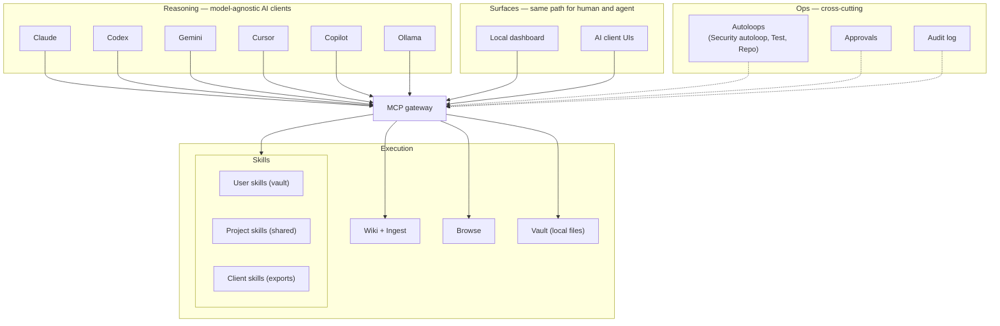
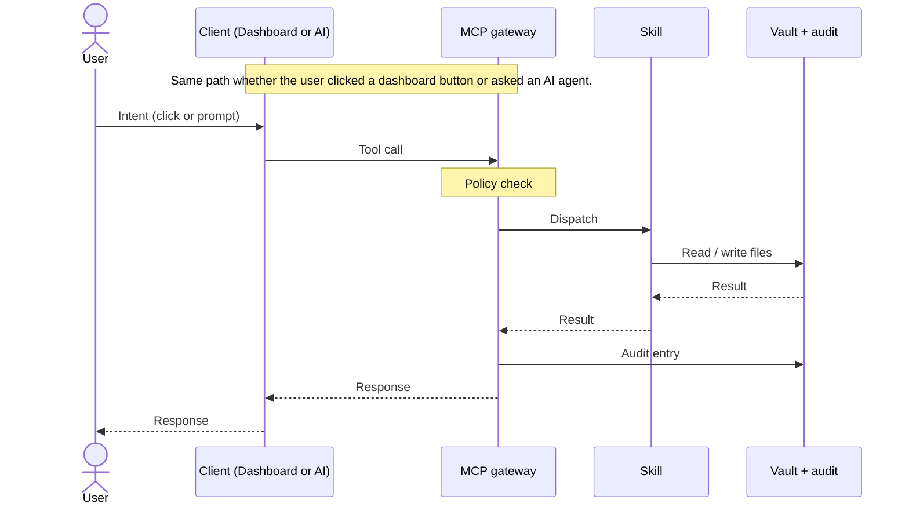
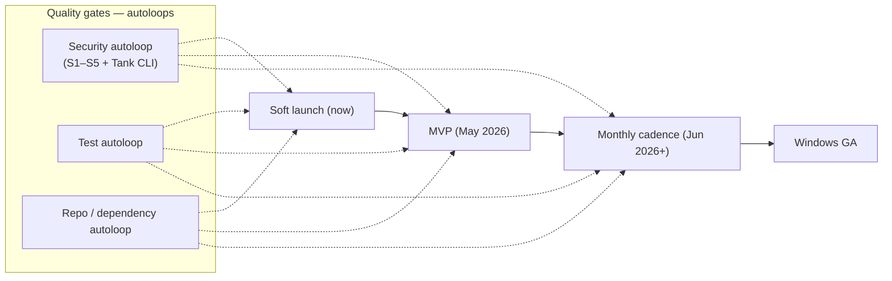

# Investor-Prep Implementation Plan

> **For agentic workers:** REQUIRED SUB-SKILL: Use superpowers:subagent-driven-development (recommended) or superpowers:executing-plans to implement this plan task-by-task. Steps use checkbox (`- [ ]`) syntax for tracking.

**Goal:** Close two credibility gaps before the imminent investor review by rewriting augur.run's homepage CTAs + `augur-os` `ROADMAP.md` (release-credibility) and rewriting `augur-os/docs/architecture-overview.md` with three Mermaid diagrams (architecture-depth), then aligning two adjacent docs so nothing contradicts.

**Architecture:** Six artifacts touched across two external repos (no changes to the main `Augur` repo beyond this plan). Site path first (ROADMAP → site CTAs), architecture second (overview rewrite → mcp-gateway polish → README ASCII conditional refresh → final cross-doc verification). Each task is a single committable / deployable unit; verification gates replace test steps because this is content/docs work.

**Tech Stack:** Markdown, Mermaid (rendered natively on github.com), HTML/CSS (no JS changes on the site), git. Site deploys via existing `release.sh` SCP pipeline configured in `~/Projects/Au-vault/websites/sites.yaml`.

**Worktree note:** the brainstorming skill normally creates a worktree, but the actual edits happen in two other repos (`~/Projects/augur-os` and `~/Projects/Au-docs/venture-augur/website-working`). Run from the working dirs of those repos directly. The Augur main repo is untouched after this plan is committed.

**Spec:** `docs/superpowers/specs/2026-04-27-investor-prep-design.md`

---

## File Structure

| File | Repo / location | Action |
|------|-----------------|--------|
| `ROADMAP.md` | `~/Projects/augur-os/` | Full rewrite |
| `index.html` | `~/Projects/Au-docs/venture-augur/website-working/` | 3 CTA placements + 1 preamble line |
| `docs/architecture-overview.md` | `~/Projects/augur-os/` | Full rewrite + 3 Mermaid diagrams |
| `docs/architecture-mcp-gateway.md` | `~/Projects/augur-os/` | Terminology polish only |
| `README.md` | `~/Projects/augur-os/` | ASCII block conditional refresh |

---

## Task 1: Pre-flight — gather verification evidence for ROADMAP `[shipped]` claims

**Files:**
- Read only: `git log` on the main `Augur` repo and `~/Projects/Au-docs/adrs/` ADR list.
- Output: scratch notes (any local file or terminal scrollback) that map each `[shipped]` ROADMAP item to a git commit / ADR.

- [ ] **Step 1: Pull the candidate `[shipped]` list from the spec into a local checklist**

The 8 `[shipped]` items in the ROADMAP draft (per spec §2):
1. Native macOS install path + dashboard + MCP gateway + 200+ skills
2. MCP-native multi-client (Claude Code, Codex, Cursor, Gemini, Copilot, Ollama)
3. Local dashboard at `localhost:3000`
4. Wiki compiler (concept-first) and ingest pipeline — ADRs 559, 560, 561, 564
5. Browse workbench redesign + skills tab — ADRs 540, 541, 554
6. Security autoloop (S1–S5 + Tank CLI) — `loop-security`
7. Gemini extension support — ADR 553
8. Runtime IDE registry — ADR 562

- [ ] **Step 2: For each item, find a real merged-to-main commit on the `Augur` repo**

Run for each ADR number:
```bash
cd ~/Projects/Augur
git log --oneline -50 --grep="ADR-559\|loop-security\|wiki\|ingest"
git log --oneline -50 --grep="ADR-540\|ADR-541\|ADR-554\|browse"
git log --oneline -50 --grep="ADR-553\|gemini.extension"
git log --oneline -50 --grep="ADR-562\|runtime.ide.registry"
```
Expected: at least one commit per item. Record commit SHA next to each item in your notes.

- [ ] **Step 3: For each `[in-flight]` item, confirm activity within the last 14 days**

Run:
```bash
cd ~/Projects/Augur
git log --since="14 days ago" --oneline --grep="vault.user\|ADR-563"
git log --since="14 days ago" --oneline --grep="windows\|ADR-550"
git log --since="14 days ago" --oneline --grep="ADR-557\|staged.release"
```
Expected: at least one commit per `[in-flight]` item, otherwise demote that item to `[planned]` in Task 2.

- [ ] **Step 4: Confirm ADR files exist for each referenced ADR**

```bash
ls ~/Projects/Au-docs/adrs/ADR-{540,541,553,554,557,559,560,561,562,564}-*.md
```
Expected: all 10 files print. Any missing ADR means the item references a non-existent decision — fix before Task 2.

- [ ] **Step 5: No commit (verification only). Notes carried into Task 2.**

---

## Task 2: Rewrite `ROADMAP.md` and push to `augur-os`

**Files:**
- Modify: `~/Projects/augur-os/ROADMAP.md` (full rewrite)

- [ ] **Step 1: Read the existing file to confirm current content before overwriting**

```bash
cat ~/Projects/augur-os/ROADMAP.md
```
Expected: short file with May / June / July headings, no status markers.

- [ ] **Step 2: Demote any Task-1 `[in-flight]` items that failed the 14-day activity check**

If Task 1 step 3 found no recent activity for an item, change its marker from `[in-flight]` to `[planned]` in the content below.

- [ ] **Step 3: Replace the file content**

Write `~/Projects/augur-os/ROADMAP.md` with:

```markdown
# Roadmap

Augur is a local-first personal AI operating system. This roadmap is the public release plan: what's shipped, what's in flight, and what's next. Dates are phase-level targets, not per-feature commitments.

How to read this:

- `[shipped]` — landed in main, behavior verified.
- `[in-flight]` — actively being built, ADR or PR open.
- `[planned]` — scoped, not started.

Each item links to its ADR or implementation plan. ADRs live in the private architecture repo; PRs and CI runs are visible on GitHub.

## Phase 1 — Soft launch (April 2026, now)

Theme: prove the harness on macOS, finish the architecture for Windows.

- [shipped]   Native macOS: install path, dashboard, MCP gateway, 200+ skills
- [shipped]   MCP-native multi-client: Claude Code, Codex, Cursor, Gemini, Copilot, Ollama
- [shipped]   Local dashboard at localhost:3000
- [shipped]   Wiki compiler (concept-first) and ingest pipeline   <!-- ADR-559/560/561/564 -->
- [shipped]   Browse workbench redesign + skills tab               <!-- ADR-540/541/554 -->
- [shipped]   Security autoloop (S1–S5 + Tank CLI)                 <!-- loop-security -->
- [shipped]   Gemini extension support                             <!-- ADR-553 -->
- [shipped]   Runtime IDE registry                                 <!-- ADR-562 -->
- [in-flight] Vault user surfaces (phase 1)                        <!-- 2026-04-23 plan -->
- [in-flight] Windows native: architecture done, validation pending <!-- ADR-550 -->
- [in-flight] MVP staged release payloads                          <!-- ADR-557 -->

## Phase 2 — MVP release (May 2026)

Theme: tighten validation, ship a version a non-developer can install.

- [planned]  npx-based one-command install on macOS
- [planned]  Windows GA after validation passes
- [planned]  Open-source brain/inbox/wiki insights surface         <!-- ADR-564 -->
- [planned]  Sync managed-output purge for clean re-installs       <!-- ADR-558 -->
- [planned]  Documented upgrade and rollback paths

## Phase 3 — Monthly cadence (June 2026 onward)

Theme: predictable shipping, fold validated platforms into the public story.

- [planned]  Monthly release train
- [planned]  Public Windows support claim once validation is green
- [planned]  Skill group and release enablement                    <!-- ADR-551 -->
- [planned]  Continued autoloop expansion (security, ops, repo)

## Enterprise and commercial

Commercial deployment, rollout support, and organization-wide infrastructure go through Guriqo. See https://guriqo.com.
```

- [ ] **Step 4: Verify the rendered Markdown is well-formed**

```bash
cd ~/Projects/augur-os
head -60 ROADMAP.md
```
Expected: no broken HTML comments, no stray markdown syntax, three phase headings present.

- [ ] **Step 5: Commit and push to the `augur-os` remote**

```bash
cd ~/Projects/augur-os
git add ROADMAP.md
git commit -m "docs(roadmap): rewrite as phased release plan with status markers

Three phases (Soft launch / MVP May 2026 / Monthly cadence Jun 2026+)
with [shipped] / [in-flight] / [planned] markers. Each item references
its ADR or implementation plan. Phase-level dates only — no per-feature
commitments. Replaces the previous May/June/July sketch."
git push origin main
```
Expected: clean push to `augur-os/main`.

- [ ] **Step 6: Confirm the file renders on github.com**

Open `https://github.com/augur-os/augur-os/blob/main/ROADMAP.md` in a browser. Expected: all three phases visible, status markers preserved (HTML comments not rendered), no markdown rendering glitches.

---

## Task 3: Rewrite three CTAs and one preamble in `index.html`

**Files:**
- Modify: `~/Projects/Au-docs/venture-augur/website-working/index.html`
  - Top nav button: around line 1066–1070
  - Hero secondary CTA: around line 1089–1093
  - Section preamble: around line 1235
  - Get-started card: around line 1251–1262

- [ ] **Step 1: Re-confirm exact line numbers (file may have shifted)**

```bash
grep -n "Explore on GitHub" ~/Projects/Au-docs/venture-augur/website-working/index.html
grep -n "Explore architecture" ~/Projects/Au-docs/venture-augur/website-working/index.html
grep -n "GitHub shows the open-source architecture today" ~/Projects/Au-docs/venture-augur/website-working/index.html
```
Expected: 3 hits for "Explore on GitHub", 1 for "Explore architecture", 1 for the preamble line.

- [ ] **Step 2: Rewrite top nav CTA**

Locate the `<a class="nav-cta repo-link" ...>` block in nav. Change:
- `href="https://github.com/augur-os/augur-os"` → `href="https://github.com/augur-os/augur-os/blob/main/ROADMAP.md"`
- The `<span>Explore on GitHub</span>` → `<span>Roadmap</span>`
- Keep the GitHub icon SVG and all CSS classes unchanged.

- [ ] **Step 3: Rewrite hero secondary CTA**

Locate the second `<a class="cta-btn-secondary repo-link" ...>` block (in the hero, paired with the waitlist). Change:
- `href` → `https://github.com/augur-os/augur-os/blob/main/ROADMAP.md`
- `<span>Explore on GitHub</span>` → `<span>See the roadmap</span>`
- Keep icon and classes.

- [ ] **Step 4: Rewrite section preamble line**

Replace this exact line (currently around line 1235):

```html
<p class="vision-sub">GitHub shows the open-source architecture today. The first community release lands in the coming month.</p>
```

with:

```html
<p class="vision-sub">The public roadmap shows what's shipped, what's in flight, and what's next. MVP release lands May 2026.</p>
```

- [ ] **Step 5: Rewrite the "Get Started" card**

Locate the card titled `<h3>Explore architecture</h3>` (the second of three cards inside `.cta-grid`).

Replace the entire card block:

```html
<div class="cta-card">
    <h3>Explore architecture</h3>
    <p>GitHub is the best place to inspect Augur today: architecture, repo shape, and open-source direction.</p>
    <div class="cta-price">Available now</div>
    <div class="cta-card-actions">
        <a href="https://github.com/augur-os/augur-os" class="cta-btn-tertiary repo-link" target="_blank" rel="noopener">
            <svg class="github-icon" viewBox="0 0 16 16" aria-hidden="true" xmlns="http://www.w3.org/2000/svg">
                <path fill="currentColor" d="M8 0C3.58 0 0 3.58 0 8a8 8 0 0 0 5.47 7.59c.4.07.55-.17.55-.38 0-.19-.01-.82-.01-1.49-2.01.37-2.53-.49-2.69-.94-.09-.23-.48-.94-.82-1.13-.28-.15-.68-.52-.01-.53.63-.01 1.08.58 1.23.82.72 1.21 1.87.87 2.33.66.07-.52.28-.87.5-1.07-1.78-.2-3.64-.89-3.64-3.95 0-.87.31-1.59.82-2.15-.08-.2-.36-1.02.08-2.12 0 0 .67-.21 2.2.82A7.65 7.65 0 0 1 8 4.69c.68 0 1.37.09 2.01.26 1.53-1.04 2.2-.82 2.2-.82.44 1.1.16 1.92.08 2.12.51.56.82 1.27.82 2.15 0 3.07-1.87 3.75-3.65 3.95.29.25.54.73.54 1.48 0 1.07-.01 1.93-.01 2.19 0 .21.15.46.55.38A8 8 0 0 0 16 8c0-4.42-3.58-8-8-8Z"/>
            </svg>
            <span>Explore on GitHub</span>
        </a>
    </div>
</div>
```

with:

```html
<div class="cta-card">
    <h3>Roadmap & architecture</h3>
    <p>The roadmap shows what's shipped, what's in flight, and what's next. The architecture overview shows how the layers fit together.</p>
    <div class="cta-price">Available now</div>
    <div class="cta-card-actions">
        <a href="https://github.com/augur-os/augur-os/blob/main/ROADMAP.md" class="cta-btn-tertiary repo-link" target="_blank" rel="noopener">
            <svg class="github-icon" viewBox="0 0 16 16" aria-hidden="true" xmlns="http://www.w3.org/2000/svg">
                <path fill="currentColor" d="M8 0C3.58 0 0 3.58 0 8a8 8 0 0 0 5.47 7.59c.4.07.55-.17.55-.38 0-.19-.01-.82-.01-1.49-2.01.37-2.53-.49-2.69-.94-.09-.23-.48-.94-.82-1.13-.28-.15-.68-.52-.01-.53.63-.01 1.08.58 1.23.82.72 1.21 1.87.87 2.33.66.07-.52.28-.87.5-1.07-1.78-.2-3.64-.89-3.64-3.95 0-.87.31-1.59.82-2.15-.08-.2-.36-1.02.08-2.12 0 0 .67-.21 2.2.82A7.65 7.65 0 0 1 8 4.69c.68 0 1.37.09 2.01.26 1.53-1.04 2.2-.82 2.2-.82.44 1.1.16 1.92.08 2.12.51.56.82 1.27.82 2.15 0 3.07-1.87 3.75-3.65 3.95.29.25.54.73.54 1.48 0 1.07-.01 1.93-.01 2.19 0 .21.15.46.55.38A8 8 0 0 0 16 8c0-4.42-3.58-8-8-8Z"/>
            </svg>
            <span>Read the roadmap</span>
        </a>
        <a href="https://github.com/augur-os/augur-os/blob/main/docs/architecture-overview.md" class="cta-btn-tertiary repo-link" target="_blank" rel="noopener">
            <svg class="github-icon" viewBox="0 0 16 16" aria-hidden="true" xmlns="http://www.w3.org/2000/svg">
                <path fill="currentColor" d="M8 0C3.58 0 0 3.58 0 8a8 8 0 0 0 5.47 7.59c.4.07.55-.17.55-.38 0-.19-.01-.82-.01-1.49-2.01.37-2.53-.49-2.69-.94-.09-.23-.48-.94-.82-1.13-.28-.15-.68-.52-.01-.53.63-.01 1.08.58 1.23.82.72 1.21 1.87.87 2.33.66.07-.52.28-.87.5-1.07-1.78-.2-3.64-.89-3.64-3.95 0-.87.31-1.59.82-2.15-.08-.2-.36-1.02.08-2.12 0 0 .67-.21 2.2.82A7.65 7.65 0 0 1 8 4.69c.68 0 1.37.09 2.01.26 1.53-1.04 2.2-.82 2.2-.82.44 1.1.16 1.92.08 2.12.51.56.82 1.27.82 2.15 0 3.07-1.87 3.75-3.65 3.95.29.25.54.73.54 1.48 0 1.07-.01 1.93-.01 2.19 0 .21.15.46.55.38A8 8 0 0 0 16 8c0-4.42-3.58-8-8-8Z"/>
            </svg>
            <span>Read the architecture</span>
        </a>
    </div>
</div>
```

- [ ] **Step 6: Verify all four edits made it in**

```bash
grep -c "Explore on GitHub" ~/Projects/Au-docs/venture-augur/website-working/index.html
grep -c "Roadmap" ~/Projects/Au-docs/venture-augur/website-working/index.html
grep -c "Read the roadmap" ~/Projects/Au-docs/venture-augur/website-working/index.html
grep -c "Read the architecture" ~/Projects/Au-docs/venture-augur/website-working/index.html
grep -c "GitHub shows the open-source architecture today" ~/Projects/Au-docs/venture-augur/website-working/index.html
```
Expected counts: `Explore on GitHub` → 0; `Roadmap` → at least 3; `Read the roadmap` → 1; `Read the architecture` → 1; `GitHub shows the open-source` → 0.

- [ ] **Step 7: Visual check in a real browser**

Open `file://~/Projects/Au-docs/venture-augur/website-working/index.html` in Chrome. Confirm:
- Top nav shows "Roadmap" with GitHub icon.
- Hero CTA below headline reads "See the roadmap".
- The middle "Get Started" card titled "Roadmap & architecture" shows two stacked links and renders without breaking the three-card grid layout (desktop and mobile widths).
- No console errors.

If the get-started card layout breaks because two links instead of one button overflow the card, fix CSS by adding `display: flex; flex-direction: column; gap: 8px;` inline on the `.cta-card-actions` for that card. Do not introduce new global classes.

- [ ] **Step 8: Commit (do NOT deploy yet — Task 2 must already be pushed)**

```bash
cd ~/Projects/Au-docs
git add venture-augur/website-working/index.html
git commit -m "site(augur.run): replace 'Explore on GitHub' CTAs with concrete roadmap links

Three CTA placements (top nav, hero secondary, get-started card) now
point at ROADMAP.md. Get-started card retitled 'Roadmap & architecture'
with two links (roadmap + architecture overview). Section preamble
replaces 'coming month' with concrete May 2026 MVP date."
```

- [ ] **Step 9: Confirm Task 2 was pushed before deploying**

```bash
cd ~/Projects/augur-os
git log -1 --oneline origin/main -- ROADMAP.md
```
Expected: the commit from Task 2 step 5 appears. If not, the new CTAs would 404 — stop and push first.

- [ ] **Step 10: Deploy via the existing `release.sh`**

```bash
cd ~/Projects/Au-docs/venture-augur/website-working
bash release.sh
```
Expected: SCP upload completes without errors against `hostinger` SSH alias from `~/Projects/Au-vault/websites/sites.yaml`.

- [ ] **Step 11: Confirm live site updated**

Open `https://augur.run` in a browser, hard-refresh (Cmd+Shift+R). Confirm: nav says "Roadmap"; hero secondary says "See the roadmap"; clicking each lands on `https://github.com/augur-os/augur-os/blob/main/ROADMAP.md`; the get-started card shows the two new links and both resolve.

---

## Task 4: Rewrite `architecture-overview.md` prose (no diagrams yet)

**Files:**
- Modify: `~/Projects/augur-os/docs/architecture-overview.md` (full rewrite, diagrams added in Tasks 5–7)

- [ ] **Step 1: Read the existing file**

```bash
cat ~/Projects/augur-os/docs/architecture-overview.md
```
Expected: existing 3-layer essay, no diagrams, soft-launch language.

- [ ] **Step 2: Replace the file with the full prose-only version**

Write `~/Projects/augur-os/docs/architecture-overview.md` with the content below. Diagram placeholders (`<!-- DIAGRAM 1 -->`, `<!-- DIAGRAM 2 -->`, `<!-- DIAGRAM 3 -->`) are filled in by Tasks 5, 6, 7 respectively.

```markdown
# Augur Architecture

Augur is a local-first personal AI operating system: a harness around the AI clients you already use (Claude, Codex, Gemini, Cursor, Copilot, Ollama). It gives those clients a shared skill layer, a persistent local knowledge base, governed local tools, automated quality gates, and a local dashboard, all exposed through Model Context Protocol. Augur is not an LLM wrapper, and it does not require an Augur API key.

This document defines the layered architecture, the named subsystems, and how an action flows through the system.

> **Architecture Decision Records:** for the rationale behind specific decisions, see the ADR index. Key ADRs referenced throughout: ADR-001 (three-layer architecture), ADR-002 (separate code and data repositories), ADR-005 (central MCP gateway), ADR-006 (local-first), ADR-557 (MVP staged release payloads), ADR-559–564 (wiki and ingest), ADR-550 (Windows hardening), ADR-553 (Gemini extension), ADR-562 (runtime IDE registry).

## At a glance

<!-- DIAGRAM 1 -->

The diagram shows the three layers and the named subsystems they contain. AI clients sit in the **Reasoning** layer as model-agnostic consumers. The **MCP gateway** is the single point through which all execution flows. Underneath the gateway live the execution subsystems: Skills (split by ownership), Wiki + Ingest, Browse, and the local Vault. The **Ops** layer (Autoloops, Approvals, Audit log) cuts across execution, governing what runs and recording what happened. Local dashboard and AI client UIs both connect through the same gateway — there is no separate path for human and agent.

## The three layers

### Reasoning

Turns an ambiguous user request into a concrete plan and acceptance criteria. Model-agnostic — Claude, Codex, Gemini, Cursor, Copilot, Ollama, and other MCP-capable clients all act in this role.

- Understands intent and constraints.
- Produces plans, prompts, and validation checks.
- Decides what to ask the human before execution.

This layer never directly mutates files, makes network calls, or runs tools. It speaks to the gateway only.

### Execution

Performs the work deterministically through the local harness: edits files, runs commands, calls MCP tools, produces artifacts.

- Executes the plan using skills, scripts, CLI, and MCP tools.
- Makes bounded, reviewable changes (small diffs, explicit outputs).
- Runs validations (tests, lint, builds) when appropriate.

This layer is also surface-agnostic: an agentic IDE, a CLI, or a dashboard click can each act as the executor.

### Ops

Makes the system safe and reliable by controlling routing, approvals, and observability.

- Intent routing — which skill or workflow handles a request.
- Approval gates — what requires confirmation, what is read-only.
- Auditability — what ran, what changed, why.
- Policy and safety constraints — allowlists, scopes, idempotency.
- Maintenance automation — health checks, dependency tracking, release workflow.
- Autoloops, including the security autoloop (see Subsystems).

## How an action flows

<!-- DIAGRAM 2 -->

The same path runs whether a user clicks a dashboard button or asks an AI agent. The dashboard is itself an MCP client; agents are also MCP clients. Both call the gateway, the gateway dispatches to a skill, the skill mutates the vault under allowlisted roots, and the gateway records an audit entry. This shared path is what makes the dashboard and agent surfaces interoperable rather than parallel.

## Subsystems

### 1. Skills

Skills are the primary unit of execution. They are small, composable, file-backed, and grouped under hubs (adaptive, brain, career, command, life, studio).

Skills come in three types:

- **User skills** live in the user's vault and are private to them. They are vault-owned (per ADR-563) and travel with the user, not the codebase.
- **Project skills** are the shared canonical set, versioned with the repo under `skills/`. These are the 200+ skills shipped with Augur.
- **Client skills** are managed exports tailored to each AI client surface — `.cursor/skills/`, `.gemini/skills/`, `.codex/skills/`, `~/.agents/skills/augur/` — generated from project skills with client-specific framing.

Skills are addressable through MCP and through the `aug` CLI. Skill-owned UI ships inside the skill (`augur/dashboard/`) so a skill is one self-contained unit of code, data, and surface.

### 2. Wiki and ingest

Augur ships a content pipeline that turns inputs (URLs, files, conversations) into durable knowledge. The ingest pipeline (ADR-559 ambient file import) accepts files, URLs, folders, and text and routes them through extraction, classification, renaming, and indexing. The wiki compiler (ADR-560 semantic page compiler, ADR-561 concept-first compiler) synthesizes durable concept pages from sources, weighted by source quality. ADR-564 surfaces the resulting brain/inbox/wiki insights in the dashboard.

### 3. Browse

Browse is the workbench surface for finding skills, clients, and content. ADR-540 redesigned the browse workbench; ADR-541 added the visibility split and logs; ADR-554 added the skills tab and client inventory; ADR-478 added freshness indicators. Browse is the human-facing complement to the agent-facing skill discovery in MCP.

### 4. Multi-client surfaces

AI clients connect through a shared MCP runtime, but each client's local environment differs. The runtime IDE registry (ADR-562) tracks which clients are present and which export targets each needs. Gemini extension support (ADR-553) added Gemini CLI as a first-class client alongside Claude Code, Codex, Cursor, Copilot, and Ollama.

Native platform support is split by maturity: macOS is shipped and validated; Windows architecture is implemented (ADR-550) with validation pending before any firmer public claim.

### 5. Autoloops (with the security autoloop as lead example)

Autoloops are scheduled, scope-bounded automation that keep the system healthy: code health, dependency audit, memory sync, repo loops, test loops, security loops. They run on the user's machine, write structured outputs, and surface findings into the dashboard.

The **security autoloop** is the most-developed example as of April 2026:

- **S1** — prompt-injection detection.
- **S2** — secret scanning, with `detect-secrets` and a fallback scanner.
- **S3** — static code analysis (Bandit + AST fallback).
- **S4** — integrity and trust checks.
- **S5** — permissions and policy checks.
- Tank CLI integration via the existing CLI registry.
- Scan-fix module that proposes corrective changes alongside findings.

The security autoloop runs ahead of releases and is shown explicitly as a quality gate in the release diagram below.

### 6. Release and lifecycle

Augur ships through staged release payloads (ADR-557): a candidate payload is built, verified through autoloops, and then promoted. Sync managed-output purge (ADR-558) keeps managed export targets clean across re-installs, and supported-client state purge (ADR-555) handles client-specific artifacts. Skill group and release enablement (ADR-551) controls which skill groups participate in a given release cut.

## Release and lifecycle

<!-- DIAGRAM 3 -->

Augur is in soft launch (April 2026, now). MVP release targets May 2026; monthly cadence begins June 2026. Windows GA follows once validation is green. Each release passes through the autoloops as quality gates — the security autoloop, the test autoloop, and the repo / dependency autoloop all run ahead of each cut. See `ROADMAP.md` for the per-phase scope.

## Human-in-the-loop and safety

Safety is the combination of bounded interfaces, allowlisted roots, approval gates, validation/rollback posture, and the security autoloop:

- **Bounded tool interfaces** — tools declare read-only vs destructive intent.
- **Allowlisted filesystem roots** — UI and tools can only mutate within configured data roots.
- **Approval gates** — destructive actions require explicit user confirmation.
- **Validation and rollback** — prefer changes that are reversible (files, git diffs).
- **Security autoloop** — the automated half of safety, complementing the human-in-the-loop gates above. See Subsystems §5.

## Repository mapping

How the current repo structure maps to the layers:

- `skills/` — execution (skills, logic, tests, scripts, skill-owned UI).
- `skills/{skill}/augur/dashboard/` — skill-owned UI source that ships with each skill.
- `src/mcp/augur_mcp/` — central execution gateway (exposes skills as tools via MCP, handles context switching, logging, background jobs). See ADR-005.
- `apps/dashboard/` — ops UI shell (Next.js App Router) that hosts skill UIs and provides framework components, navigation, and bounded execution actions.
- `src/config/paths.py` — ops configuration for user data locations.
- `.cursor/`, `.gemini/`, `.codex/`, `~/.agents/skills/augur/` — managed client export targets (Client skills).

## Where to go next

- ROADMAP.md — public release plan with status markers.
- architecture-mcp-gateway.md — gateway-internal detail.
- getting-started.md — local install and first run.
- [Sessions log](https://augur.run/sessions.html) — recent change log on augur.run.
```

- [ ] **Step 3: Confirm placeholders are present (will be replaced in Tasks 5–7)**

```bash
grep -c "<!-- DIAGRAM 1 -->\|<!-- DIAGRAM 2 -->\|<!-- DIAGRAM 3 -->" ~/Projects/augur-os/docs/architecture-overview.md
```
Expected: `3`.

- [ ] **Step 4: Commit (prose only, diagrams in next tasks)**

```bash
cd ~/Projects/augur-os
git add docs/architecture-overview.md
git commit -m "docs(architecture): rewrite overview around current product (prose only)

3-layer model stays as the spine. Six subsystems become first-class:
Skills (User/Project/Client taxonomy), Wiki+Ingest, Browse, Multi-client
surfaces, Autoloops (security autoloop as lead example), Release+lifecycle.
Diagrams added in follow-up commits."
```

---

## Task 5: Embed Diagram 1 — hero system diagram

**Files:**
- Modify: `~/Projects/augur-os/docs/architecture-overview.md` (replace `<!-- DIAGRAM 1 -->`)

- [ ] **Step 1: Replace `<!-- DIAGRAM 1 -->` with the Mermaid block**

Find the `<!-- DIAGRAM 1 -->` line and replace it with:

````markdown

````

- [ ] **Step 2: Confirm only one diagram placeholder is gone**

```bash
grep -c "<!-- DIAGRAM 1 -->\|<!-- DIAGRAM 2 -->\|<!-- DIAGRAM 3 -->" ~/Projects/augur-os/docs/architecture-overview.md
```
Expected: `2` (Diagrams 2 and 3 still pending).

- [ ] **Step 3: Local syntax sanity check**

Run a local Mermaid renderer if available, or visually scan: every `subgraph` has an `end`, every node referenced in arrows is declared, no unmatched brackets.

```bash
grep -c "^subgraph\|^    subgraph" ~/Projects/augur-os/docs/architecture-overview.md
grep -c "^end\|^    end" ~/Projects/augur-os/docs/architecture-overview.md
```
Counts should match (the diagram has 4 `subgraph` blocks, so 4 `end` lines).

- [ ] **Step 4: Commit**

```bash
cd ~/Projects/augur-os
git add docs/architecture-overview.md
git commit -m "docs(architecture): add Diagram 1 — hero system diagram (Mermaid)

Top-down flowchart. Reasoning clients on top, MCP gateway as the single
execution surface, named subsystems below (Skills with three-type
taxonomy, Wiki+Ingest, Browse, Vault). Ops cross-cuts via dashed arrows.
Surfaces (dashboard + AI client UIs) both connect through the gateway."
```

---

## Task 6: Embed Diagram 2 — MCP gateway sequence

**Files:**
- Modify: `~/Projects/augur-os/docs/architecture-overview.md` (replace `<!-- DIAGRAM 2 -->`)

- [ ] **Step 1: Replace `<!-- DIAGRAM 2 -->` with the Mermaid block**

````markdown

````

- [ ] **Step 2: Confirm placeholder count is now 1**

```bash
grep -c "<!-- DIAGRAM 1 -->\|<!-- DIAGRAM 2 -->\|<!-- DIAGRAM 3 -->" ~/Projects/augur-os/docs/architecture-overview.md
```
Expected: `1`.

- [ ] **Step 3: Commit**

```bash
cd ~/Projects/augur-os
git add docs/architecture-overview.md
git commit -m "docs(architecture): add Diagram 2 — MCP gateway sequence (Mermaid)

Five-participant sequenceDiagram showing how an action flows from intent
to audit entry. Note over Client+Gateway calls out: same path for
dashboard click and AI agent. This diagram is canonical for the
cross-component sequence; gateway-internal detail lives in
architecture-mcp-gateway.md."
```

---

## Task 7: Embed Diagram 3 — release / lifecycle pipeline

**Files:**
- Modify: `~/Projects/augur-os/docs/architecture-overview.md` (replace `<!-- DIAGRAM 3 -->`)

- [ ] **Step 1: Replace `<!-- DIAGRAM 3 -->` with the Mermaid block**

````markdown

````

- [ ] **Step 2: Confirm all placeholders are now gone**

```bash
grep -c "<!-- DIAGRAM 1 -->\|<!-- DIAGRAM 2 -->\|<!-- DIAGRAM 3 -->" ~/Projects/augur-os/docs/architecture-overview.md
```
Expected: `0`.

- [ ] **Step 3: Commit**

```bash
cd ~/Projects/augur-os
git add docs/architecture-overview.md
git commit -m "docs(architecture): add Diagram 3 — release / lifecycle pipeline (Mermaid)

Left-to-right flowchart showing Soft launch → MVP (May 2026) →
Monthly cadence (Jun 2026+) → Windows GA, with autoloops (security,
test, repo) as quality gates feeding each release cut. Pays off the
security autoloop being a first-class subsystem."
```

---

## Task 8: Push architecture-overview and verify all three diagrams render on github.com

**Files:**
- No file edits.

- [ ] **Step 1: Push commits from Tasks 4–7 to `augur-os` remote**

```bash
cd ~/Projects/augur-os
git push origin main
```
Expected: clean push of four commits (prose rewrite + three diagram commits).

- [ ] **Step 2: Open the file on github.com**

URL: `https://github.com/augur-os/augur-os/blob/main/docs/architecture-overview.md`

- [ ] **Step 3: Confirm Diagram 1 renders**

Scroll to "At a glance". Expected: a rendered flowchart with three layer subgraphs (Reasoning, Execution, Ops), Surfaces subgraph at the bottom, MCP gateway in the middle, three skill nodes labeled User skills / Project skills / Client skills. **No raw `flowchart TB` text visible** — that means Mermaid silently failed.

If raw text shows: scroll up the diagram source for a syntax error (most common: a node label containing parentheses without quotes, an unmatched `subgraph`/`end`). Fix in `docs/architecture-overview.md`, commit a fix, push, re-check.

- [ ] **Step 4: Confirm Diagram 2 renders**

Scroll to "How an action flows". Expected: a rendered sequence diagram with five participants and the boxed Note over Client and Gateway visible.

- [ ] **Step 5: Confirm Diagram 3 renders**

Scroll to "Release and lifecycle". Expected: a rendered left-to-right flowchart with four release nodes and a Quality gates subgraph below feeding each release node via dashed arrows.

- [ ] **Step 6: If any diagram failed, iterate**

A failed Mermaid block typically shows the raw source rendered as a code block instead of a diagram. Fix syntax, push, re-verify. Do not move on to Task 9 until all three render.

---

## Task 9: Polish `architecture-mcp-gateway.md` for terminology consistency

**Files:**
- Modify: `~/Projects/augur-os/docs/architecture-mcp-gateway.md` (terminology only, not a rewrite)

- [ ] **Step 1: Read the current file**

```bash
cat ~/Projects/augur-os/docs/architecture-mcp-gateway.md
```
Expected: existing gateway spec.

- [ ] **Step 2: Reconcile terminology against the new overview**

Apply targeted edits — only where they conflict with the new overview:

- If the doc refers to skills generically without distinguishing types, add one sentence pointing to the three-type taxonomy in `architecture-overview.md` §Subsystems §1.
- If the doc names subsystems differently from the overview (e.g., calls Wiki "knowledge graph"), align names to: `Skills`, `Wiki + Ingest`, `Browse`, `Vault`, `Autoloops`, `Approvals`, `Audit log`.
- If the doc has its own end-to-end sequence diagram covering the same flow as Diagram 2, replace that diagram with a single line: `> See architecture-overview.md §How an action flows for the canonical cross-component sequence.` Keep any gateway-internal detail diagrams (e.g., context-switching internals).
- Do not add new sections. Do not rewrite intro paragraphs.

- [ ] **Step 3: Verify no contradictions**

Grep both docs for the named subsystems and confirm they appear with the same names:

```bash
cd ~/Projects/augur-os
for term in "MCP gateway" "Audit log" "Approvals" "Autoloops" "Wiki" "Browse" "Vault"; do
  echo "=== $term ==="
  grep -c "$term" docs/architecture-overview.md docs/architecture-mcp-gateway.md
done
```
Expected: each term appears at least once in both files (or appears in the overview and is intentionally absent from the gateway doc — confirm the absence is OK).

- [ ] **Step 4: Commit**

```bash
cd ~/Projects/augur-os
git add docs/architecture-mcp-gateway.md
git commit -m "docs(mcp-gateway): align terminology with new architecture overview

Subsystem names match overview. If a duplicate end-to-end sequence
existed, defer to overview Diagram 2 and keep only gateway-internal
diagrams here. No structural rewrite."
```

---

## Task 10: README.md ASCII diagram conditional refresh

**Files:**
- Possibly modify: `~/Projects/augur-os/README.md` (lines around 56–84)

- [ ] **Step 1: Read the current ASCII block**

```bash
sed -n '55,90p' ~/Projects/augur-os/README.md
```

- [ ] **Step 2: Decide: contradict or compatible?**

The current block shows three layers (Reasoning Engines / Local Harness Layer / Ops Layer) and the harness layer lists `skills/`, `.cursor/...`, `.gemini/...`, `.codex/...`. The new overview adds Wiki+Ingest, Browse, and the security autoloop as first-class subsystems, and reframes skills into three types.

The block visibly contradicts the new overview because:
1. The harness layer hides Wiki+Ingest and Browse.
2. The skills lines don't reflect the User / Project / Client taxonomy.
3. The Ops layer says "38 auto-* skills" — outdated number, no mention of the security autoloop.

Decision: **refresh** (within the 15-minute cap). Do not bloat the diagram — simplify rather than add detail.

- [ ] **Step 3: Replace the ASCII block**

Find the existing ASCII block (between the two ` ``` ` fences, lines ~56–84) and replace its inner content (keep the fences) with:

```
+-----------------------------------------------------------+
|                    REASONING ENGINES                       |
|           (AI clients you choose and subscribe to)         |
| Claude · Codex · Gemini · Cursor · Copilot · Ollama       |
+-----------------------------+-----------------------------+
                              |
+-----------------------------v-----------------------------+
|                       MCP GATEWAY                          |
|        Single execution surface for human and agent        |
+-----------------------------+-----------------------------+
                              |
+-----------------------------v-----------------------------+
|                    EXECUTION LAYER                         |
|                                                            |
|   Skills (200+)        User · Project · Client            |
|   Wiki + Ingest        Concept-first compiler              |
|   Browse               Workbench surfaces                  |
|   Vault                Local files, allowlisted            |
+-----------------------------+-----------------------------+
                              |
+-----------------------------v-----------------------------+
|                       OPS LAYER                            |
|   Autoloops · Approvals · Audit log · Health checks       |
|   Security autoloop: S1–S5 + Tank CLI                      |
+-----------------------------------------------------------+
                              |
          +-------------------+-------------------+
          |                   |                   |
     CLI (aug)          MCP Server          Dashboard
                                         localhost:3000
```

- [ ] **Step 4: Verify the surrounding sentence still makes sense**

The line below the block reads: `For a deeper dive, see docs/architecture-overview.md.` Leave it.

- [ ] **Step 5: Commit**

```bash
cd ~/Projects/augur-os
git add README.md
git commit -m "docs(readme): refresh ASCII diagram to match new architecture overview

Adds MCP gateway as a named layer; surfaces Wiki+Ingest, Browse, and
Vault under Execution; mentions the three-type skills taxonomy in
prose; references the security autoloop in Ops. Same level of
abstraction as before — no diagram bloat."
```

- [ ] **Step 6: If 15-minute cap is hit and the refresh isn't clean, revert**

```bash
cd ~/Projects/augur-os
git checkout README.md
```
The README defaulting back to its original is acceptable — the architecture-overview is canonical. Do not delay shipping over the README.

---

## Task 11: Push architecture commits and run cross-doc consistency verification

**Files:**
- No file edits.

- [ ] **Step 1: Push remaining commits to `augur-os`**

```bash
cd ~/Projects/augur-os
git push origin main
```

- [ ] **Step 2: Cross-doc subsystem-name consistency check**

```bash
cd ~/Projects/augur-os
for term in "User skills" "Project skills" "Client skills" "Wiki + Ingest" "Wiki and ingest" "Browse" "Autoloops" "Security autoloop"; do
  echo "=== $term ==="
  grep -l "$term" README.md ROADMAP.md docs/architecture-overview.md docs/architecture-mcp-gateway.md
done
```
Expected: subsystem names appear in at least the overview, and the same names (when used elsewhere) match — no synonyms drift.

- [ ] **Step 3: Tone audit — scan all four docs for hedging language**

```bash
cd ~/Projects/augur-os
grep -n -i "soft launch\|coming month\|coming weeks\|might\|maybe\|hopefully" README.md ROADMAP.md docs/architecture-overview.md docs/architecture-mcp-gateway.md
```
Expected: hits only on the Windows-validation context, where hedging is intentional. Anywhere else, rewrite to a confident factual statement and commit a follow-up fix.

- [ ] **Step 4: Final live-site sanity check**

Open `https://augur.run` in a fresh browser tab. Click each of the three rewritten CTAs and confirm each lands on `ROADMAP.md` or `architecture-overview.md` on `github.com/augur-os/augur-os` and renders correctly (Mermaid blocks visible in the architecture doc).

- [ ] **Step 5: Final consistency: dates and subsystem names match across artifacts**

Open in three browser tabs:
- `https://augur.run/`
- `https://github.com/augur-os/augur-os/blob/main/ROADMAP.md`
- `https://github.com/augur-os/augur-os/blob/main/docs/architecture-overview.md`

Confirm all three reference the same `May 2026` MVP date and the same subsystem names. A reader bouncing between the three sees one consistent story.

- [ ] **Step 6: Final summary commit log review**

```bash
cd ~/Projects/augur-os
git log --oneline origin/main -10
```
Expected: a clean sequence of commits, each describing a single artifact change.

---

## Self-Review Notes

**Spec coverage:**
- ROADMAP rewrite → Task 2.
- Site CTAs (3 placements + preamble) → Task 3.
- Architecture-overview prose rewrite → Task 4.
- Three Mermaid diagrams → Tasks 5–7.
- Github render verification → Task 8.
- mcp-gateway polish → Task 9.
- README ASCII conditional refresh → Task 10.
- Cross-doc verification, tone audit, final live check → Task 11.
- Pre-flight verification of `[shipped]` claims → Task 1 (gates Task 2).

All in-scope artifacts (1–6 in spec §"In scope") map to tasks. Out-of-scope items (other site pages, Augur main repo changes, threat model, etc.) are not addressed and remain explicitly excluded.

**Type / name consistency:**
- "MCP gateway", "Wiki + Ingest" / "Wiki and ingest", "Browse", "Vault", "Autoloops", "Security autoloop", "User skills", "Project skills", "Client skills" — used consistently across Tasks 4, 5, 9, 10.
- The Skills section in prose uses "Wiki and ingest" (English-natural); the diagram label uses "Wiki + Ingest" (compact). Task 11 step 2 explicitly checks for both forms — this is intentional, not drift.

**Placeholder scan:** the only placeholders are the deliberate `<!-- DIAGRAM 1/2/3 -->` markers inside Task 4's content, which Tasks 5–7 explicitly replace. No "TBD", "TODO", "fill in" elsewhere.
