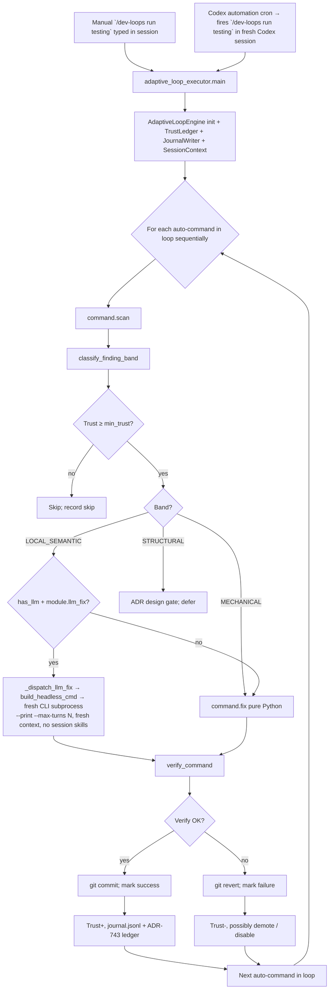
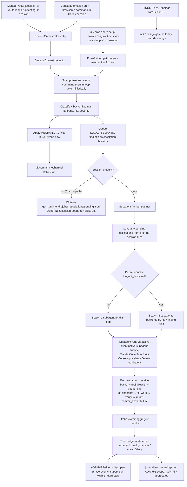

# Auto-Loop Runner Modernization — Agent-Orchestrated Subagent Execution — Design

> Design spec for **ADR-755**. Companion to the thin index ADR at
> `docs/adrs/ADR-755-auto-loop-runner-modernization.md`.

## Goal

Modernize the auto-loop runner so LLM-driven fixes route through the **active
AI client's session** via **subagent fan-out**, instead of through a fresh
headless CLI subprocess per fix. Preserve everything that makes auto-loops
valuable today: deterministic `scan()` first (token-saving), trust /
difficulty / reward gating, `protocol: scan-fix` discovery, ADR design gates
for structural findings. Preserve a pure-Python deterministic path runnable
without an AI client (CI, cron, bare scripts).

This ADR is **deliberately narrow**. It rebuilds the runtime; it does not
rename anything, does not collapse skills, does not retire the journal, does
not unify with Dream. Those are follow-up ADRs (756, 757, 758) so each
decision lands on its own merits and can be reverted independently.

## What This ADR Does NOT Do (deferred to follow-ups)

- **Skill consolidation.** The 11 `loop-*` skills stay as-is. The follow-up
  ADR-756 collapses them into 4–5 `routine-*` skills by concern.
- **`journal.jsonl` deprecation.** Verified during this spec that the
  journal has real consumers beyond the adaptive engine:
  `shared-vault/skills/daemon/scripts/mcp/_loops.py`,
  `shared-vault/skills/daemon/scripts/ops/heal_validate.py`. Migrating those
  to the ledger is ADR-757's scope.
- **`/dev-loops` rename.** Slash command name stays. Naming is ADR-758.
- **Dream cycle integration as a registered routine.** Dream is still pre-prod
  spec; integrating it as a Routine subtype waits for Dream production
  evidence (also ADR-758).

## Architectural Reality Today

Grounded in code, not memory:

- **Trigger surfaces.** `/dev-loops run <loop>` fires from one of:
  - Manual session invocation (the bulk case)
  - Codex automation cron (materialized from
    `shared-vault/skills/daemon/assets/seeds/codex-dev-loop-schedules.yaml`
    by `_sync_dev_loop_automations` in the Codex adapter)
  - `launchd` / Task Scheduler **does NOT fire loops** — it only keeps
    `unified_daemon.py` alive as a KeepAlive service. The daemon's child
    services do not include the adaptive loop engine
    (`shared-vault/skills/daemon/scripts/unified_daemon.py:134-160`).

- **LLM dispatch today.** When an auto-command's `fix()` exhausts pure-Python
  options, the engine's `_dispatch_llm_fix`
  (`shared-vault/skills/daemon/scripts/adaptive/engine_fix_phase.py:423-460`)
  calls `build_headless_cmd` (`src/lib/llm_retry.py:206-260`) to spawn a
  **fresh, isolated CLI subprocess per fix attempt** (`claude --print
  --max-turns N` or equivalent), bounded by `max-turns`, budget×3, git
  snapshot before, build verify after, revert on failure. The subprocess has
  none of the calling session's context, none of the loaded skills, none of
  the orchestration the user set up.

- **What the calling session does today.** When you type `/dev-loops run
  testing` in a Claude Code session, the slash command resolves to
  `adaptive_loop_executor.main()` which runs the loop **sequentially** in
  that session — for each auto-command, scan + classify + fix (or escalate
  to headless CLI). No subagent fan-out. One auto-command's LLM escalation
  blocks the next auto-command's scan.

- **What's good about today's design that we keep:**
  - **Scan-first.** Findings produced by Python in ms; the LLM (if dispatched
    at all) only ever sees the curated findings list. Major token saving.
  - **Trust + difficulty + reward.** Per-category state in
    `~/.Library/Application Support/Augur/state/adaptive/trust_state.json`,
    mutated only on **verified commit** (the right closed loop). Categories
    that misbehave get demoted automatically; categories that perform get
    promoted to higher difficulty.
  - **Finding-band classification.** `MECHANICAL` → pure Python fix.
    `LOCAL_SEMANTIC` → needs LLM judgment. `STRUCTURAL` → ADR design gate,
    no code change. This bands what even *needs* LLM and prevents wasted
    escalation.
  - **`protocol: scan-fix` discovery.** Declarative; the runner reads
    `x-augur-commands` / `x-augur-loop` frontmatter on each skill's
    `SKILL.md`. No magic registration. New auto-commands just add a frontmatter
    block; the runner finds them.

- **The architectural drift.** `build_headless_cmd` was the only available
  primitive when ADR-444 shipped — daemon-launched loops had no session.
  Reality moved: loops are session-launched in practice (manual or via Codex
  automation, both of which open a session). The headless subprocess model
  is now solving a problem that no longer exists, and *costs* real context
  loss + zero parallelism + no subagent isolation.

## Today's Flow (Mermaid)



Three drifts visible in that diagram: HEADLESS (fresh subprocess), SEQ (no
parallelism), single-session blocking.

## Proposed Flow (Mermaid)



Five things changed:

1. **Subagent fan-out** (top-level: per-loop; second-level: per-bucket when
   findings exceed threshold).
2. **Native subagent surface** — no headless subprocess; orchestrator uses
   Claude Code's `Task` tool / Codex's subagent dispatch / Gemini's equivalent.
3. **No-session deterministic path** — CI / cron can run scan + mechanical
   fixes without a client. LLM escalations queue for next session-bound run.
4. **Pending-escalation queue** — bridges no-session deterministic runs to
   session-bound LLM runs.
5. **Trust + reward + finding-band classification preserved exactly.** Only
   the dispatch mechanism changes.

## Architecture

### New module — `routine_orchestrator/`

Lives at `shared-vault/skills/daemon/scripts/routine_orchestrator/`.
Sibling to `adaptive/`, not a replacement (during phased migration). After
the migration completes (Phase 4), `adaptive/` shrinks to the pure-algorithm
modules `trust.py` and `engine_context.py` (kept and re-used); the dispatch
modules `engine_fix_phase.py` and `engine_escalation.py` are retired.

```
shared-vault/skills/daemon/scripts/routine_orchestrator/
  __init__.py              # public entry: orchestrate_run(loop_name, ...)
  orchestrator.py          # the top-level run-a-loop coordinator
  scan_phase.py            # deterministic scan dispatch; reads protocol: scan-fix discovery
  fix_phase_mechanical.py  # pure-Python mechanical fix application
  bucket_planner.py        # group findings into subagent buckets (per file / finding type)
  subagent_dispatch.py     # client-aware subagent fan-out (Claude/Codex/Gemini/...)
  budget.py                # per-subagent budget enforcement (max-turns, soft timeout)
  escalation_queue.py      # pending.jsonl read/write; bridges no-session ↔ session runs
  session_detect.py        # wraps existing engine_context.SessionContext for compatibility
  trust.py                 # extracted from adaptive/trust_state.py; pure-algorithm reuse
  reward.py                # extracted from adaptive/; pure-algorithm reuse
```

### Subagent dispatch contract

`subagent_dispatch.py:dispatch_bucket()`:

- **Input**: `(bucket: FindingBucket, auto_command: AutoCommand,
  session_context: SessionContext, budget: SubagentBudget)`
- **Resolves** the active client's native subagent primitive:
  - `claude-code` → `Task` tool with `subagent_type` matching the
    auto-command's owning loop skill (`loop-test` → `general-purpose`,
    `loop-security` → `security-reviewer`, etc.; mapping in
    `subagent_dispatch.CLIENT_SUBAGENT_MAP`)
  - `codex` → Codex's subagent dispatch primitive
  - `gemini` → Gemini's equivalent
  - `cursor` / `copilot` → **degraded mode**: run inline in the calling
    session sequentially. No fan-out. Slower but still works. The
    orchestrator logs that it degraded.
- **Subagent receives**:
  - The auto-command's `description` (from frontmatter) + the bucket of
    findings (typed; not a free-form prompt)
  - Tool allowlist (the auto-command's module declares which MCP tools it
    needs; subagent gets *only* those)
  - Budget cap (max-turns + soft timeout)
  - A wrapper instruction: "Apply the fix described above to the given
    findings. After applying, verify with `<verify_command>`. If verify
    passes, commit with `<commit_message_template>`. If verify fails,
    revert. Return JSON: `{"status": "success"|"failed",
    "commit_hash": str|null, "diagnostic": str}`."
- **Subagent returns**: structured result. Orchestrator parses, updates
  trust ledger, writes ledger event, moves to next bucket.

### Top-level fan-out (per loop)

`orchestrator.py:orchestrate_run(loop_name)`:

1. Detect session context.
2. **For "/auto-loops all"**: spawn one orchestrator-managed subagent per
   loop in the loop catalog (5–8 subagents, parallel). Each loop's subagent
   runs its own `scan() → bucket → mechanical fix → escalation` cycle in
   that subagent's context. Top-level orchestrator aggregates.
3. **For "/auto-loops run testing"**: skip top-level fan-out; run the
   single-loop orchestrator inline.

### Second-level fan-out (per bucket within a loop)

`bucket_planner.py:plan_dispatch(buckets, fan_out_threshold=8)`:

- Buckets group LOCAL_SEMANTIC findings by `(auto_command, primary_file)`
  (so each subagent fixes one auto-command's findings in one file)
- If `len(buckets) <= fan_out_threshold`: dispatch sequentially in the loop
  subagent's own context (no grandchild subagents — keeps context, avoids
  spawning overhead)
- If `len(buckets) > fan_out_threshold`: fan out into grandchild subagents,
  one per bucket, dispatched in parallel by the loop subagent

The threshold is configurable per loop in `config/system/adaptive_loops.yaml`
(`fan_out_threshold:` per loop entry, default 8).

### Pending-escalation queue

`escalation_queue.py`:

- **File**: `get_runtime_dir()/jobs/_escalations/pending.jsonl`
- **Schema**:
  ```json
  {
    "queued_at": "2026-05-16T03:00:00Z",
    "loop": "testing",
    "auto_command": "auto-test-build",
    "finding_band": "LOCAL_SEMANTIC",
    "finding": { ... auto-command-specific ... },
    "scan_run_id": "<adr-743 job id of the scan that found this>",
    "reason": "no-session",
    "ttl_at": "2026-05-30T03:00:00Z"
  }
  ```
- **Read order**: orchestrator loads pending escalations *before* its own
  scan phase; merges them with current scan findings into the bucket
  planner.
- **TTL**: 14 days (configurable). Entries past TTL are dropped with a
  ledger event; their findings will resurface on the next scan if still
  applicable.
- **No mutation of pending.jsonl after read**: orchestrator marks entries as
  `picked_up_at`, then either succeeds (entry removed) or fails (entry
  stays for retry; TTL preserved).
- **Concurrent safety**: append-only writes; reads take a snapshot. Race
  windows are tiny (sub-second) and resolved by TTL.

### Pure-Python deterministic path

`scan_phase.py` and `fix_phase_mechanical.py` are session-agnostic:

- No SessionContext dependency
- No subagent dispatch
- Importable from CI / cron / a bare Python script
- Provided as a CLI: `aug routine scan-only --loop <name>` or
  `aug routine scan-and-fix-mechanical --loop <name>`
- The pure-Python path **still writes to the trust ledger and the ADR-743
  ledger** — those are file-based, no LLM, no session needed.

This is what makes "lint my repo at 3am via cron with no AI client" still
work. The LLM escalation path is the only thing that strictly requires a
session.

### Trust algorithm preserved

`trust.py` is extracted from `adaptive/trust_state.py` with no behavior
change. The orchestrator imports and calls the same functions. Trust state
file location is unchanged (`get_runtime_dir()/adaptive/trust_state.json`)
— the legacy engine and the new orchestrator share the same state file.
This means a partial-migration period (some loops on legacy, some on
orchestrator) keeps a coherent trust view.

`reward.py` similarly extracts the reward signal logic.

## Migration Plan

Each phase is independently shippable and revertable. Auto-commands opt into
the new orchestrator one at a time via a frontmatter marker; absence of the
marker means legacy path.

### Phase 1 — Build the orchestrator alongside legacy

1. Implement `routine_orchestrator/` modules.
2. Extract `trust.py` + `reward.py` from `adaptive/`. Adaptive engine
   imports the extracted modules — behavior unchanged.
3. New CLI: `aug routine scan-only --loop X` exercises the pure-Python
   path.
4. New CLI: `aug routine orchestrate --loop X` exercises the session-bound
   orchestrator (only callable from within a session; refuses otherwise).
5. **Tests**: fixture-loop end-to-end. A toy loop with three auto-commands
   (one mechanical, one local-semantic, one structural) routed through the
   orchestrator. Subagent dispatch is mocked in the test harness.
6. **No production loops migrated yet.** Legacy `adaptive_loop_executor`
   handles every existing auto-command.

### Phase 2 — Cut over one low-risk loop

1. Pick `loop-docs/auto-doc-freshness` (or similar low-risk auto-command
   with mostly mechanical fixes).
2. Add `x-augur-runner: orchestrator` to its frontmatter.
3. `adaptive_loop_executor` routing logic: if any auto-command in the
   requested loop has the marker, delegate to the orchestrator for *that
   command*; legacy path for the rest.
4. Observe for two weeks. Compare trust trajectories before/after via
   `trust_state.json` diff.

### Phase 3 — Migrate remaining loops

1. One auto-command at a time, in order of risk (mechanical-only first,
   LLM-escalation-heavy last).
2. Once an entire loop is migrated, the loop's `/auto-loops run <loop>`
   path runs fully through the orchestrator.
3. Once all loops are migrated, `/auto-loops all` runs through the
   orchestrator with top-level fan-out.

### Phase 4 — Retire legacy dispatch

1. `_dispatch_llm_fix` and the `build_headless_cmd` call path in
   `engine_fix_phase.py` deleted. Confirmation: no auto-command in the
   repo lacks the `x-augur-runner: orchestrator` marker.
2. `adaptive_loop_executor.py` becomes a thin shim: parses args, delegates
   to `routine_orchestrator.orchestrate_run`. Keeps the same CLI surface
   for backwards compatibility.
3. `build_headless_cmd` in `src/lib/llm_retry.py` is **kept** — it has
   other callers outside the auto-loop engine (verified during this spec:
   used in `oneshot` dispatch elsewhere). Only the auto-loop's use of it
   is retired.

## What Stays Identical

- **Trust ledger file path** (`get_runtime_dir()/adaptive/trust_state.json`)
  — orchestrator + legacy engine share it during the migration.
- **`protocol: scan-fix` discovery** — same frontmatter, same module
  protocol (`scan()` + `fix()`).
- **`config/system/adaptive_loops.yaml`** — same schema; gains optional
  `fan_out_threshold` per loop.
- **ADR-743 ledger schema** — orchestrator writes the same shape of
  events as the adaptive engine writes today.
- **`journal.jsonl`** — orchestrator writes to it during Phase 2–4 so
  legacy consumers (`mcp/_loops.py`, `ops/heal_validate.py`) keep working.
  Deprecation handled by ADR-757.
- **`/dev-loops` slash command** — name and verbs unchanged. Just dispatches
  to the orchestrator after Phase 4.
- **All `auto-*.md` commands and their `*_ops.py` modules** — no rewrites.
  Each gets a one-line frontmatter addition (`x-augur-runner: orchestrator`)
  during its Phase 3 cutover.

## Cross-Client Compatibility

| Client | Subagent surface | Fan-out support | Degraded mode |
|---|---|---|---|
| Claude Code | `Task` tool | Yes (native) | n/a |
| Codex | Codex subagent dispatch | Yes (native) | n/a |
| Gemini | Equivalent native surface | Yes (assumed; verify in Phase 1) | sequential inline if not |
| Cursor | None | No | Sequential inline in calling session |
| Copilot | None | No | Sequential inline in calling session |
| None (CI / cron) | n/a | n/a | Deterministic-only; LLM findings queue to pending escalation |

The `CLIENT_SUBAGENT_MAP` in `subagent_dispatch.py` is the canonical place
where new clients get added.

## Testing Strategy

Per Augur convention (memory: `feedback-skill-test-convention`), tests live
in `shared-vault/skills/daemon/augur/tests/` and load target modules via
`importlib.util.spec_from_file_location`.

- `test_routine_orchestrator_scan_phase.py` — scan dispatch against fixture
  auto-commands.
- `test_routine_orchestrator_bucket_planner.py` — bucketing rules, fan-out
  threshold behavior.
- `test_routine_orchestrator_mechanical_fix.py` — pure-Python fix path
  isolation.
- `test_routine_orchestrator_escalation_queue.py` — pending.jsonl
  read/write/TTL.
- `test_routine_orchestrator_subagent_dispatch.py` — dispatch with mocked
  subagent surface, contract verification (input shape, output parsing,
  budget enforcement).
- `test_routine_orchestrator_session_detect.py` — degraded-mode behavior
  when no client surface available.
- `test_routine_orchestrator_trust_integration.py` — trust state mutations
  on success/failure parity with legacy engine.
- `test_routine_orchestrator_end_to_end.py` — fixture-loop with three
  auto-commands, mocked subagent, full orchestrate_run round-trip.

## Real-Data Validation (Rule #34)

Phase 1 acceptance gate: run the pure-Python `scan-only` path against the
real repo with a real auto-command. Quote the actual findings the scan
returned, prove they're non-empty and accurate.

Phase 2 acceptance gate: cut over `loop-docs/auto-doc-freshness`, run it
session-bound through the orchestrator, quote the subagent's actual diff +
commit hash. Compare trust mutation before/after — must match what legacy
engine would have produced for the same finding.

## Open Design Questions

1. **Default subagent max-turns?** Per-loop configurable, but what's the
   default? Today's headless CLI defaults to 20. Recommended: same default
   (20) so trust trajectories stay comparable.
2. **Default `fan_out_threshold`?** Recommended: 8 (above this many
   buckets, grandchild subagents win; below, sequential in the loop
   subagent's context wins).
3. **Pending-escalation TTL?** Recommended: 14 days. Findings older than
   that resurface on next scan if still real; old queued copies are
   dropped.
4. **Subagent commit ownership.** Should the subagent's commit be wrapped
   in an orchestrator-owned snapshot/revert, or does the subagent own the
   full git lifecycle? Recommended: subagent owns the full lifecycle
   (snapshot → fix → verify → commit-or-revert), returns commit_hash or
   failure. Orchestrator only updates trust state. This matches what
   `build_headless_cmd` does today (it owns the snapshot+verify) and
   minimizes coordination state.
5. **What if a subagent times out mid-run?** Recommended: the orchestrator
   detects via budget timeout, treats as failure (trust−), the in-progress
   commit (if any) is reverted by the subagent's own snapshot logic, the
   finding stays for the next run. ADR-743 ledger captures the timeout.
6. **Subagent failure attribution.** If a subagent fails, was it the
   finding's fault or the subagent's? Recommended: track in trust ledger
   as `subagent_failure: true` vs `verify_failure: true` separately;
   demote on repeated verify_failure (the auto-command is wrong); don't
   demote on repeated subagent_failure (something else is going on).

## Risks

- **Subagent dispatch isn't atomic across all clients.** Claude Code's
  `Task` is stable; Codex / Gemini equivalents may have different timeout
  / context-window / tool-allowlist semantics. Mitigation: Phase 1
  validates the contract on Claude Code first; Codex / Gemini support
  ships in Phase 2 with their own validation gates.
- **Two-engine concurrency.** During Phase 2–3, some auto-commands run on
  the orchestrator, others on the legacy engine. Both share the trust
  state file. Risk: write race. Mitigation: trust state file already uses
  atomic write semantics (read+modify+write with file lock — verify in
  Phase 1). If not, add file lock during Phase 1.
- **`x-augur-runner` frontmatter marker proliferation.** Every auto-command
  gets one new line. Mitigation: scripted addition during Phase 3 (a
  one-time migration script).
- **`build_headless_cmd` deprecation surprise.** Other callers outside
  the auto-loop engine still use it (e.g. oneshot dispatch). Mitigation:
  do NOT retire `build_headless_cmd` itself; only retire the auto-loop's
  use of it. Spec is explicit about this in Phase 4.
- **Pending-escalation queue corruption.** A bad write could lose findings.
  Mitigation: append-only JSONL, atomic line writes, TTL fallback (entries
  resurface on next scan if applicable), tests for malformed-line
  recovery.

## Why This Is Worth Doing

- **Architectural drift correction.** ADR-444's headless CLI was the right
  answer to a problem (no session available) that no longer holds in
  practice. The new orchestrator solves the same problem (LLM in the loop)
  with the right primitive (session-bound subagent) for today's reality.
- **Real parallelism for `/auto-loops all`.** Today's sequential
  execution is the dominant time-cost for "run all loops" — 85
  auto-commands serially. Top-level + second-level fan-out cuts wall time
  dramatically.
- **Continuous context.** Subagent has the calling session's loaded skills,
  the user's project context, the full MCP tool surface (filtered by
  allowlist). Fixes are more likely to be correct.
- **Pending-escalation queue.** Bridges the CI / cron / bare-script
  deterministic path to the session-bound LLM path cleanly. Today there's
  no bridge — a finding that needs LLM gets a headless CLI subprocess fired
  immediately, even if no user is around to evaluate the result. The new
  model defers LLM work to a session where a human can review.
- **Preserves what works.** Trust, reward, finding-bands, scan-first, ADR
  design gates, the `protocol: scan-fix` declarative discovery — all kept.
  Only the dispatch mechanism changes.
- **Sets up follow-ups cleanly.** Skill consolidation (ADR-756),
  observability merge (ADR-757), and Routines unification (ADR-758) all
  become tractable once the dispatch model is fixed. Doing them in the
  reverse order (renaming first) would have been pure churn.
