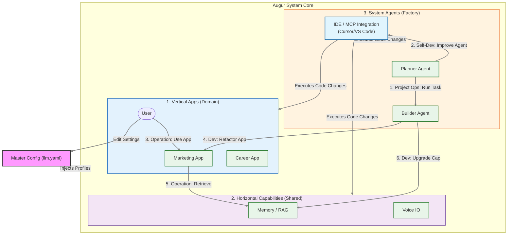

# User Journey: LLM Configuration & Project Evolution

This journey maps how the **Master Configuration File (`llm.yaml`)** acts as the central nervous system for your project's intelligence, evolving from a simple global setup to a highly optimized, component-specific configuration.

## System Ecosystem Flow

This diagram illustrates how the Global Config and IDE interact across the three main layers of Augur: **Vertical Apps**, **Horizontal Capabilities**, and **System Agents**.

## Detailed Flow Breakdown

### 1. Vertical App Usage (Operation & Dev)
**Context:** Domain-specific applications like Marketing or Career.
*   **Operation:** You (the User) interact directly with the app (e.g., "Generate LinkedIn Post"). The app uses the **Active LLM Profile** defined in `llm.yaml` to generate content.
*   **Development:** You notice a bug or want a new feature. You create a request. The **System Agents** (Planner/Builder) use the **IDE MCP** to modify the Vertical App's code safely.

### 2. Horizontal Capabilities (Operation & Dev)
**Context:** Shared powers like Memory (RAG), Voice, or Browser access.
*   **Operation:** Vertical Apps call these services in the background. For example, the Career App asks **Memory** for your resume data. This uses the storage/embedding configurations.
*   **Development:** If a capability is slow or inaccurate, the **System Agents** can refactor the underlying service code (e.g., "Switch RAG from Chroma to PGVector") via the **IDE MCP**.

### 3. System Agents (Project Ops & Self-Dev)
**Context:** The "Meta-Layer" that manages the codebase (Planner, Builder, Reviewer).
*   **Project Operation:** The **Planner** reads your backlog and assigns tasks to the **Builder**. They run nightly to keep the project moving.
*   **Agent Self-Dev**: The most powerful loop. The Agents can recognize their own limitations (e.g., "I failed to parse this file"). They then generate a self-improvement task, use the **IDE MCP** to rewrite their own logic, and restart with improved capabilities.

## The Role of `llm.yaml` in These Flows

| Layer | Configuration Impact | Example Override |
| :--- | :--- | :--- |
| **System** | Determines how smart the Planner is. | `factory/planner: { active_profile: "reasoning_model" }` |
| **Vertical** | Determines the creative voice of the app. | `vertical/marketing: { active_profile: "creative_model" }` |
| **Horizontal**| Determine embedding/search quality. | `horizontal/memory: { active_profile: "fast_model" }` |

This architecture ensures that **Configuration** (Brain) is decoupled from **Implementation** (Body), but the Body can rewrite itself using the Brain.
